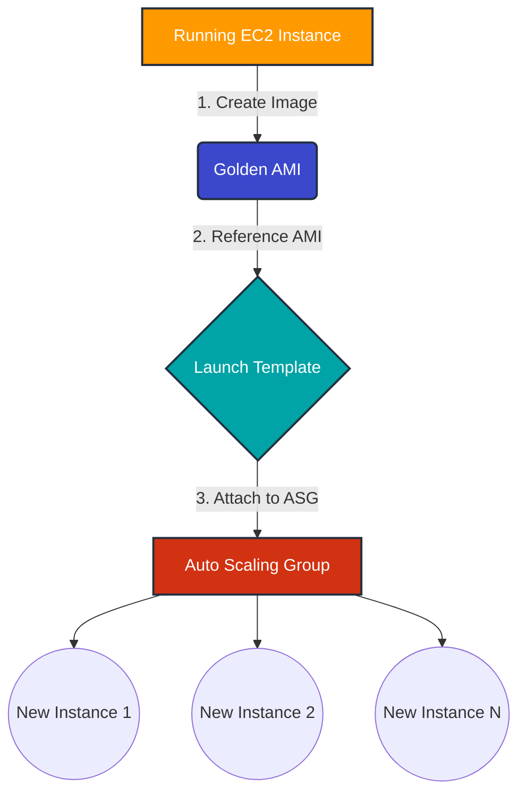

# 🚀 AWS Interview Question: Attaching an Existing EC2 to a New ASG

**Question 1:** *How can you add an existing instance to a new Auto Scaling group?*

---

## ⏱️ The Short Answer
You **cannot** directly attach a running EC2 instance to a newly created Auto Scaling Group (ASG) in a production-safe way. The recommended approach is to migrate the configuration via an Amazon Machine Image (AMI).

**The 3-Step Strategy:**
1. 📸 **Create an AMI** from the existing instance.
2. 📝 **Create a Launch Template** using that newly created AMI.
3. 🔄 **Create a new Auto Scaling Group** using the Launch Template.

> [!TIP]
> **Why this way?** This ensures scalable, consistent, and reproducible infrastructure, perfectly aligning with Infrastructure as Code (IaC) principles.

---

## 🔍 Detailed Explanation

Auto Scaling Groups are designed to launch instances dynamically using **Launch Templates** or **Launch Configurations**. They are not built to seamlessly adopt manually customized standalone EC2 instances in a scalable manner. 

While AWS *does* allow attaching an existing instance to an ASG via the CLI or Console, **it is strongly discouraged in production** because:
- ⚠️ **Configuration Mismatch:** The instance's specifications might not match the underlying Launch Template.
- 📉 **Drift Issues:** Future instances launched by the ASG will differ from your manually attached one.
- ❌ **No Repeatability:** It breaks the immutable infrastructure paradigm.

---

## 🏆 Recommended Production Approach (Best Practice)

Here is the exact workflow you should follow in a production environment:



### Step 1: Create an AMI from the Existing Instance
**Path:** `EC2 Console → Select Instance → Actions → Image → Create Image`

This captures a complete snapshot of the server, including its OS, installed applications, custom configurations, patches, and software stack.

### Step 2: Create a Launch Template
**Path:** `EC2 Console → Launch Templates → Create Launch Template`

Specify the exact blueprint for future instances:
- The **AMI** created in Step 1
- Instance Type
- Security Groups & IAM Role
- Key Pair & User Data (if necessary)

### Step 3: Create the Auto Scaling Group
**Path:** `EC2 Console → Auto Scaling → Create ASG`

Attach the Launch Template and define your scaling parameters:
- Desired, Min, and Max capacity
- Target Group (if deploying behind an Application Load Balancer)
- Scaling Policies (e.g., target tracking on CPU)

---

## 🛠️ The Alternative Method (Technically Possible, but Risky)

If you absolutely *must* attach an instance (e.g., for temporary migration or gradual transition), you can do it via the AWS CLI:

```bash
aws autoscaling attach-instances \
  --instance-ids i-xxxxxxxxxxxxxxxxx \
  --auto-scaling-group-name my-production-asg
```

> [!WARNING]
> This command only associates the instance with the ASG. It **does not** update the ASG's Launch Template. Do not rely on this for long-term scalability.

---

## 🏢 Real-World Production Scenario

**Scenario:** A company has a manually configured EC2 web server running in production. Traffic is surging, and they urgently need Auto Scaling.

**The Execution:**
1. **Audit:** Verified application configs and cleaned out unnecessary temporary logs.
2. **Snapshot:** Created a *Golden AMI* from the running instance.
3. **Blueprint:** Drafted a Launch Template from the AMI.
4. **Scale:** Deployed an ASG (`min=2`, `max=10`) and attached it to an ALB target group.
5. **Validation:** Ran a CPU stress test to confirm automatic scale-out.

**The Result:** The infrastructure handled traffic spikes automatically with zero downtime, eliminating manual intervention!

---

## 🗣️ Interview Follow-up Questions

### ❓ Q: Why not just directly attach the instance to the ASG?
> **A:** Because it is not reproducible. Directly attaching risks configuration drift, meaning future ASG instances will likely differ from the attached one. It violates core IaC (Infrastructure as Code) principles.

### ❓ Q: What if the existing instance holds unique, stateful data?
> **A:** Before scaling, the instance must be made **stateless**. Unique data should be migrated to centralized storage like EFS, S3, or an RDS database. 

---

## ⭐ Enterprise Golden Rules
- ✔️ **Never scale stateful instances.**
- ✔️ **Always use a Golden AMI pipeline.**
- ✔️ **Store session data externally** (e.g., Redis / ElastiCache).
- ✔️ **Keep servers 100% stateless.**

> [!IMPORTANT]
> **Final Interview-Ready Summary:**
> *"In production, we never directly attach a running EC2 instance to an Auto Scaling group. Instead, we create an AMI from it, build a Launch Template, and deploy an ASG. This ensures our infrastructure remains consistent, highly scalable, and perfectly repeatable."*
