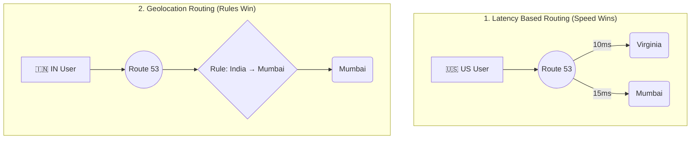

# 🚀 AWS Interview Question: LBR vs. Geo DNS in Route 53

**Question 5:** *What is the difference between Latency Based Routing and Geo DNS?*

> [!NOTE]
> This question is heavily favored in Route 53 and Global Architecture interviews. Interviewers expect both deep conceptual clarity and a solid real-world production example to prove you understand the "why" behind the routing choice.

---

## ⏱️ The Short Answer
**Latency Based Routing** routes user traffic to the AWS region that provides the fastest network response time. **Geo DNS (Geolocation Routing)** routes traffic strictly based on the user’s physical geographic location, regardless of latency.

**Latency Based Routing** routes user traffic to the AWS region that provides the fastest network response time (performance optimized). **Geo DNS (Geolocation Routing)** routes traffic strictly based on the user’s physical geographic location, regardless of latency (compliance and localization optimized).

---

## 🏎️ 1. Latency Based Routing (LBR)

### 📖 Concept
Latency Based Routing uses real-time AWS network performance data to dynamically decide which region will respond fastest to the end user.

### ⚙️ How It Works
1. You deploy your application in multiple active regions (e.g., `ap-south-1` Mumbai, `ap-southeast-1` Singapore, `eu-central-1` Frankfurt).
2. Route 53 continuously measures network latency from global user locations to AWS regions.
3. The user is automatically routed to whichever region provides the lowest millisecond latency at that exact moment.

### 🏢 Production Scenario
**Use Case:** A global SaaS company footprint.
- **The Deployment:** The application backend is hosted in both Mumbai and Singapore.
- **The Routing:** A user in India is routed to Mumbai. A user in Malaysia is routed to Singapore.
- **The Catch:** Even if both regions are healthy, traffic goes to the objectively fastest region. The geographically closest region is usually the fastest, but not *always* (due to complex ISP peering and submarine cable routing).

> [!TIP]
> **Key Purpose:** Maximum performance and optimizing global end-user experience (UX).
---

## 📊 Visual Architecture Flow: LBR vs Geo DNS

---

## 🏎️ 1. Latency Based Routing (LBR)
Uses real-time AWS network performance data to dynamically decide which region responds fastest.
- **How It Works:** Route 53 continuously measures network latency from global user locations to AWS regions. The user is routed to whichever region provides the lowest latency at that exact moment.
- **Production Scenario:** A global SaaS backend is hosted in Mumbai and Singapore. A user in India is natively routed to Mumbai, while a Malaysia user goes to Singapore. Even if both are healthy, traffic inherently goes to the objectively fastest region.

## 🌍 2. Geo DNS (Geolocation Routing)
Routes traffic statically based on the user's IP-derived country, continent, or state, completely ignoring latency.
- **How It Works:** You manually define static routing rules (e.g., India → Mumbai, Europe → Frankfurt). Route 53 routes traffic according to those predetermined rules strictly.
- **Production Scenario:** A media streaming company has licensing laws. Indian users MUST hit Indian servers; European users MUST hit EU servers for GDPR. Even if a US server is technically faster, an Indian user is locked to the India region.

### 📖 Concept
Geo DNS routes traffic statically based on the user's IP-derived geographic location (country, continent, or state)—*completely ignoring* network latency.

### ⚙️ How It Works
1. You manually define static geographic routing rules mapping locations to specific endpoints.
   - *Example: India → Mumbai, USA → Ohio, Europe → Frankfurt.*
2. Route 53 checks the incoming user’s IP address against a geographic database.
3. It routes the traffic strictly according to the predefined rules.

### 🏢 Production Scenario
**Use Case:** A media streaming company with strict licensing laws.
- **The Deployment:** Indian users *must* access Indian content servers; US users *must* access US content servers; European users *must* hit EU servers to comply with GDPR.
- **The Routing:** Even if the US region happens to provide lower latency for an Indian user on a specific ISP, that user will **still** be routed to the Indian region because the rule is statically geography-based.

> [!TIP]
> **Key Purpose:** Serving localized content, enforcing legal compliance, honoring distribution rights, and implementing geo-fencing.

---

## 🆚 Side-by-Side Comparison

| Feature | 🏎️ Latency Based Routing (LBR) | 🌍 Geo DNS (Geolocation Routing) |
| :--- | :--- | :--- |
| **Routing Logic** | Lowest network latency (ms) | User IP geographic location |
| **Decision Type** | Dynamic (Performance-based) | Static (Rule-based) |
| **Primary Use Case** | Global performance optimization | Compliance, Licensing, & Regional control |
| **Winning Factor** | "Fastest region wins" | "Specific country maps to specific region" |

---

## ⚖️ When to Use What?
### 🟢 Use Latency Routing When: 
- You want the absolute best theoretical network performance and user experience.
- You run a multi-region active-active architecture.
- You have no strict legal constraints on where data is served from geographically.

### 🔵 Use Geo DNS When:
- You have legal compliance needs (e.g., Data Residency, GDPR).
- You need to deliver country-specific content, pricing, or language localization.
- You want explicit traffic segmentation by geographical region.
---

## 🧠 Advanced Architect Insight (Bonus)

> [!IMPORTANT]
> **Enterprise Production Strategy:** Do not treat routing policies as mutually exclusive!
> 
> Many global enterprises combine Route 53 policies for maximum resiliency:
> - **Latency Routing + Route 53 Health Checks** = High Availability + Peak Performance.
> - **Geo Routing + Failover Routing** = Strict Compliance + Disaster Recovery.

---

## 🎤 Final Interview-Ready Answer
*"Latency Based Routing deeply optimizes network performance by exclusively routing user traffic specifically to the AWS region that provides the absolute lowest measured millisecond latency. Conversely, Geo DNS specifically routes web traffic statically strictly based on the user’s native physical geographic location, making it exclusively ideal for enforcing total legal compliance, data residency laws, and regional content restrictions."*
