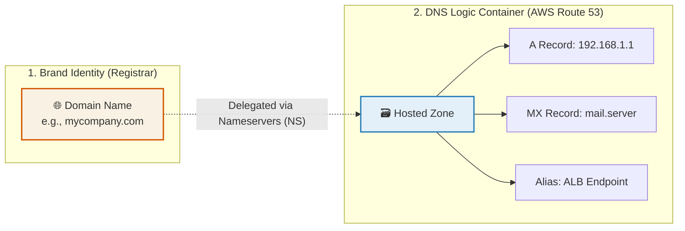

# 🚀 AWS Interview Question: Domain vs. Hosted Zone

**Question 7:** *What is the difference between a Domain and a Hosted Zone?*

> [!NOTE]
> This is a foundational networking question that often trips up beginners. Interviewers want to see that you understand the clear mathematical separation between registrar identity (Domain) and the routing instruction container (Hosted Zone).

---

## ⏱️ The Short Answer
A **Domain** is the globally registered, human-readable name of a website (e.g., `example.com`), while a **Hosted Zone** is a DNS configuration container specifically within AWS Route 53 that stores records (A, CNAME, MX, etc.) to control exactly how traffic for that domain is physically routed. 

*Simply put: The Domain is the outward identity; the Hosted Zone is the internal traffic controller.*

---

## 📊 Visual Architecture Flow: Domain to Hosted Zone

---

## 🔍 Detailed Explanation

### 1. 🌐 What is a Domain?
A Domain is simply a human-readable string used to access a service on the internet instead of attempting to memorize an IPv4/IPv6 address.
- **The Function:** When you register a domain (`mycompany.com`), you are purchasing the exclusive right to use that exact name globally.
- **The Provider:** Domains are leased through Domain Registrars (like Route 53, GoDaddy, Namecheap).
- **The Limitation:** A domain *by itself* does not define how traffic is routed. It is legally just a name reservation.

### 2. 🗃️ What is a Hosted Zone?
A Hosted Zone is a DNS container that holds the actual routing instructions (DNS records) for a given domain.
- **The Function:** When you create a hosted zone for `example.com` in Route 53, you are telling AWS: *"I want you to manage the comprehensive DNS logic for this domain."*
- **The Contents:** It holds the critical records like:
  - **A Record:** Maps the name to an IPv4 address.
  - **CNAME:** Maps the name to another canonical name.
  - **MX:** Maps the name to a mail exchange server.
  - **TXT:** Used for domain verification, SPF rules, and SSL validation.
  - **Alias:** AWS-specific records pointing natively to AWS resources (ALBs, CloudFront, S3).
- **The Types:**
  - **Public Hosted Zone:** Used for internet-facing domains explicitly queryable by the global public.
  - **Private Hosted Zone:** Used exclusively for internal DNS inside an isolated VPC (not visible to the internet).

---

## 🆚 Interview Comparison Table

| Feature | 🌐 Domain | 🗃️ Hosted Zone (in Route 53) |
| :--- | :--- | :--- |
| **What is it?** | Registered human-readable name | DNS configuration container |
| **Example** | `example.com` | Collection of A, CNAME, MX records |
| **Where is it from?** | Purchased from a DNS Registrar | Created inside AWS Route 53 |
| **Primary Role** | Establishes brand identity | Controls how traffic is routed |

---

## 🏢 Real-World Production Scenarios

### Scenario 1: Deploying a Public Website

**The Setup:** A company formally registers the domain `mycompany.com`. However, users currently cannot successfully load the website.
- **The Problem:** The domain exists, but there are no routing instructions telling internet browsers where the server legitimately lives.
- **The Action (DevOps Engineer):**
  1. Creates a **Public Hosted Zone** specifically in Route 53.
  2. Adds an **A Record (Alias)** pointing directly to the AWS Application Load Balancer (ALB).
  3. Adds an **MX Record** pointing to their corporate email provider.
  4. Adds a **TXT Record** for rapid SSL certificate validation (via AWS ACM).
- **The Result:** Now, `www.mycompany.com` dynamically points to the Load Balancer, and `mail.mycompany.com` routes correctly to the email servers. The Domain provided the branded name; the Hosted Zone provided the routing instructions.

**The Action (DevOps Engineer):**
1. Actively registers `mycompany.com` (Domain).
2. Creates a **Public Hosted Zone** specifically in Route 53.
3. Adds an **A Record (Alias)** pointing directly to the AWS Application Load Balancer (ALB).
4. Adds an **MX Record** pointing to their corporate email provider.
**The Result:** `www.mycompany.com` dynamically points to the Load Balancer. The Domain provided the branded name; the Hosted Zone natively provided the routing instructions.

### Scenario 2: Private Internal Microservices DNS

**The Setup:** An enterprise runs highly secure internal databases inside a private VPC. They strictly do not want these endpoints exposed to the public internet.
- **The Action:** The advanced DevOps engineer creates a **Private Hosted Zone** named `internal.local` and seamlessly attaches it directly to the VPC.
- **The Result:** Internal application microservices can securely communicate with the database utilizing the internal DNS name `db.internal.local` instead of hardcoding static IP addresses. This DNS name is completely invisible and unresolvable to the outside world.

**The Action:** The advanced DevOps engineer natively creates a **Private Hosted Zone** named `internal.local` and seamlessly attaches it directly exclusively to the secure VPC.
**The Result:** Internal application microservices logically can securely communicate essentially with the database intrinsically utilizing the internal DNS name `db.internal.local`. This DNS name is completely invisible and cleanly unresolvable to the outside world.

---

## 🎤 Final Interview-Ready Answer
*"The fundamental architectural difference is essentially about identity versus routing. A Domain natively is simply the globally exclusively registered branded name of a service directly purchased from a registrar. Conversely, a Hosted Zone is expressly the natively robust logical container specifically natively within AWS Route 53 that perfectly securely strictly holds the specific critical DNS records dictating exactly how internal and external web traffic destined for that domain should technically inherently be correctly actively optimally strictly structurally routed to the underlying dynamically auto-scaled physical infrastructure."*
