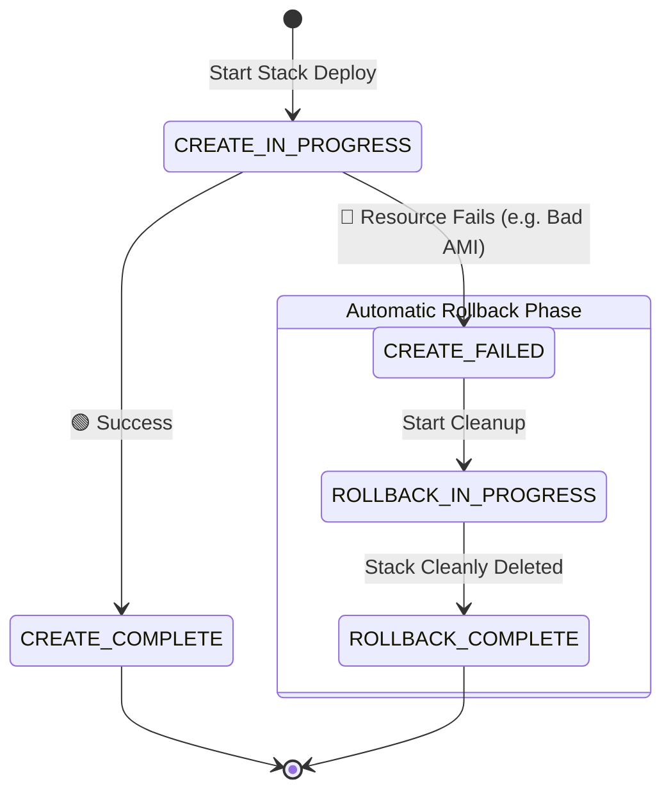

# 🚀 AWS Interview Question: CloudFormation Failure & Rollback

**Question 9:** *What happens in CloudFormation when one resource fails to create?*

> [!NOTE]
> This question deeply tests your understanding of **Idempotency** and **Atomic Deployments** in Infrastructure as Code (IaC). Interviewers specifically want to know that you understand *why* CloudFormation is fundamentally safer than running custom manual scripts.

---

## ⏱️ The Short Answer
When a resource natively fails to create or update perfectly in AWS CloudFormation, the entire stack firmly enters a `CREATE_FAILED` (or `UPDATE_FAILED`) state. By default, CloudFormation immediately triggers an **Automatic Rollback**, comprehensively deleting all successfully created resources from that specific operation or precisely restoring them to their last absolute stable configuration. This guarantees entirely atomic and consistent infrastructure deployment.

---

## 📊 Visual Architecture Flow: CFN Rollback

---

## 🔍 Detailed Breakdown

### 1. 🛑 The Failure Phase
CloudFormation structurally provisions resources in strict dependency order (either logically inferred automatically by AWS or explicitly defined using the `DependsOn` attribute).
- If mathematically even a single resource fails (e.g., an EC2 launch fails because of an invalid AMI, or an RDS fails due to a missing Subnet Group), execution halts entirely.
- The formal Stack Status immediately changes unconditionally to: `CREATE_FAILED`.

### 2. ↩️ Automatic Rollback (Default Behavior for New Stacks)
AWS heavily protects your baseline infrastructure state. After the isolated failure occurs:
- CloudFormation systematically begins gracefully deleting all the surrounding resources it *was* able to successfully create right before the critical failure point.
- The Stack Status smoothly transitions to: `ROLLBACK_IN_PROGRESS`.
- Once absolutely everything is cleaned up, the status formally ends at: `ROLLBACK_COMPLETE`.
- **The Result:** The deployed infrastructure formally returns exactly to its previous clean state (or completely cleanly deletes if it was a brand-new stack).

### 3. 🔄 During a Stack Update
If the internal failure happens while *updating* an existing, previously healthy and running stack:
- Instead of completely deleting the existing stack, CloudFormation smartly rolls the newly failing configuration changes cleanly structurally backward.
- It meticulously logically restores the strict prior working configuration.
- The Stack Status sequentially becomes: `UPDATE_ROLLBACK_IN_PROGRESS` → `UPDATE_ROLLBACK_COMPLETE`.

---

## 💡 Why This Mechanism is Critical

If you were functionally running a custom Python/Bash script algorithm and it failed halfway through, you would be left with a catastrophic, half-deployed, unmanageable mess. CloudFormation explicitly prevents this by structurally ensuring changes are uniformly **Atomic** (all or definitively nothing). 

It systematically prevents:
- ❌ Partial infrastructure deployments
- ❌ Broken or completely mixed-state unroutable environments
- ❌ Manual cleanup headaches and 3 AM pager alerts for ops teams
- ❌ Orphan unattached resources causing hidden unmonitored billing leakage

---

## 🏢 Real-World Production Scenario

**The Goal:** You are formally deploying a standard 3-tier global architecture: VPC → ALB → Auto Scaling Group (EC2) → RDS Database.
**The Incident:** During the pipeline deployment, the VPC, ALB, and EC2s flawlessly naturally create. However, the specific exact configuration for the massive RDS instance logically fails simply because the DB Subnet Group parameter was manually fat-fingered.
**The CloudFormation Action:** 
1. The core engine instantly halts further creation.
2. It automatically dynamically deletes the ALB, cleanly terminates the EC2 instances, and entirely destroys the VPC it literally just spun up.
3. The entire comprehensive stack safely completely rolls back.
**The Enterprise Result:** Your team completely perfectly avoids a nightmare scenario where an expensive ALB and EC2 massive compute fleet are literally left running completely disconnected and useless, leaking thousands of literal dollars in hidden billing costs over an unmonitored weekend.

---

## 🛠️ Advanced Architect Behavior (Enterprise Modifications)

You absolutely do not *always* have to accept the native default rollback structural behavior. Senior principal engineers dynamically securely control this:

### 1. 🛑 Disable Rollback (For Fast Rapid Debugging)
While actively iteratively specifically creating a stack, you can explicitly physically explicitly disable rollback (`--disable-rollback` via CLI). 
- **Use Case:** When actively authoring brand new unverified IaC architectures, this allows you to completely physically SSH into or natively physically inspect the failed broken resources via the AWS Console entirely before AWS automatically unconditionally deletes all the critical evidence you need to natively troubleshoot.

### 2. 🛡️ Stack Policies
You can structurally mathematically protect critical highly-sensitive resources (like Production primary persistent RDS Databases) from literally ever being modified, dynamically physically replaced, or explicitly deleted during any update, strictly regardless of the internal rollback state.

---

## 🧠 Pro Tip (To Impress Your Interviewer)

> [!TIP]
> **When specifically asked precisely how you realistically troubleshoot a `ROLLBACK_IN_PROGRESS`:**
> Always highly explicitly explicitly mention that you immediately natively routinely check the **Events** tab directly in the CloudFormation console (which explicitly inherently tells you the exact explicit logical ID resource that logically failed first) and the global intrinsic **CloudTrail** logs. 
> 
> *Clearly natively list the 4 strictly most overwhelmingly common causes of pipeline failure:*
> 1. Highly insufficient restrictive strict IAM permissions specifically for the CloudFormation executing assumable service role.
> 2. Highly invalid parameter inputs (e.g., dynamically explicitly pointing to a native VPC ID that literally physically doesn't exist anymore).
> 3. Cloud Provider inherent hard resource limits actively being rigidly physically exceeded (e.g., completely hitting the max hard core vCPU limit for a specific locked region).
> 4. Incorrect highly strictly implicit/explicit dependency mapping architectural setups.

---

## 🎤 Final Interview-Ready Answer
*"By default, AWS CloudFormation mathematically securely guarantees strictly atomic deployments. If logically even a single underlying resource categorically explicitly physically fails, the absolute stack specifically explicitly cleanly enters `CREATE_FAILED` and specifically automatically initiates a totally pristine clean rollback, inherently safely unilaterally thoroughly rigorously deleting exactly all explicitly previously functionally created functionally partial completely detached resources."*
