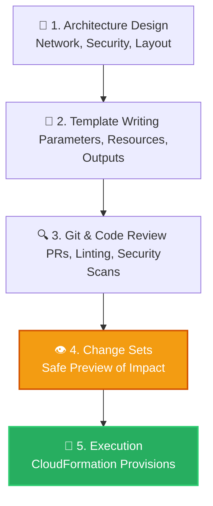

# 🚀 AWS Interview Question: CloudFormation Solution Lifecycle

**Question 10:** *What are the steps involved in a CloudFormation Solution?*

> [!NOTE]
> This is a Senior DevOps / Architect question. Standard engineers just talk about "writing code and clicking deploy." Architects talk about the *Enterprise Lifecycle*, which includes Architecture Design, Git Code Reviews, and Change Sets!

---

## ⏱️ The Short Answer
The AWS CloudFormation lifecycle in an enterprise environment follows a strict Infrastructure-as-Code (IaC) pipeline. It starts with Architecture Design, moves to writing the YAML/JSON template, tracking it via Git for peer reviews, validating and explicitly creating a **Change Set** to safely preview the impact, and finally executing the stack deployment.

---

## 📊 Visual Architecture Flow: The Enterprise CFN Lifecycle



---

## 🔍 Detailed Breakdown of the Steps

### 1. 📐 Requirement Gathering & Architecture Design
Before writing a single line of YAML, you must design the infrastructure.:
- **Actions:** Identify required AWS resources, define networking bounds (public/private subnets, IGWs, NATs), strict security controls (IAM Roles, Security Groups), and HA/Scaling strategies.
- **Identify AWS resources needed** (e.g., EC2, RDS, VPC, ALB).
- **Define networking architecture** (Public/Private subnets, IGW, NAT Gateways).
- **Identify security controls** (IAM roles, Security Group rules).
- **Example:** For a 3-tier application, you first conceptually design a Public ALB, Private EC2 App Servers, and a Multi-AZ RDS cluster.

### 2. 📝 Create the CloudFormation Template (YAML/JSON)
Write the highly declarative template.
- Define `Parameters` for dynamic environment inputs (InstanceType, EnvironmentName).
- Define the `Resources` referencing the architectural design.
- Define `Outputs` (e.g., Exporting the ALB DNS Name).
- Define `Mappings/Conditions` (e.g., environment specific values).

- **Snippet:**
```yaml
AWSTemplateFormatVersion: '2010-09-09'
Parameters:
  InstanceType:
    Type: String
Resources:
  MyEC2Instance:
    Type: AWS::EC2::Instance
```
### 3. ✅ Validate the Template
Test the code locally before deploying it.
- **Actions:** Use the AWS CLI to rigorously check syntax and verify logical references.
  `aws cloudformation validate-template --template-body file://template.yaml`
- **Benefit:** Explicitly prevents partial deployment failures caused by simple typos.


### 4. 🚀 Create Stack (Deployment)
Deploy the validated template to officially provision the resources.
- **Actions:** Execute via the AWS Console, AWS CLI, or ideally, an automated CI/CD pipeline.
- **Execution:** CloudFormation intelligently provisions all resources in the mathematically correct dependency order.

### 5. 📉 Monitor Stack Creation
Monitor the live events tab to ensure stable deployment.
- **Tracking States:** `CREATE_IN_PROGRESS` → `CREATE_COMPLETE`. 
- **Failure Handling:** If any single resource fails, CloudFormation triggers a `CREATE_FAILED` and automatically transitions into `ROLLBACK_IN_PROGRESS`.

### 6. 🔗 Stack Outputs & Integration
Expose key infrastructure attributes to be used by other systems.
- **Actions:** Use the `Outputs` section to export exactly what you need (e.g., ALB DNS names).
- **Benefit:** An independent "Networking Stack" can export its `VpcId`, dynamically imported by downstream "Application Stacks" using `Fn::ImportValue`.

### 7. 🔄 Stack Update (Change Management)
Modify live infrastructure safely without destroying state.
- **Actions:** Update the YAML file and deliberately generate a **Change Set**.
- **Change Sets:** Allow you to preview exactly what resources will be added, modified, or permanently deleted *before* executing the update.

### 8. 🗑️ Stack Deletion
Cleanly decommission environments that are no longer needed.
- **Actions:** Delete the root stack, and AWS recursively deletes every single resource tied to it.
- **Data Protection:** You can preserve critical databases using the `DeletionPolicy: Retain` attribute.
- **Benefit:** Temporary developer QA environments can be deleted with one click, leaving exactly zero hidden orphan resources.

---

### 1. 🔍 Source Control & Peer Review (Crucial Step)
Infrastructure code is still code.
- Commit the YAML file to a Git repository (GitHub/GitLab/CodeCommit).
- A Senior Engineer peer-reviews the Pull Request specifically checking for security flaws (e.g., open `0.0.0.0/0` ports or unencrypted S3 buckets).
- Automated CI/CD tools (like `cfn-lint` or `checkov`) officially validate the syntax.

### 2. 👁️ Create a Change Set (The Safety Net)
**Never deploy blindly.** 
- Before officially updating a live Production stack, explicitly generate a **Change Set**.
- A Change Set acts as a "Dry Run." It strictly shows you exactly what CloudFormation *intends* to do (e.g., *Modify 1 Security Group, Replace 1 EC2 Instance, Delete 1 IAM Role*).
- This absolutely prevents accidental database deletions or critical server replacements before they physically happen.

### 3. 🚀 Review and Execute
If the Change Set looks completely safe, the DevOps pipeline systematically executes the update. CloudFormation securely handles the strict dependency order and physical provisioning logic in the background.

---

## 🏢 The Ultimate Enterprise Workflow

In top-tier tech companies, a CloudFormation solution strictly follows this path:
1. **Design:** Architecture formally approved by security.
2. **Code:** Template cleanly written and pushed to Git.
3. **Review:** Code is peer-reviewed via a standard Pull Request (PR).
4. **Deploy:** CI/CD pipeline dynamically deploys the CloudFormation stack.
5. **Monitor:** CloudWatch Alarms natively monitor the created resources.
6. **Update:** Future updates are exclusively handled via CI/CD executing safe Change Sets.

## 🧠 Important Interview Edge Points (To Impress)

> [!IMPORTANT]
> **Final Interview-Ready Summary:**
> *"A complete CloudFormation solution is a strict lifecycle involving architecture design, template creation, CLI validation, automated deployment, comprehensive monitoring, lifecycle change management via Change Sets, and safe atomic deletion. Mastering this lifecycle enables strict infrastructure consistency, true version control, and absolute zero manual clicking errors."*

---

## 🎤 Final Interview-Ready Answer
*"An enterprise-grade CloudFormation solution lifecycle fundamentally begins with rigorous architecture design, followed cleanly by authoring declarative YAML templates. Critically, these templates are strictly tracked in Git version control for formal peer review and automated security linting. Before executing any production updates, we specifically mandatorily generate a CloudFormation Change Set to explicitly preview the blast radius and ensure zero critical resources are natively accidentally replaced or definitively deleted before final pipeline execution."*
