# 🚀 AWS Interview Question: AWS Config vs. AWS CloudTrail

**Question 11:** *How does AWS Config work with AWS CloudTrail?*

> [!NOTE]
> This is guaranteed to come up in any Security, Governance, or DevOps interview. Interviewers specifically want to see if you can naturally articulate the exact mathematical boundary between *activity auditing* (CloudTrail) and *state/configuration tracking* (AWS Config).

---

## ⏱️ The Short Answer
"AWS CloudTrail natively logs API activity (answering **Who did what?**), while AWS Config deeply tracks resource configuration state changes (answering **What specifically changed?**). Together, they inherently provide full end-to-end visibility for comprehensive auditing, strict compliance, and rapid security troubleshooting in enterprise AWS environments."

---

## 📊 Visual Architecture Flow: The Security Investigation

```mermaid
sequenceDiagram
    participant User as 🧑‍💻 Compromised Dev
    participant API as 🌐 AWS API
    participant CT as 🕵️‍♂️ AWS CloudTrail
    participant Config as ⚙️ AWS Config
    
    User->>API: Execute: AuthorizeSecurityGroupIngress (Open Port 22)
    
    rect rgb(40, 44, 52)
    Note over API,CT: The "Who and When"
    API-->>CT: Log Event: user=devops-user, IP=192.168.1.5, Time=02:15AM
    end
    
    rect rgb(139, 0, 0)
    Note over API,Config: The "What Changed"
    API-->>Config: Detect State Change: Port 22 changed to 0.0.0.0/0
    Config->>Config: Evaluate against Corporate Rule: "No Open SSH"
    Config--xConfig: Flag Resource as NON-COMPLIANT 🔴
    end
```

---

## 🔍 Detailed Explanation

While they are profoundly complementary services, they have distinctly different tactical roles in AWS Governance.

### 🕵️‍♂️ 1. AWS CloudTrail *(Who did what?)*
CloudTrail provides the immutable event history of your actual AWS account activity, perfectly capturing actions successfully taken through the Management Console, AWS SDKs, automated CLI scripts, and backend AWS services.
- **The Core Function:** It explicitly tracks identity API calls.
- **What it securely records:** 
  - *Who* exactly made the change (IAM User, Assumed Role, or AWS Service).
  - *What* exact API action was formally requested (e.g., `StopInstances`, `DeleteBucket`, `AuthorizeSecurityGroupIngress`).
  - *When* the action structurally happened (UTC Timestamp).
  - *From where* it physically happened (Source IP address and User Agent).

### ⚙️ 2. AWS Config *(What changed?)*
AWS Config is a deeply integrated service that natively enables you to carefully assess, logically audit, and strictly evaluate the specific configurations of your AWS resources over time.
- **The Core Function:** It explicitly tracks physical configuration state changes.
- **What it securely records:** 
  - What the exact *previous* JSON configuration of the affected resource was.
  - What the specific *new* JSON configuration fundamentally is.
  - A highly visual historical timeline of these distinct state changes.
  - Whether the physical resource is currently *Compliant* or *Non-compliant* based on your custom Security Rules (e.g., `encrypted-volumes-only`).

---

## 🆚 Feature Comparison Table

| Feature | 🕵️‍♂️ AWS CloudTrail | ⚙️ AWS Config |
| :--- | :--- | :--- |
| **Core Focus** | Immutable API Activity & Identity Authorization | Resource State & Compliance Rules |
| **Primary Question** | *"Who actively made the API call?"* | *"What exactly is the new configuration state?"* |
| **What is Logged?** | IAM Identity, API action, Timestamp, and origin IP address | Structural configuration drift and physical state changes |
| **Visual Output** | Raw JSON API audit logs | Visual timeline of changes & boolean Compliance flags |

### 🔗 The Combined Enterprise Flow
1. A developer fundamentally modifies a critical resource (e.g., explicitly opens port 22 to `0.0.0.0/0` in a core Security Group via the web console).
2. **CloudTrail** instantly flawlessly logs: User `devops-user` explicitly triggered the `AuthorizeSecurityGroupIngress` active API call from origin IP `192.168.1.5`.
3. **AWS Config** instantly logically logs: The specific Security Group's structural state abruptly transitioned from "Closed" to "Open to 0.0.0.0/0 on Port 22" and visually forcefully flags the specific resource as heavily **Non-compliant**.

---

## 🏢 Real-World Production Scenario

**Scenario: A Critical Security Incident Investigation**
A highly stressed SecOps team gets an automated P1 alert that SSH Port 22 is dangerously fully open to the entire public internet on a core Tier-1 production Security Group. 

**The Investigation Timeline:**
1. **Initial Discovery (AWS Config):** The security team naturally checks AWS Config first. Config visually highlights the exact clear timeline: Right before 2:15 AM, the SG was properly locked down to the firm's strict VPN IP. Precisely at 2:15 AM, the underlying state suddenly changed to `0.0.0.0/0`. Config actively flagged it natively as strongly *Non-compliant*.
2. **Finding the Culprit (AWS CloudTrail):** The team instantly pivots precisely to AWS CloudTrail, strictly filtering specifically for the `AuthorizeSecurityGroupIngress` action logically around 2:15 AM. CloudTrail reveals that a junior engineer's compromised IAM User (`user123`) executed the critical change.
3. **The Immediate Remediation:** 
    - The team deletes the vulnerable open rule manually.
    - They invalidate `user123`'s active security credentials globally.
    - They natively practically implement a proactive automated **AWS Config Rule**: *"No Security Group should literally ever purposefully allow 0.0.0.0/0 on internal port 22,"* which will structurally seamlessly cleanly automatically remediate similar issues entirely in the future autonomously utilizing isolated SSM Automation runbooks.

## 🧠 Important Interview Edge Points (To Impress)

> [!IMPORTANT]
> **Enterprise Key Takeaways:**
> - ✔️ **CloudTrail** = User Identity & Core API Activity Logging.
> - ✔️ **AWS Config** = Resource Configuration State Tracking & Rule Enforcement.
> - ✔️ **Combined** = The absolute ultimate framework for deeply comprehensive security incident investigations, strict ISO/SOC external compliance audits, and bulletproof enterprise resource governance.

---

## 🎤 Final Interview-Ready Answer
*"CloudTrail natively fundamentally logs API activity and identity authorization, concretely mathematically answering 'Who did what and from where?'. Conversely, AWS Config deeply tracks the actual physical resource configuration state drift over time, cleanly answering 'What specifically changed structurally?'. Together, they functionally explicitly uniquely fundamentally definitively naturally flawlessly provide absolute end-to-end security compliance visibility securely tracking exactly what an engineer broke and dynamically auditing exactly who inherently affirmatively broke it."*
