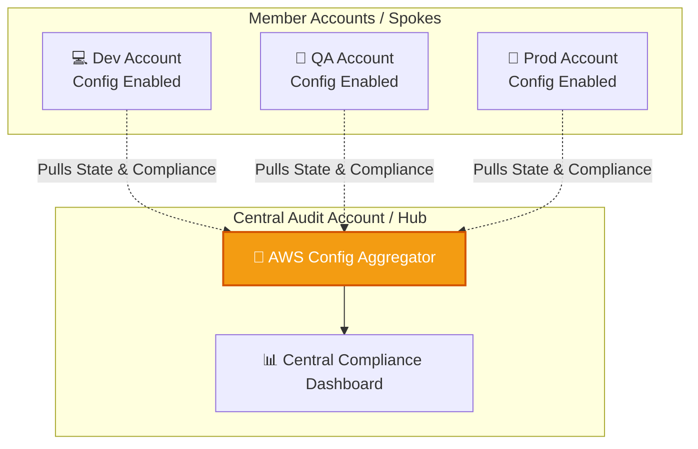

# 🚀 AWS Interview Question: AWS Config Multi-Account Aggregation

**Question 12:** *Can AWS Config aggregate data across different AWS accounts?*

> [!NOTE]
> This is a Senior Cloud Engineer question. Scaling compliance across organizations is a critically highly valued skill in enterprise DevOps. Interviewers want to hear the keywords: **Config Aggregator** and **AWS Organizations**.

---

## ⏱️ The Short Answer
**Yes.** AWS Config natively supports cross-account and cross-region data aggregation using a feature called **AWS Config Aggregator**. It enables centralized visibility of resource configurations, compliance states, and change histories across hundreds of AWS accounts simultaneously.

---

## 📊 Visual Architecture Flow: Config Aggregator

---

## 🔍 What is AWS Config Aggregator?
AWS Config Aggregator is a centralized compliance dashboard feature that allows a Security or Governance team to collect, view, and query configuration and compliance data from multiple member accounts funneling into a single delegated administrator account.

### ⚙️ How It Works
1. **The Hub:** Create a central aggregator in your designated Security/Compliance AWS account.
2. **The Spokes:** Enable AWS Config recording natively in all target member accounts.
3. **The Authorization:** Grant the aggregator permission to inherently pull data using **AWS Organizations** (highly preferred) or manual IAM role-based access.
4. **The Pull:** The Aggregator continuously pulls securely resource configurations, compliance statuses against rules, and historical timelines.

### 🛠️ Key Capabilities
- **Multi-Account/Multi-Region Visibility:** A true logically single pane of glass.
- **Advanced Queries:** Query the aggregated data seamlessly using SQL-like syntax (e.g., *“Show me every unencrypted EC2 volume across all 50 accounts”*).
- **Security Hub Integration:** Feeds compliance findings heavily directly into AWS Security Hub securely.

---

## 🏢 Real-World Enterprise Production Scenario

**Scenario:** An enterprise securely has 50 AWS accounts separated thoroughly by department (`Dev`, `QA`, `Production`, `Security`, etc.).
**The Problem:** The Security team is mandated to accurately ensure NO S3 buckets are explicitly public, and ALL EC2 volumes are specifically encrypted. Manually logging into 50 separate AWS accounts securely to distinctly selectively evaluate these safely is strictly explicitly functionally impossible manually.
**The Solution:**
1. Enable AWS Config across exactly all 50 smoothly accounts proactively.
2. Deploy explicitly an **Aggregator** exclusively structurally into the central Security Account.
3. Apply inherently AWS natively Managed Rules centrally like `s3-bucket-public-read-prohibited` and `restricted-ssh`.

**The Result:** 
- ✔️ A single dashboard showing global compliance.
- ✔️ Instant detection of violations.
- ✔️ Permanent audit-readiness for SOC2, ISO, and PCI.
- ✔️ No need to log into each account.

---

## 🧠 Advanced Architect Insight (Pro Tip)

> [!TIP]
> **To truly impress your interviewer, mention these integrations:**
> 1. **AWS Organizations Integration:** Automatically includes newly vended accounts in the compliance sweep without manual intervention.
> 2. **Security Hub:** Combine Config Aggregator with Security Hub to translate raw compliance rules into a standardized security posture score.
> 3. **SQL Queries:** Use **Advanced Queries** to run ad-hoc compliance checks instantly across the aggregate data pool when responding to zero-day vulnerabilities.

