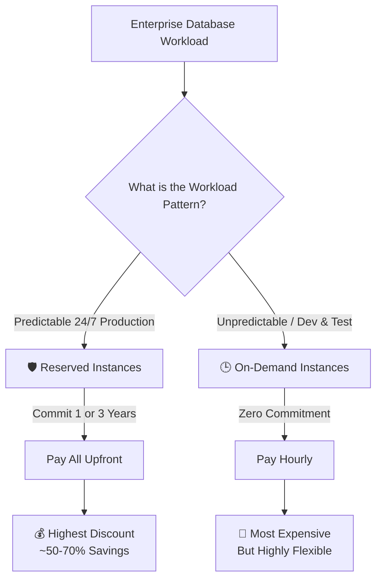

# 🚀 AWS Interview Question: Reserved vs. On-Demand DB Instances

**Question 13:** *How are reserved instances different from on-demand DB instances?*

> [!NOTE]
> This is a FinOps (Cloud Cost) question. Companies want engineers who can build efficiently.

---

## ⏱️ The Short Answer
**On-Demand DB instances** are flexible, have zero commitment, and are billed hourly (expensive). **Reserved DB Instances (RIs)** require a 1-year or 3-year commitment but offer huge cost savings (up to 70%). Production uses RIs; Dev/Test uses On-Demand.

---

## 📊 Visual Architecture Flow: DB Pricing Models

---

## 🔍 Detailed Explanation

### 1. 🕒 On-Demand DB Instances
- **Cost:** Highest baseline cost.
- **Commitment:** None. You can start, stop, or terminate the database anytime.
- **Best For:** Short-term projects, Dev/Test environments, and highly unpredictable workloads.

### 2. 🛡️ Reserved DB Instances (RIs)
- **Cost:** Up to 70% discount. Payment options include No Upfront, Partial Upfront, or All Upfront.
- **Commitment:** Requires a strict 1-year or 3-year contract.
- **Best For:** Long-running, 24/7 production databases with predictable traffic patterns.

---

## 🆚 Feature Comparison Table

| Feature | 🕒 On-Demand DB | 🛡️ Reserved DB (RIs) |
| :--- | :--- | :--- |
| **Cost Profile** | Highest Baseline | Highly Discounted |
| **Commitment** | None (Cancel anytime) | 1 Year or 3 Years |
| **Flexibility** | Extremely High | Very Limited |
| **Primary Use Case** | Testing, Staging, QA | 24/7 Enterprise Production |

---

## 🏢 Enterprise Production Scenario

**Scenario:** A rapidly scaling SaaS Application needs a dedicated MySQL production database running 24/7 indefinitely.
- ❌ **If using On-Demand:** Yearly cost = ~₹6,00,000.
- ✅ **If using a 3-Year Reserved Instance:** Yearly cost = ~₹3,00,000.
**The Result:** By switching a stable production workload to RIs, the DevOps team successfully saves the company **₹3,00,000 per year** on a single database.

---

## 🧠 Advanced Architect Insight

> [!WARNING]
> **The Critical Trap:** Reserved Instances are **not** physical instances. They are simply a *billing discount* applied automatically to matching on-demand instances currently running in your account. You do not "boot up" a reserved instance; your bill simply drops for any instance that identically matches your active RI contract.

---

> [!TIP]
> **Pro Tip:** "In enterprise tech, we heavily purchase RIs for static Production databases to slash baseline costs, while keeping Developer databases On-Demand so we can shut them down via automation natively on weekends."

## 🎤 Final Interview-Ready Answer
*"On-Demand database instances provide maximum architectural flexibility with absolutely zero term commitment, but they functionally incur the highest hourly costs. Conversely, Reserved Instances logically require a rigid 1-year or 3-year billing commitment but securely offer massive cost savings reaching up to 70 percent. In real enterprise production environments with highly predictable continuous workloads, we exclusively purchase Reserved Instances to drastically optimize cloud billing."*
