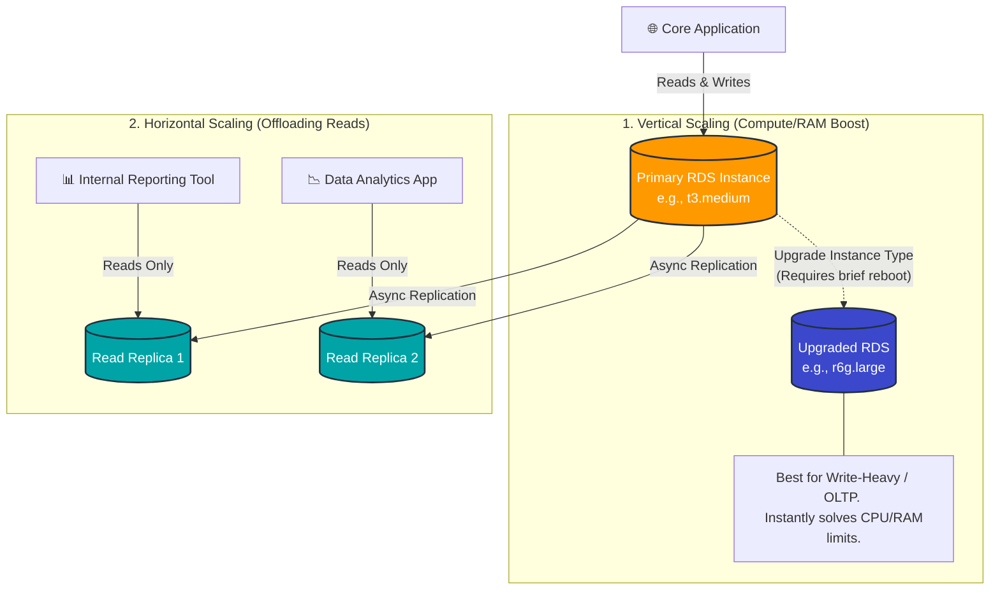

# 🚀 AWS Interview Question: RDS Scaling Strategies

**Question 14:** *Which type of scaling would you recommend for RDS and why?*

> [!NOTE]
> This is a crucial database architecture question. Interviewers want to see that you understand the difference between *Vertical Scaling* (for raw compute/memory) and *Read Replicas* (for read-heavy workloads), as well as avoiding the common trap of confusing scaling with Multi-AZ HA.

---

## ⏱️ The Short Answer
"The recommendation depends entirely on the workload bottleneck. For heavy transactional processing (writes), I recommend **Vertical Scaling** (increasing instance compute size). For analytics or read-heavy reporting, I recommend **Horizontal Scaling** using Read Replicas. Additionally, **Storage Auto Scaling** should always be enabled to prevent disk-full downtime."

---

## 📊 Visual Architecture Flow: RDS Scaling

---

## 🔍 Detailed Explanation

Amazon RDS handles scaling very differently than stateless web servers like EC2. You must systematically choose the right tool for the specific bottleneck.

### 1. 📈 Vertical Scaling (Primary Compute Recommendation)
Increasing the physical instance size (CPU, RAM, Network Baseline capacity).
- **Example:** Scaling up from `db.t3.medium` (2 vCPUs, standard memory) to `db.r6g.large` (2 vCPUs, highly optimized memory).
- **Why it's recommended:** Extremely simple to implement (a single API call or console click). It fundamentally requires strictly zero application code changes and provides an immediate massive performance boost for single-node OLTP transactional workloads.
- **When to use:** When CloudWatch metrics clearly show high CPU utilization (90%+), severe persistent memory pressure, or maxed-out DB network connections.

**🏢 Production Scenario:** A critical fintech app experiences massive 95% CPU spikes during peak market trading hours, inherently causing terrible API latency. 
*Solution:* Upgrade the instance vertically from `m5.large` → `r6.xlarge` during a predefined architectural maintenance window.

### 2. 🔀 Horizontal Scaling (Read Replicas)
Distributing heavy *read* traffic securely across up to 15 fully managed Read Replicas.
- **Why it's used:** It radically reduces the I/O load organically on the Primary DB, fundamentally allowing the primary node to focus exclusively on fast, critical transactional writes.
- **When to use:** When you specifically have read-heavy workloads (analytics dashboards, massive daily scheduled BI reports, complex dataset queries).

**🏢 Production Scenario:** An e-commerce platform's Primary DB crashes daily due to massive internal marketing reporting queries.
*Solution:* Create 2 Read Replicas and route all internal reporting application queries structurally directly to the distinct replica endpoints. The Primary DB is saved entirely.

### 3. 💾 Storage Auto Scaling
Automatically dynamically allocating more underlying EBS disk space to the RDS instance exactly when it runs dangerously low.
- **Why it's crucial:** A relational database *will instantly crash* if the disk functionally hits 100% capacity. Enabling this prevents catastrophic downtime seamlessly with zero manual late-night engineering intervention.

---

## 🚫 What NOT to Use for Scaling

> [!WARNING]
> **The Interview Trap:** *Never* arbitrarily say you use "Multi-AZ" for scaling! Multi-AZ is strictly exclusively a **High Availability / Disaster Recovery** mechanism. Your application absolutely cannot read from or write to the synchronous standby database. It exists purely for automated failover.

---

## 🧠 Advanced Architect Insight (Pro Tip to Impress)

> [!IMPORTANT]
> **The Perfect Enterprise Production Setup:**
> When a senior interviewer specifically asks what the ultimate database architecture honestly is, tell them you flawlessly combine all mechanisms harmoniously:
> 1. Use **Vertical Scaling** specifically to ensure baseline raw transaction performance.
> 2. Attach **Read Replicas** strictly to offload heavy reporting/analytical traffic.
> 3. Enable **Multi-AZ** natively for bulletproof High Availability failover contingencies.
> 4. Activate **Storage Auto Scaling** for 100% hands-free reliability against disk exhaustion.

---

## 🎤 Final Interview-Ready Answer
*"For RDS, I recommend vertical scaling for performance improvements because it is fundamentally simple and strictly requires no application changes. For read-heavy workloads, I securely use read replicas for horizontal scaling. Additionally, I explicitly natively enable storage auto scaling to proactively prevent any disk-related downtime."*
