# 🚀 AWS Interview Question: RDS Maintenance Windows

**Question 15:** *What is a maintenance window in Amazon RDS? Will the DB be available?*

> [!NOTE]
> This is a critical operations question. Interviewers use this to identify whether you understand how AWS automatically handles OS patching, database engine upgrades, and hardware replacement—and more importantly, how you architect around the inevitable downtime.

---

## ⏱️ The Short Answer
An Amazon RDS maintenance window is a predefined 30-minute block of time during which AWS applies system modifications, security patches, or database engine upgrades to your instance. During this window, your database **will experience brief downtime** (typically a few minutes) while the instance reboots, unless you have specifically architected for High Availability using a **Multi-AZ** deployment to mitigate the impact.

---

## 📊 Visual Architecture Flow: Multi-AZ Maintenance 

```mermaid
sequenceDiagram
    participant App as 🌐 Application
    participant Route53 as 🔀 RDS DNS Endpoint
    participant Primary as 🗄️ Primary DB (AZ-A)
    participant Standby as 🗄️ Standby DB (AZ-B)

    Note over Primary,Standby: 🕒 Maintenance Window Begins
    
    rect rgb(40, 44, 52)
    Note right of Standby: 1. AWS applies patches to Standby first.
    Standby-->>Standby: Patching & Rebooting...
    end
    
    rect rgb(139, 0, 0)
    Note left of Primary: 2. AWS briefly takes Primary offline.
    Primary--xPrimary: Primary Offline (Patching begins)
    end
    
    rect rgb(0, 100, 0)
    Note over Route53,Standby: 3. Automatic Failover triggers (60-120s)
    Route53->>Standby: DNS CNAME points to Standby
    App->>Route53: App reconnects
    Route53->>Standby: Traffic flows to new Primary
    end
    
    rect rgb(40, 44, 52)
    Note left of Primary: 4. Patches applied to old Primary. <br/> It now becomes the new Standby.
    Primary-->>Primary: Patching & Rebooting...
    end
```

---

## 🔍 Detailed Explanation

### 1. 🕒 What Exactly is the Maintenance Window?
Every RDS instance has a weekly maintenance window (e.g., Sunday 02:00 UTC to 02:30 UTC). AWS uses this time to apply critical changes that cannot be performed while the database is actively serving traffic.
- **What happens:** OS-level security patches, DB engine version upgrades, and hardware replacements.
- **Can you skip it?** You can arbitrarily defer *optional* upgrades, but mandatory security patches will eventually be forced by AWS. You control *when* it happens by defining the 30-minute window in your settings.

### 2. 🔌 Will the DB Be Available? (Single-AZ vs. Multi-AZ)
The availability of your database during this window depends entirely on your architecture:

#### ❌ Single-AZ Deployment (Downtime Expected)
If your database is entirely contained in a single Availability Zone, it **will go offline**. The database engine is physically stopped, patches are applied to the OS, and the instance is rebooted. Your application will completely fail Database connection requests during this time (usually 1–5 minutes depending on the patch).

#### ✅ Multi-AZ Deployment (Minimized Downtime)
If your database is configured for Multi-AZ, AWS executes a brilliant rolling upgrade sequence that drastically minimizes downtime:
1. AWS patches the **Standby** instance first.
2. AWS forces a **Failover**. The newly-patched Standby becomes the new Primary instance.
3. The application experiences a very brief interruption (typically 60–120 seconds) while the DNS `CNAME` abruptly propagates to the new Primary.
4. AWS then patches the old Primary, which quietly becomes the new Standby.

---

## 🏢 Real-World Production Scenario

**Scenario:** A massive global E-Commerce ticketing application processing thousands of orders.
**The Problem:** AWS heavily mandates a critical underlying OS security patch that requires an unavoidable reboot.
**The Execution:**
- The skilled DevOps team purposefully schedules the RDS maintenance window for **Tuesday at 3:00 AM**, strictly historically analyzing traffic patterns to confirm this is the absolute lowest period of customer activity.
- The database is heavily configured for **Multi-AZ**.
**The Result:** At exactly 3:00 AM, the standby is seamlessly patched, and AWS triggers a failover. A handful of user requests natively fail for 60 seconds (which the application handles safely utilizing aggressive retry logic), and the entire massive platform remains structurally fully operational without waking up any engineers.

---

## 🧠 Important Interview Edge Points (To Impress)

> [!WARNING]
> **The App-Level Retry Catch:**
> Do not simply state "Multi-AZ prevents downtime." A spectacular candidate explicitly mentions that while Multi-AZ reduces the outage to ~60 seconds, **the application code itself must possess exponential backoff and connection retry logic**, otherwise the application will catastrophically crash when the physical DB socket connection abruptly drops during the automatic failover.

---

## 🎤 Final Interview-Ready Answer
*"A maintenance window natively is a predefined weekly 30-minute period specifically where Amazon AWS formally applies OS patches, hardware replacements, or DB engine upgrades. During this specific window, the database will inherently experience a brief period of downtime. However, in enterprise environments, we strictly configure RDS for Multi-AZ. This inherently forces AWS to organically patch the standby database completely first, and then explicitly seamlessly failover, safely minimizing total operational customer downtime to roughly 60 seconds during strictly scheduled off-peak hours."*
