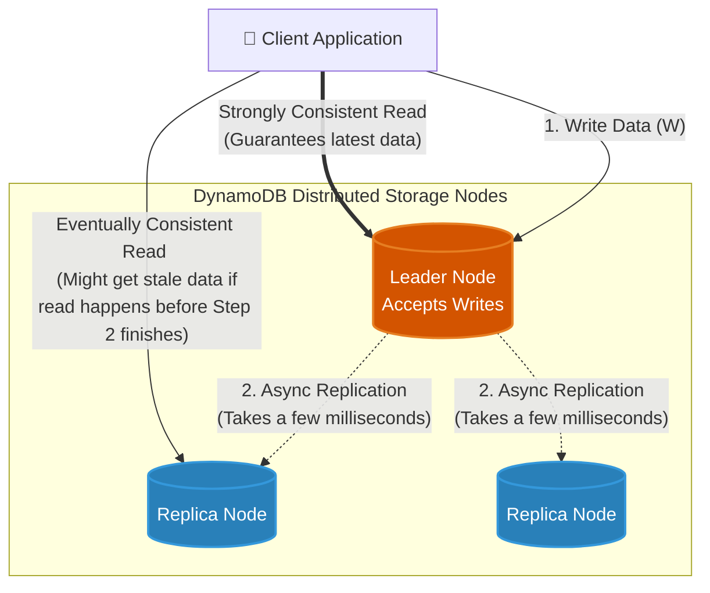

# 🚀 AWS Interview Question: DynamoDB Consistency Models

**Question 16:** *What are the consistency models in DynamoDB?*

> [!NOTE]
> This is a crucial NoSQL database architecture question. Interviewers use this to determine if you understand the trade-offs between read performance, pricing, and data accuracy in distributed systems.

---

## ⏱️ The Short Answer
Amazon DynamoDB supports two read consistency models: **Eventually Consistent Reads** (the default) and **Strongly Consistent Reads**. Eventual consistency guarantees speed and lower costs but might return slightly stale data. Strong consistency guarantees returning the absolute latest data strictly written, but uses more capacity and has slightly higher latency.

---

## 📊 Visual Architecture Flow: Read Consistency

---

## 🔍 Detailed Explanation

When you write data to DynamoDB, it is stored across three geographically distributed storage nodes to ensure High Availability. Because data replication across these nodes takes a few milliseconds, you have a choice in how you logically read that data back.

### 1. ⚡ Eventually Consistent Reads (The Default)
When you request an eventually consistent read, DynamoDB routes your read request to *any* of the three storage nodes.
- **The Catch:** If you read the exact same data immediately after writing it, the node you hit might not have received the latest replicated copy yet. You might get "stale" data from 1 second ago.
- **The Benefit:** It is lightning fast, highly available, and **costs 50% less** in Read Capacity Units (RCUs) compared to strong consistency.

### 2. 🛡️ Strongly Consistent Reads
When you explicitly request a strongly consistent read (`ConsistentRead=True`), DynamoDB forces the read query to exclusively hit the primary Leader Node that holds the most recent successful write.
- **The Catch:** It requires more network routing logic, incurs higher latency, costs exactly **double the RCUs**, and if the primary node is temporarily unavailable (network partition), the read will outright fail (HTTP 500) rather than return stale data.
- **The Benefit:** It 100% guarantees you will receive the absolute most up-to-date data. No stale reads.

---

## 🆚 Feature Comparison Table

| Feature | ⚡ Eventually Consistent (Default) | 🛡️ Strongly Consistent |
| :--- | :--- | :--- |
| **Data Freshness** | Might be slightly stale (milliseconds) | Guaranteed 100% accurate |
| **Read Capacity Unit (RCU) Cost** | 0.5 RCU per 4KB read | 1.0 RCU per 4KB read (Double the cost) |
| **Latency** | Lowest possible latency | Slightly higher latency |
| **Availability** | Highest | Can fail if network delays occur |

---

## 🏢 Real-World Production Scenario

### Scenario 1: The Banking Application (Strong Consistency)
- **The Setup:** A core banking application is processing real-time fund transfers.
- **The Execution:** A user deposits $500, and immediately refreshes the page to see their new balance.
- **The Architecture Choice:** The developers **must** use **Strongly Consistent Reads**. If they used eventual consistency, the user might securely deposit the money, refresh, and maliciously or confusingly see their old balance because the read hit a replica that was 100 milliseconds behind. Financial apps absolutely require 100% consistency.

### Scenario 2: The Social Media Analytics Engine (Eventual Consistency)
- **The Setup:** An application is counting the number of "Likes" on a viral video.
- **The Execution:** The video is receiving thousands of likes per second.
- **The Architecture Choice:** The developers use **Eventually Consistent Reads**. If a user refreshes the page and sees 1,005,000 likes instead of the actual 1,005,012 likes, it does not negatively impact the business logic at all. Using eventual consistency here saves 50% on database reading costs at a massive scale.

---

## 🧠 Important Interview Edge Points (To Impress)

> [!WARNING]
> **Global Tables Trap:**
> If an interviewer asks you about DynamoDB Global Tables (multi-region active-active replication), strictly point out that **Strongly Consistent Reads are NOT supported across different AWS Regions**. Strong consistency only logically works within the *same* AWS Region.

---

## 🎤 Final Interview-Ready Answer
*"DynamoDB physically replicates data across three storage nodes, creating a slight delay. Because of this, it elegantly offers two read models: **Eventually Consistent Reads**, which are the default, offering the lowest latency and 50% half-price RCU costs at the risk of returning slightly stale data. The alternative is **Strongly Consistent Reads**, which explicitly hit the primary node to functionally guarantee returning the absolute most recent successful write, but at the cost of double the RCUs and slightly higher latency. In production, we strictly use Strong Consistency for critical financial states like banking balances, and Eventual Consistency for highly scalable analytical dashboards where mild staleness is completely acceptable."*
