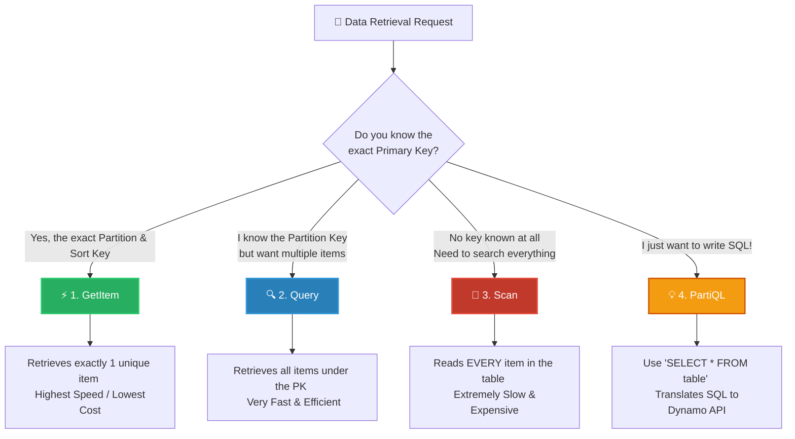

# 🚀 AWS Interview Question: DynamoDB Query Functionality

**Question 17:** *What type of query functionality does DynamoDB support?*

> [!NOTE]
> This is a fundamental database performance question. DynamoDB is not a relational SQL database; it fundamentally operates differently. Interviewers use this question to see if you understand the massive cost and performance differences between a proper `Query` and a dangerous `Scan`.

---

## ⏱️ The Short Answer
Amazon DynamoDB supports four primary ways to read data: **GetItem** (fetches a single exact item), **Query** (fetches multiple items sharing the same Partition Key), **Scan** (reads the entire table, which is slow and expensive), and **PartiQL** (allows you to write SQL-compatible statements against DynamoDB). 

---

## 📊 Visual Architecture Flow: DynamoDB Retrieval Decisions

---

## 🔍 Detailed Explanation of the Query Types

### 1. ⚡ GetItem (The Sniper)
The absolute most efficient way to get data out of DynamoDB.
- **How it works:** You must provide the *exact* Primary Key (Partition Key + Sort Key). 
- **The Result:** It reaches directly into the specific physical storage node and returns a maximum of 1 item in single-digit milliseconds.

### 2. 🔍 Query (The Efficient Search)
Used to retrieve multiple items that logically belong to the exact same partition.
- **How it works:** You *must* provide the Partition Key. You can optionally provide Sort Key conditions (e.g., `SortKey > 10` or `begins_with(SortKey, "2024")`).
- **The Result:** It is highly efficient because DynamoDB directly navigates to the physical location of the Partition Key and purely sweeps the sorted data block.

### 3. 🐢 Scan (The Sledgehammer)
The most dangerous operation in DynamoDB.
- **How it works:** You provide absolutely no keys. DynamoDB physically reads *every single item* in the entire database table.
- **The Catch:** Even if you use a `FilterExpression` to only show 5 matching results to the user, AWS fundamentally charges you for reading the entire 100-Gigabyte table! It will completely exhaust your Read Capacity Units (RCUs) and throttle your production application.

### 4. 💡 PartiQL (The SQL Bridge)
A feature allowing SQL-compatible queries on DynamoDB.
- **How it works:** You write commands like `SELECT * FROM "Orders" WHERE OrderId = '123'`.
- **The Catch:** This does not magically turn DynamoDB into MySQL. Under the hood, AWS simply takes your SQL statement and translates it strictly into a `GetItem`, `Query`, or `Scan` API path.

---

## 🏢 Real-World Production Scenario

**Scenario: A Massive Global Multiplayer Gaming Application**
- **The Setup:** A game stores player metrics in a `PlayerStats` table. The Partition Key is `PlayerID` and the Sort Key is `GameSessionID`.
- **The Actions:** 
  1. A player loads their profile. The app logically uses **Query** strictly targeting `PlayerID = 'Gamer123'` to fetch and load all their past game sessions into the UI instantly.
  2. The player wants to view a specific match summary. The app uses **GetItem** targeting `PlayerID = 'Gamer123'` and `GameSessionID = 'Match-987'` to retrieve the exact scoreboard with zero RCU waste.
- **The Trap Avoided:** A junior developer initially tried to build a "Global Top 10 Leaderboard" by using a **Scan** on the `PlayerStats` table. The lead architect rejects the Pull Request explaining that Scanning millions of rows will instantly crash the database and cost thousands of dollars. (Instead, they use an entirely separate *Global Secondary Index*).

---

## 🧠 Important Interview Edge Points (To Impress)

> [!WARNING]
> **The Scan Limits Trap:**
> If an interviewer asks you what happens if you run a `Scan` or `Query` on a massive table, you strongly specify that they explicitly inherently top out at **1 MB of data per requested operation**. If the database matches more than 1 MB, DynamoDB physically returns a `LastEvaluatedKey`, forcing your Application Code to programmatically implement manual Pagination (`Do...While` loops) to effectively retrieve the rest of the logically remaining data.

---

## 🎤 Final Interview-Ready Answer
*"Amazon DynamoDB natively supports four core data retrieval methods. **GetItem** is fundamentally the most efficient, directly retrieving exactly one item using its full Primary Key. **Query** explicitly finds multiple interrelated items utilizing a known Partition Key. Conversely, **Scan** reads the entire physical table sequentially, making it incredibly slow and expensive for production reads. Finally, **PartiQL** enables engineers to use familiar SQL statements to interact with DynamoDB, though it translates into the native API calls under the hood."*
