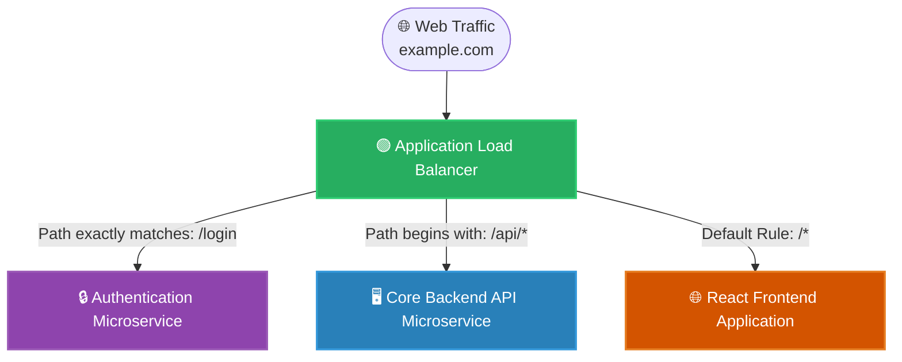

# 🚀 AWS Interview Question: Load Balancer Use Cases

**Question 19:** *What are the different specific uses of AWS load balancers?*

> [!NOTE]
> While the previous question tested your theoretical knowledge of OSI Layers, this question explicitly tests your **architectural application**. Interviewers want to hear exactly *when* and *why* you deploy a specific Load Balancer in a real-world enterprise setting.

---

## ⏱️ The Short Answer
The **Application Load Balancer (ALB)** is used for intelligent, content-based routing (e.g., directing traffic to different microservices based on the URL path). The **Network Load Balancer (NLB)** is fundamentally used for high-performance, ultra-low latency TCP applications that rigidly require static IP addresses. The **Classic Load Balancer (CLB)** is exclusively used to temporarily support outdated legacy applications running on obsolete EC2-Classic networks.

---

## 📊 Visual Architecture Flow: ALB Content-Based Routing

---

## 🔍 Detailed Practical Use Cases

### 🟢 1. The ALB Use Case: Content-Based Microservice Routing
The ALB is the absolute backbone of modern cloud-native applications (ECS, EKS, Serverless).
- **The Core Capability:** It natively supports **Path-Based Routing** and **Host-Based Routing**.
- **Practical Use:** Instead of running massive monolithic backend servers, you can break your architecture logically into tiny, cheap microservices. You place exactly *one* unified ALB in front of them all. The ALB inherently inspects the HTTP request and flawlessly routes the packet physically to the exactly correct Target Group.
- **Bonus Feature:** It natively supports WebSocket connections and securely integrates with AWS WAF flawlessly out-of-the-box to block SQL injections directly at the edge.

### 🔵 2. The NLB Use Case: Ultra-Low Latency & Static IPs
The NLB definitively does not care about what URL the user typed. It only cares about raw speed.
- **The Core Capability:** It safely operates at the transport layer, easily blasting millions of packets concurrently through highly stable TCP/UDP connections.
- **Practical Use:** Financial Trading Platforms heavily rely on NLBs because executing high-frequency trades requires network latency measured in microseconds.
- **Static IP Requirement:** Many enterprise firewalls strictly require the destination to have statically fixed IP addresses. ALBs cannot support this correctly. NLBs flawlessly provide exactly one permanently fixed Elastic IP per Availability Zone.

### 🔴 3. The CLB Use Case: Legacy Support
Do not use this for anything. It is fully deprecated.
- **Practical Use:** It attempts to blend TCP and HTTP but lacks the complex rule sets of the ALB and the raw speed of the NLB. Use solely to maintain 2009-era EC2-Classic infrastructure if perfectly required by an archaic enterprise architecture.

---

## 🎤 Final Interview-Ready Answer
*"An Application Load Balancer is specifically used for intelligent content-based routing—making it the de facto choice for directing HTTP requests to separate containerized microservices based on specific URL paths or host headers. The Network Load Balancer is used explicitly when an application heavily requires static IP addresses or strictly demands millions of raw TCP connections per second with ultra-low latency, such as high-frequency financial trading servers. The Classic Load Balancer is fundamentally deprecated and is naturally never used in modern cloud deployments."*
