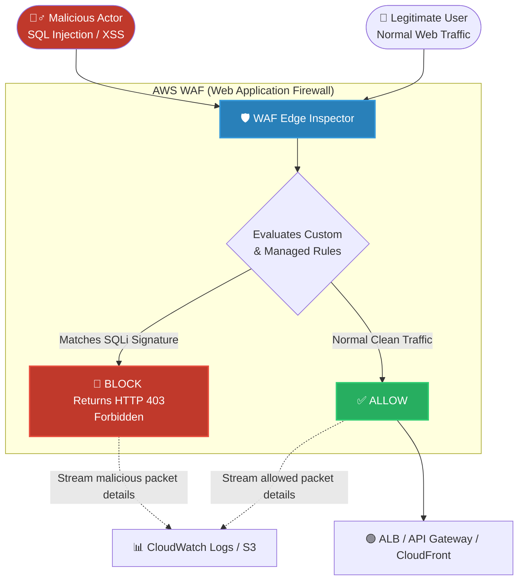

# 🚀 AWS Interview Question: AWS WAF and Application Monitoring

**Question 20:** *How can you use AWS WAF in monitoring your AWS applications?*

> [!NOTE]
> This is a Security/SecOps question. AWS WAF (Web Application Firewall) is not a standalone resource; it must be attached to specific edge services. Interviewers are checking to see if you know *where* it attaches and *how* it logs attacks.

---

## ⏱️ The Short Answer
AWS WAF proactively monitors and filters incoming web traffic by attaching strictly to an Application Load Balancer (ALB), API Gateway, or Amazon CloudFront. It evaluates HTTP requests against custom or Managed Rules to flawlessly block common exploits like SQL Injection (SQLi) and Cross-Site Scripting (XSS). Critically, it streams detailed logs of all blocked and allowed packets directly to CloudWatch Logs or Amazon S3 for centralized real-time security monitoring.

---

## 📊 Visual Architecture Flow: AWS WAF Inspection

---

## 🔍 Detailed Explanation

### 1. 🛡️ What Exactly Does AWS WAF Protect Against?
Unlike a standard Security Group (which only blocks IPs and Ports), AWS WAF deeply inspects the actual Layer 7 application payload.
- **SQL Injection (SQLi):** Blocks attackers trying to append `OR 1=1` to form fields.
- **Cross-Site Scripting (XSS):** Blocks attackers trying to inject `<script>` tags into URLs.
- **Rate-Based Rules:** Automatically blocks an IP address if it sends more than 100 requests in 5 minutes (preventing brute-force attacks).
- **Managed Rule Groups:** You can subscribe to AWS-maintained rule sets (like the *Core Rule Set* or *Known Bad Inputs* rule set) which automatically update daily as new global CVEs are discovered.

### 2. 📡 Where Do You Attach AWS WAF?
A WAF cannot protect an EC2 instance directly. You must natively attach a Web Access Control List (Web ACL) to one of the following integration points:
1. **Amazon CloudFront** (Global Edge Protection).
2. **Application Load Balancer (ALB)** (Regional Web Server Protection).
3. **Amazon API Gateway** (REST API Protection).
4. **AWS AppSync** (GraphQL API Protection).

### 3. 📊 How Do You Monitor with It?
WAF provides comprehensive logging capabilities for full security visibility.
- **Full Packet Logging:** Every single evaluated web request is captured, detailing exactly which specific Rule caused a block or an allow.
- **Destinations:** The logs can be pushed in real-time natively to **CloudWatch Logs** (for instant alerting), **Amazon S3** (for long-term cheap retention), or **Amazon Data Firehose** (for streaming to 3rd-party tools like Datadog or Splunk).

---

## 🏢 Real-World Production Scenario

**Scenario: A Fintech Company Under Siege (DDoS & Brute Force)**
- **The Setup:** A critical banking application is suddenly hit by a massive volume of malicious logins coming from thousands of rotating international IPs.
- **The Problem:** The backend database CPU spikes to 100% because the Application Load Balancer treats all requests equally and blindly forwards them.
- **The Execution:** The SecOps engineer immediately attaches an AWS WAF Web ACL directly to the ALB. They deploy three critical rules:
  1. A **Rate-Based Rule** blocking any single IP attempting more than 50 logins per minute.
  2. A **Geo-Match Rule** instantly dropping all traffic originating outside of authorized countries.
  3. The **AWS Managed IP Reputation List** which intrinsically blocks traffic from globally known botnets.
- **The Result:** The malicious traffic is instantly intercepted directly at the WAF edge layer and safely returns HTTP 403 Forbidden to the attackers. The backend database stabilizes completely. The WAF continuously logs the blocked IPs securely to CloudWatch for further forensic analysis.

---

## 🎤 Final Interview-Ready Answer
*"AWS WAF actively monitors and protects applications by deeply inspecting Layer 7 web traffic against predefined signatures to catch SQL injection, XSS, and botnet attacks. Structurally, it must be attached strictly to an Application Load Balancer, an API Gateway, or Amazon CloudFront. Crucially for monitoring, AWS WAF fully logs the raw HTTP headers and execution results of every evaluated request natively into CloudWatch Logs or Amazon S3, allowing Security Operations teams to instantly visualize exactly who is attacking their architecture and exactly which specific rule successfully blocked them in real-time."*
