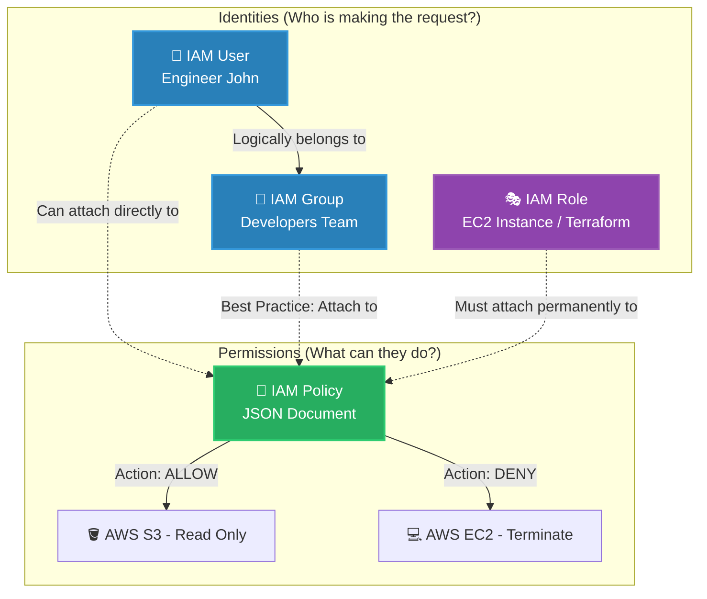

# 🚀 AWS Interview Question: AWS IAM Categories

**Question 21:** *What are the different AWS IAM categories you can control?*

> [!NOTE]
> IAM is the absolute heart of AWS Security. This question tests if you understand the conceptual architectural differences between an Identity (who you are) and a Permission (what you are legally allowed to do).

---

## ⏱️ The Short Answer
AWS Identity and Access Management (IAM) is fundamentally broken down into four core categories: **Users** (representing a single physical person or application), **Groups** (logical collections of users), **Roles** (temporary identities assumed by AWS services or federated identities), and **Policies** (the actual JSON documents defining exactly what permissions the first three categories are granted).

---

## 📊 Visual Architecture Flow: IAM Foundations

---

## 🔍 Detailed Breakdown of IAM Categories

### 1. 👤 IAM Users
An incredibly specific identity with permanent long-term credentials.
- **What it is:** A person (like "Admin_Sarah") or an external application needing programmatic access (like a GitHub Actions pipeline).
- **Credentials:** They use a standard Username/Password for the AWS web console, or persistent Access Keys for the AWS CLI / SDks.
- **Architect Rule:** Never use the Root User for daily tasks. Always create specific IAM Users.

### 2. 👥 IAM Groups
A logical grouping mechanism to make administration massively easier.
- **What it is:** A collection of IAM Users (e.g., "Junior_Data_Scientists").
- **The Catch:** A Group is *not* a true identity on its own. You cannot natively "login" as a Group.
- **Best Practice:** Never attach a Policy directly to a single User. Always attach the Policy strictly to a Group, and then simply move the User in or out of that Group.

### 3. 🎭 IAM Roles
A temporary identity that does not have permanent static passwords or permanent access keys whatsoever.
- **What it is:** An identity designed to be securely *assumed* temporarily by trusted entities.
- **Use Cases:** 
  1. Letting an EC2 Instance dynamically reach out and grab files from S3 without hardcoding API keys onto the server.
  2. Identity Federation: Letting an employee log into AWS temporarily using their corporate Active Directory (SSO) credentials.
  3. Cross-Account Access: Letting a Dev account run a quick script against a Sandbox account.

### 4. 📜 IAM Policies
The actual rulebook of AWS Security.
- **What it is:** Highly strict, declarative JSON documents that dictate the exact `Effect` (Allow or Deny), `Action` (e.g., `s3:GetObject`), and `Resource` (which specific database or bucket) is affected.
- **The Rule of Threat:** By default, absolutely everything in AWS is strictly `DENY`. You must explicitly create an IAM Policy to `ALLOW` anything at all.

---

## 🏢 Real-World Production Scenario

**Scenario: A Growing Enterprise Engineering Team**
- **The Setup:** A company hires 50 new backend developers this month to work on a proprietary Analytics Platform. 
- **The Problem:** It is incredibly insecure and impossibly tedious to manually assign 50 different JSON Policies dynamically to 50 individual developers.
- **The Solution:** The Cloud Administrator builds an **IAM Group** called `Backend_Engineers`. They natively attach an **IAM Policy** exclusively to this group that enforces the **Principle of Least Privilege** (e.g., they can strictly read CloudWatch Logs and restart specific ECS containers, but they absolutely cannot touch production databases or modify billing).
- **The Execution:** The 50 new **IAM Users** are simply dropped into the Group, instantly inheriting safe, uniform, restricted production access.

---

## 🧠 Important Interview Edge Points (To Impress)

> [!WARNING]
> **Understanding IAM Roles:**
> If the interviewer specifically presses you on IAM Roles, immediately say: *"Roles use exactly temporary, dynamically rotated STS (Security Token Service) Security Credentials that strictly expire anywhere from 15 minutes to 12 hours. This absolutely eliminates the massive security vulnerability of developers accidentally pushing static Access Keys into public GitHub repositories."*

---

## 🎤 Final Interview-Ready Answer
*"IAM fundamentally consists of four heavily integrated categories. **Users** represent physical end-users or service accounts utilizing permanent, static credentials. **Groups** are simply logical administrative collections of those Users. **Roles** are identities that provide strictly temporary STS credentials that can be natively assumed by AWS services like EC2 or federated corporate SSO platforms. Finally, **Policies** are the declarative JSON documents that define the exact Allow and Deny permissions securely attached to the first three identities. In modern architecture, we strictly avoid attaching Policies to Users directly; we attach them to Groups, and we heavily rely on assuming Roles exclusively to permanently eliminate hardcoded secrets."*
