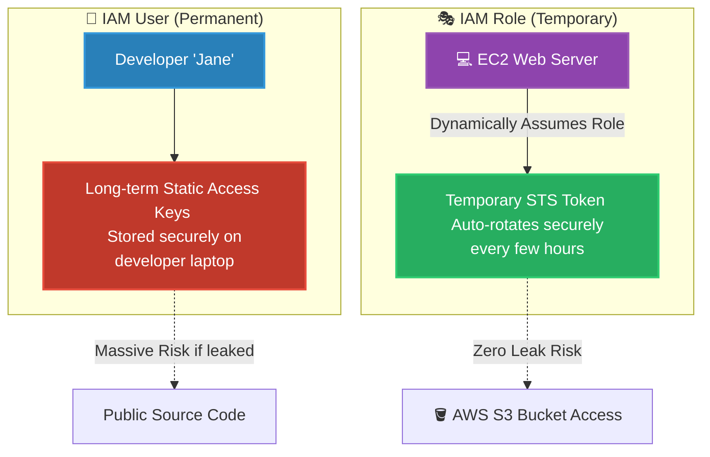

# 🚀 AWS Interview Question: IAM Role vs. IAM User

**Question 22:** *What is the exact difference between an IAM role and an IAM user?*

> [!NOTE]
> This is a mandatory core security question. If you answer "Roles are for EC2s and Users are for humans," you will get partial credit. An Architect must specifically emphasize the difference in **credential lifecycle** (static vs. dynamic temporary credentials).

---

## ⏱️ The Short Answer
An **IAM User** represents a specific, uniquely identifiable person or service account and possesses permanent, static, long-term security credentials (a password or Access Keys). An **IAM Role** is an identity that anyone (a user, an EC2 instance, or a federated external identity) can temporarily securely *assume*. Roles do not have static passwords; they exclusively use dynamically generated, temporary AWS STS (Security Token Service) credentials that safely auto-expire after a short duration.

---

## 📊 Visual Architecture Flow: Credential Types

---

## 🔍 Detailed Breakdown of Differences

### 1. 👤 IAM User (The Permanent Identity)
- **Credential Lifespan:** Infinite (until manually rotated or deleted by an Administrator).
- **Authentication Method:** Requires a physical Username and Password to log into the AWS Management Console, or an Access Key ID and Secret Access Key to use the AWS CLI.
- **Primary Use Case:** When a specific human engineer needs daily programmatic or UI access to the AWS environment.
- **The Security Risk:** Static Access Keys are frequently accidentally committed to public GitHub repositories by junior developers, immediately leading to massive crypto-mining account compromises.

### 2. 🎭 IAM Role (The Temporary Identity)
- **Credential Lifespan:** Temporary (ranges from 15 minutes to exactly 12 hours max).
- **Authentication Method:** Never uses a password. It is securely *Assumed* via the AWS STS API (e.g., executing the `AssumeRole` command), which temporarily hands back a short-lived access token.
- **Primary Use Case:** When an AWS Service (like an EC2 instance or a Lambda function) needs to securely access another AWS Service (like writing logs to CloudWatch or fetching files from S3).
- **The Security Benefit:** Because the STS keys are completely temporary and automatically disappear, the risk of a leaked credential permanently destroying an enterprise account is functionally eliminated.

---

## 🆚 Feature Comparison Table

| Feature | 👤 IAM User | 🎭 IAM Role |
| :--- | :--- | :--- |
| **Identity Type** | A specific person or application | An identity anyone trusted can assume |
| **Credentials** | Long-term, static, permanent | Short-lived, dynamic STS tokens |
| **Password Supported?**| ✅ Yes (Console Login) | ❌ No |
| **Automatic Rotation** | ❌ No (Requires manual rotation) | ✅ Yes (Handled exclusively by AWS under the hood) |
| **Primary Beneficiary**| Human Engineers / CI/CD Bots | EC2 Instances / Lambda / Federated Corporate SSO |

---

## 🏢 Real-World Production Scenario

**Scenario: A Secure Web Server fetching Images from S3**
- ❌ **The Junior Developer Approach (IAM User):** A junior engineer nervously creates an IAM User named `S3-AppUser`. They generate static Access Keys, explicitly copy them, and permanently paste them inside an `.env` file directly on their active EC2 production server. If that EC2 server is hacked, the attacker definitively steals those permanent keys forever.
- ✅ **The Architect Approach (IAM Role):** The senior engineer creates an **IAM Role** named `EC2-S3-ReadRole`. They explicitly attach an Instance Profile directly exclusively to the EC2 server. The server seamlessly asks AWS for a heavily temporary token, accesses S3 cleanly, and intentionally drops the token automatically a few hours later. Absolutely zero static keys ever touch the server's hard drive.

---

## 🎤 Final Interview-Ready Answer
*"An IAM User represents a permanent, specific entity with long-term, static security credentials like exactly a standard password or static Access Keys. Conversely, an IAM Role is fundamentally a temporary identity that can be safely assumed by securely trusted entities—such as AWS EC2 instances, Lambda functions, or federated corporate SSO identities. Roles exclusively utilize short-lived STS tokens that automatically securely expire. In enterprise production, we strictly use IAM Roles for all server-to-server communication to cleanly definitively mathematically permanently eradicate the massive security risk of hardcoding static credentials."*
