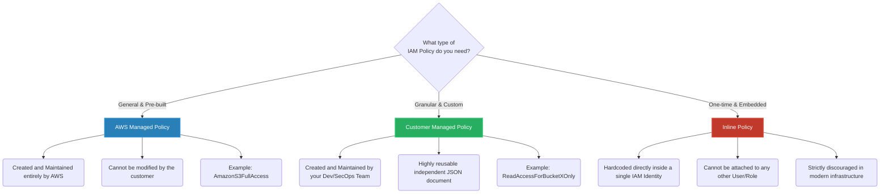

# 🚀 AWS Interview Question: IAM Policy Types

**Question 23:** *What are the different types of managed policies in AWS IAM?*

> [!NOTE]
> This is a mandatory core security architecture question. The interviewer is testing your understanding of **Policy Reusability** and checking if you understand the dangers of using Inline Policies incorrectly in an enterprise environment.

---

## ⏱️ The Short Answer
AWS IAM policies dictate exactly what actions an identity can perform. Structurally, there are three types: **AWS Managed Policies** (universally pre-built and managed strictly by AWS), **Customer Managed Policies** (custom-built by your organization, adhering strictly to the Principle of Least Privilege, and highly reusable across many users/roles), and **Inline Policies** (a JSON policy tightly coupled and embedded directly into a single specific User or Role, meaning it completely lacks reusability).

---

## 📊 Visual Architecture Flow: IAM Policy Types

---

## 🔍 Detailed Explanation of Policy Types

### 1. 🔵 AWS Managed Policies (The Quick Start)
These are standalone JSON policies created, explicitly managed, and dynamically updated directly by Amazon Web Services.
- **The Catch:** You cannot change the permissions defined inside an AWS Managed Policy. If AWS updates `AmazonDynamoDBFullAccess` tomorrow to include a brand new DynamoDB feature, your account implicitly inherits that permission immediately.
- **Primary Use Case:** Exceptional for rapid onboarding, quick Proofs of Concept, and early-stage startups that need simple standard administrative roles (e.g., `AdministratorAccess` or `ViewOnlyAccess`).

### 2. 🟢 Customer Managed Policies (The Enterprise Standard)
These are standalone JSON policies that *you* construct directly inside your AWS account.
- **The Catch:** You bear full responsibility for correctly writing the JSON and keeping it securely updated.
- **Primary Use Case:** Enterprise Production architecture. Unlike AWS Managed Policies (which broadly grant `S3FullAccess`), a Customer Managed Policy allows you to explicitly restrict access to exactly one specific S3 bucket and limit actions specifically to `s3:GetObject`. 
- **The Core Benefit:** Because they are standalone, you only write the Policy strictly once, and you can reliably attach it to 5,000 different Developers safely.

### 3. 🔴 Inline Policies (The Legacy Method)
An inline policy is an IAM policy that is structurally embedded directly inside a specific IAM user, group, or role. 
- **The Catch:** There is absolutely a strict 1-to-1 relationship. If you embed an Inline Policy inside "Developer A", you definitively cannot attach that exact same policy to "Developer B". You would uniquely have to copy/paste the raw JSON text manually again.
- **Primary Use Case:** The primary use case is when you want a highly strict mathematical guarantee that the specific policy cannot physically be accidentally attached to any other entity in the account. Generally, AWS actively advises cleanly migrating away from Inline Policies entirely towards Customer Managed Policies for sanity and scale.

---

## 🏢 Real-World Production Scenario

**Scenario: A Developer needs to read from the Production Database**
- ❌ **The Lazy Approach (AWS Managed Strategy):** The junior administrator attaches the AWS Managed Policy `AmazonRDSFullAccess` directly to the developer. The developer is now heavily over-privileged and accidentally physically deletes the production cluster.
- ✅ **The Architect Approach (Customer Managed Strategy):** The senior Cloud Architect writes a custom JSON **Customer Managed Policy** named `Rds-ReadOnly-Prod`. This policy explicitly restricts the developer to `rds:DescribeDBClusters` and nothing else.
  - *The Bonus:* When a second developer gets hired next week, the Architect seamlessly uniquely natively attaches that exact natively same reusable standalone `Rds-ReadOnly-Prod` policy cleanly to the new hire in exactly 3 seconds mathematically.

---

## 🎤 Final Interview-Ready Answer
*"IAM policies are explicitly evaluated declarative JSON documents that define precise Allow or Deny permissions. **AWS Managed Policies** are pre-built templates completely maintained organically by AWS itself, perfect for rapid generic role assignment. However, in enterprise architecture, we strictly utilize **Customer Managed Policies**, which we write deeply ourselves to perfectly enforce the strict Principle of Least Privilege, as these policies are independent documents inherently cleanly functionally reusable across our entire organizational structure. Lastly, **Inline Policies** are legacy JSON configurations embedded explicitly hardcoded directly into precisely one single identity, lacking absolutely any core reusability whatsoever."*
