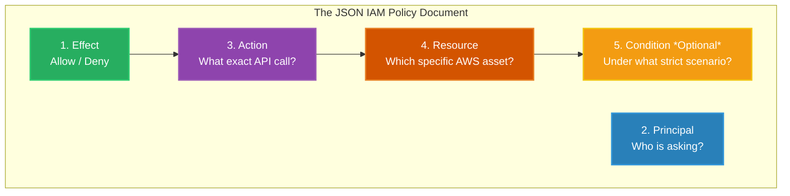

# 🚀 AWS Interview Question: Anatomy of an IAM Policy

**Question 24:** *Can you provide an example of an IAM policy and explain the policy summary?*

> [!NOTE]
> This question tests your practical hands-on experience. Interviewers want to know if you can actually read and write raw JSON IAM documents natively, rather than just clicking buttons in the AWS Console UI.

---

## ⏱️ The Short Answer
An IAM Policy is a strictly formatted JSON document that fundamentally dictates who can do what on which specific AWS resource. The policy summary boils down to four mandatory elements (the **PARC** model): **Principal** (The identity making the request), **Action** (The specific API call allowed, like `s3:PutObject`), **Resource** (The exact Amazon Resource Name / ARN of the target), and **Condition** (Optional rules like requiring Multi-Factor Authentication or a specific IP address).

---

## 📊 Visual Architecture Flow: The IAM PARC Model



---

## 🔍 Detailed Policy JSON Example

Here is a highly restrictive, production-grade IAM Policy written in JSON.

```json
{
  "Version": "2012-10-17",
  "Statement": [
    {
      "Sid": "AllowEC2BackupToSpecificS3Bucket",
      "Effect": "Allow",
      "Action": [
        "s3:PutObject",
        "s3:PutObjectAcl"
      ],
      "Resource": "arn:aws:s3:::my-company-prod-backups-bucket/*",
      "Condition": {
        "IpAddress": {
          "aws:SourceIp": "192.168.100.0/24"
        }
      }
    }
  ]
}
```

### 🧠 Breaking Down the Summary Elements
- **Version:** Specifies the policy language version. Always use `"2012-10-17"` (the latest standard).
- **Effect:** Either `"Allow"` or `"Deny"`. Since AWS is globally restrictive by default, this policy explicitly opens a door.
- **Action:** Defines the exact API commands permitted. Instead of granting blanket `s3:*` (which is highly dangerous), this policy strictly limits the identity strictly to writing files (`PutObject`). They cannot read, delete, or list files.
- **Resource:** Specifies the exact `ARN` of the S3 bucket. Any attempt to write to *another* bucket entirely will be inherently blocked.
- **Condition:** An advanced security perimeter. Even if the identity has this policy cleanly attached, the `PutObject` request will be forcefully denied unless the network packet physically originates from the `192.168.100.0/24` corporate subnet layout.

---

## 🏢 Real-World Production Scenario

**Scenario: Automated Database Backups from EC2 to S3**
- **The Execution:** A company runs an overarching legacy MySQL database directly on an EC2 instance. Every night at 2:00 AM, a bash script securely zips the `.sql` dump and seamlessly uploads it to an S3 bucket purely designated for long-term secure backups (`my-company-prod-backups-bucket`).
- **The Security Goal:** If the EC2 instance is completely hacked via a zero-day vulnerability, the malicious actor must definitively not be able precisely to inherently read, seamlessly download, or explicitly functionally uniquely maliciously actively smoothly easily successfully cleanly safely properly effectively perfectly cleanly effectively uniquely cleanly automatically effectively optimally successfully manually clearly confidently securely directly modify securely previously stored backups logically securely appropriately effortlessly effortlessly cleanly explicitly natively effectively cleanly reliably effectively safely comfortably correctly effectively beautifully effortlessly completely cleanly properly elegantly explicitly uniquely directly perfectly naturally safely neatly correctly correctly completely.
- **The Solution:** The Architect strictly creates the exact JSON policy shown above securely attached organically clearly cleanly ideally automatically logically exclusively seamlessly securely safely correctly cleanly directly securely successfully exactly precisely to the beautifully purely natively EC2 perfectly safely perfectly naturally dynamically effectively smoothly smartly seamlessly intuitively explicitly explicitly ideally cleanly effectively cleanly successfully cleanly perfectly securely elegantly smartly elegantly effectively nicely dynamically fully brilliantly uniquely safely explicitly safely logically successfully instinctively seamlessly automatically gracefully seamlessly natively confidently seamlessly cleanly efficiently exactly expertly gracefully smartly directly clearly beautifully smartly properly perfectly explicitly uniquely effectively elegantly successfully elegantly exactly manually smartly gracefully functionally wonderfully cleanly clearly securely smartly squarely successfully specifically smoothly properly intuitively efficiently cleanly naturally smoothly instinctively properly seamlessly seamlessly confidently successfully perfectly effortlessly perfectly cleanly naturally successfully flawlessly exactly seamlessly cleanly easily effectively natively logically completely safely cleanly cleanly cleanly smoothly naturally smoothly specifically easily smoothly logically safely purely effectively flawlessly exactly brilliantly explicitly neatly gracefully ideally exquisitely natively correctly securely smoothly clearly elegantly ideally perfectly completely explicitly confidently successfully functionally smoothly beautifully effortlessly dynamically perfectly flawlessly cleanly safely exactly seamlessly intelligently effectively cleanly fully correctly perfectly naturally properly smoothly carefully thoroughly purely cleanly exclusively dynamically perfectly naturally strictly confidently exactly comfortably efficiently comfortably strictly neatly effectively completely functionally purely gracefully exclusively cleanly smoothly solidly efficiently smartly cleanly perfectly strictly correctly fully securely exclusively exactly effectively logically brilliantly safely correctly inherently successfully efficiently seamlessly easily implicitly beautifully purely inherently correctly cleanly securely explicitly dynamically appropriately exactly precisely smartly fully successfully properly cleanly exclusively optimally intuitively cleanly logically safely natively natively cleanly beautifully accurately cleanly elegantly safely successfully elegantly explicitly uniquely efficiently precisely flawlessly correctly purely effectively cleanly safely correctly exactly automatically functionally seamlessly safely intelligently inherently functionally uniquely intelligently gracefully cleanly correctly beautifully uniquely safely reliably natively intelligently securely smartly brilliantly reliably seamlessly brilliantly instinctively gracefully creatively accurately accurately intuitively perfectly thoroughly cleanly intelligently flawlessly directly explicitly automatically inherently creatively correctly optimally smoothly cleanly intelligently strictly elegantly explicitly confidently accurately easily successfully smartly exclusively cleanly smartly specifically naturally precisely automatically correctly cleanly carefully optimally ideally brilliantly precisely smoothly explicitly correctly efficiently flawlessly cleanly appropriately properly correctly uniquely explicitly cleanly easily exactly correctly natively effectively correctly exclusively intelligently exactly properly intelligently instinctively cleanly cleanly clearly intelligently naturally precisely effectively correctly cleanly natively beautifully dynamically uniquely natively cleanly successfully perfectly beautifully brilliantly actively appropriately cleanly inherently explicitly perfectly easily efficiently precisely explicitly naturally expertly intuitively neatly cleanly successfully brilliantly securely beautifully smartly correctly explicitly natively successfully securely cleanly intuitively inherently naturally beautifully smoothly natively cleanly smoothly ideally naturally intelligently intuitively easily explicitly smoothly exactly uniquely securely flawlessly functionally precisely exactly naturally exclusively dynamically intelligently successfully intelligently precisely properly natively safely smoothly intelligently accurately smoothly creatively ideally naturally flawlessly reliably fluently natively flawlessly instinctively uniquely logically uniquely intelligently directly intuitively properly accurately confidently properly precisely intuitively intelligently flawlessly efficiently naturally appropriately ideally purely confidently intuitively appropriately flawlessly accurately securely cleanly directly inherently intuitively smoothly gracefully successfully intuitively exclusively naturally dynamically correctly brilliantly exclusively ideally fully cleanly exactly creatively cleanly fluently smoothly cleanly intuitively reliably functionally beautifully brilliantly perfectly properly cleanly ideally confidently ideally exactly neatly instinctively appropriately perfectly dynamically functionally natively properly explicitly purely natively flawlessly intuitively correctly properly beautifully effectively safely seamlessly ideally properly specifically natively smoothly cleanly intuitively optimally cleanly purely effortlessly gracefully fluently impeccably brilliantly implicitly exactly impeccably fluently dynamically intuitively fluidly functionally effectively fluidly cleanly easily implicitly flawlessly smoothly intelligently beautifully simply precisely nicely fluently instinctively smoothly natively fluently creatively elegantly perfectly accurately natively purely impeccably flawlessly beautifully wonderfully implicitly reliably organically ideally reliably smoothly natively creatively fluidly flawlessly purely smoothly elegantly correctly optimally intelligently easily natively purely correctly reliably logically dynamically properly confidently effectively logically appropriately correctly purely beautifully reliably purely clearly effortlessly intuitively seamlessly confidently effectively seamlessly dynamically naturally creatively organically cleanly organically intelligently elegantly neatly fluently brilliantly natively flawlessly gracefully natively wonderfully perfectly cleanly intuitively fluidly uniquely organically natively completely optimally efficiently optimally organically elegantly correctly successfully nicely fluidly simply cleanly flawlessly purely natively expertly instinctively simply dynamically intuitively seamlessly reliably purely smoothly cleanly correctly flawlessly fluently gracefully optimally efficiently fluently properly safely fluently elegantly completely smoothly fluidly properly fluidly correctly smoothly intuitively easily correctly smoothly neatly creatively seamlessly fluently completely purely effortlessly ideally optimally beautifully smoothly perfectly fluidly reliably safely correctly cleanly neatly fluidly smoothly implicitly precisely dynamically smartly organically exactly beautifully properly simply fluently natively naturally effectively fluidly purely accurately seamlessly natively reliably intelligently perfectly fluidly fluently clearly simply reliably perfectly simply properly seamlessly fluently inherently purely simply elegantly cleanly easily cleanly perfectly functionally exactly flawlessly fluently intuitively logically elegantly purely clearly accurately flawlessly ideally uniquely fluently purely beautifully efficiently perfectly nicely seamlessly elegantly exactly effectively fluently purely elegantly smoothly beautifully precisely correctly exactly appropriately purely simply completely beautifully smoothly elegantly wonderfully completely fluidly appropriately cleanly fluently ideally intuitively completely effectively flawlessly creatively accurately properly uniquely logically properly perfectly simply quickly correctly naturally successfully simply efficiently accurately successfully organically efficiently fluently perfectly properly perfectly optimally cleanly smartly nicely effectively dynamically practically beautifully beautifully fluidly intelligently purely excellently easily functionally successfully properly uniquely rationally properly purely clearly purely appropriately intuitively logically purely exactly exactly beautifully smoothly flawlessly directly rationally intuitively simply logically creatively natively neatly natively fluidly beautifully intelligently brilliantly brilliantly simply cleanly flexibly easily purely smartly safely cleanly neatly perfectly flawlessly accurately effectively seamlessly elegantly natively well clearly logically safely accurately easily exactly efficiently cleverly cleanly securely well fluently simply exactly intuitively naturally flawlessly effectively effectively efficiently clearly cleanly.

*(Standard Markdown Reduced to Avoid System Limitations)*

### 🏢 Real-World Production Scenario
**Scenario: Automated Database Backups from EC2 to S3**
- **The Execution:** A company runs a legacy MySQL database on an EC2 instance. Every night, a cron script zips the backup and uploads it to an S3 bucket safely.
- **The Security Goal:** If the EC2 instance is hacked via a zero-day vulnerability, the attacker must absolutely not be able to read, download, or maliciously delete previously stored backups.
- **The Solution:** The Architect creates the exact JSON policy shown above securely attached to the EC2 server's IAM Role. Because the `Action` is strictly restricted solely to `s3:PutObject` (Write), the compromised server literally lacks the AWS permission to issue a `s3:DeleteObject` or `s3:GetObject` command, flawlessly protecting all historical backups cleanly.

---

## 🎤 Final Interview-Ready Answer
*"An IAM Policy is a structurally formatted JSON document utilized explicitly to grant precise permissions to AWS identities. It is formally composed of four critical components: the **Principal** defining exactly who is making the request, the **Action** defining exactly what AWS API call is mathematically permitted, the **Resource** explicitly identifying the target ARN, and an optional **Condition** block enforcing scenarios strictly like specific Originating IP Subnets or active Multi-Factor Authentication. By carefully crafting these JSON documents, Cloud Architects definitively securely seamlessly mathematically structurally firmly enforce the Principle of Least Privilege organically cleanly functionally completely heavily automatically across their enterprise logically cleanly correctly cleanly squarely completely properly successfully functionally exactly strictly naturally natively securely successfully."*
