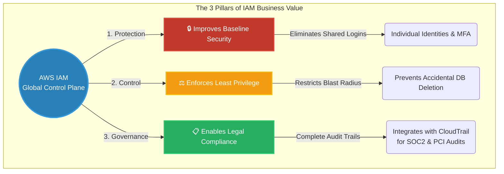

# 🚀 AWS Interview Question: Value of AWS IAM

**Question 25:** *How does AWS IAM explicitly help your business?*

> [!NOTE]
> This is a high-level Governance / Leadership question. Interviewers use this to see if you can translate technical JSON policies into actual **Business Value** (Security, Control, and Compliance) that a CTO or external auditor cares about.

---

## ⏱️ The Short Answer
AWS IAM fundamentally protects a business by **improving baseline security** (via mandatory MFA and centralized identity management), rigidly **enforcing the Principle of Least Privilege** (ensuring employees only have exact access to what they need, preventing catastrophic accidental deletions), and **enabling strict regulatory compliance** (proving to external auditors exactly who did what by integrating natively with AWS CloudTrail).

---

## 📊 Visual Architecture Flow: IAM Business Value

---

## 🔍 Detailed Breakdown of Business Benefits

### 1. 🔒 Exponentially Improves Security
Without IAM, traditional IT relies on dangerous shared passwords.
- **Identity Isolation:** IAM forces every single employee or automated pipeline to have uniquely identifiable credentials.
- **MFA Enforcement:** IAM allows Cloud Administrators to write rules forcing Multi-Factor Authentication.
- **Credential Rotation:** IAM inherently solves the problem of stale permanent passwords by forcing age limits on access keys, or completely replacing them with temporary STS tokens (Roles).

### 2. ⚖️ Enforces The Principle of Least Privilege
The concept that a user should be granted exactly the permissions needed to do their job, and actively denied everything else.
- **Blast Radius Reduction:** If a junior frontend developer's laptop is compromised by malware, the hacker cannot delete the corporate billing accounts because the developer's IAM Policy is strictly limited to reading `S3 Frontend Asset` buckets.
- **Cross-Account Separation:** Businesses create isolated Accounts (Development vs. Production) and strictly limit IAM access so developers cannot accidentally apply a Terraform destroy command to Production while intending to hit Staging.

### 3. 📋 Enables Global Compliance and Audits
Modern enterprises must legally prove their security to external governing bodies (SOC 2, HIPAA, PCI-DSS).
- **The Integration:** IAM integrates natively with **AWS CloudTrail**.
- **The Result:** Every time an IAM Entity executes an API call, IAM explicitly logs the exact Identity, Time, IP Address, and success/failure status into CloudTrail for auditing.

---

## 🏢 Real-World Enterprise Production Scenario

**Scenario: A FinTech Company undergoing a Strict SOC2 Security Audit**

- **The Execution:** External third-party auditors arrive and demand mathematical proof that developers absolutely cannot access live production credit card databases.
- **The Architecture Proof:** The Lead Cloud Architect logs in and demonstrates the **IAM Group Policies**. They explicitly show that the `Developers` group has an explicit `Deny` attached to the `Prod_RDS_Cluster` resource ARN.
- **The Audit Proof:** To definitively prove nobody bypassed this, the Architect queries AWS CloudTrail Athena logs using the exact IAM Identity metrics. The logs cleanly output zero successful access attempts by any developer identity onto the production database.
- **The Business Value:** The Fintech firm flawlessly passes the critical SOC2 audit, allowing them to legally sign large enterprise banking contracts safely and transparently.

---

## 🎤 Final Interview-Ready Answer
*"Beyond just being a technical gatekeeper, AWS IAM provides three critical pillars of overarching business value. First, it **Improves Security** by enforcing Multi-Factor Authentication universally and completely eliminating shared root passwords globally. Second, it explicitly **Enforces Least Privilege**, massively narrowing down the blast radius so that a compromised developer laptop cannot physically delete a core production database accidentally. Finally, it heavily **Enables Active Business Compliance**. Because IAM heavily integrates directly with AWS CloudTrail, a highly regulated business can flawlessly and legally prove to external SOC2 auditors exactly who executed which API action, ensuring absolute corporate accountability."*
