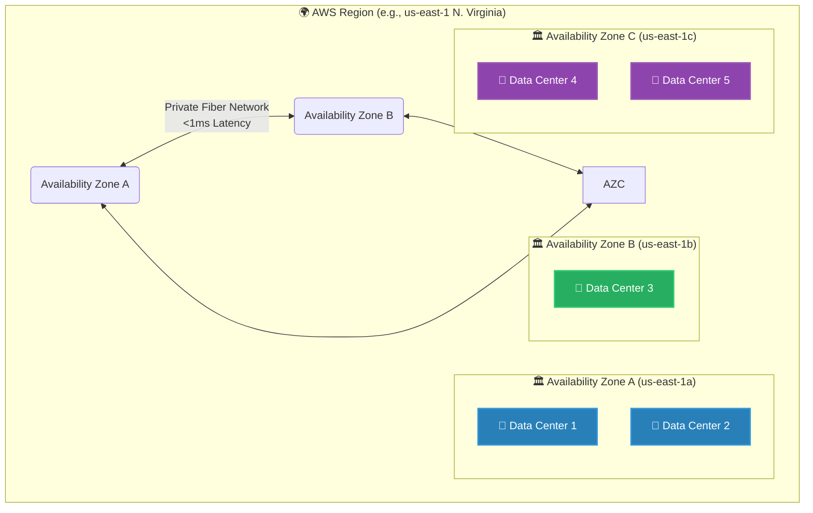

# 🚀 AWS Interview Question: AWS Regional Infrastructure

**Question 26:** *What is the exact relation between an Availability Zone (AZ) and a Region?*

> [!NOTE]
> This is a day-one cloud fundamental question. However, Interviewers are testing your architectural vocabulary. Do not just say "Zones are in Regions." You must explicitly use terms like "isolated fault domains" to sound like a true Senior Cloud Architect.

---

## ⏱️ The Short Answer
An **AWS Region** is a distinct, large geographic location on the globe (such as Northern Virginia, Tokyo, or Frankfurt). Within every Region, there are multiple **Availability Zones (AZs)**. An AZ is a structurally isolated fault domain consisting of one or more physical data centers equipped with independent power grids, cooling systems, and networking, completely insulated from the physical failure of other AZs in the exact same Region.

---

## 📊 Visual Architecture Flow: Region vs. AZ Hierarchy

---

## 🔍 Detailed Architectural Breakdown

### 1. 🌍 The AWS Region (Geographic Border)
You choose a Region based primarily on three core factors:
- **Latency:** Placing the architecture geographically closest to your physical customers.
- **Data Sovereignty:** Legal compliance laws that heavily dictate that user data cannot leave a specific country's physical borders.
- **Service Availability:** Not all new AWS services launch globally at the same time. `us-east-1` (N. Virginia) typically gets brand-new services months before smaller regions.

### 2. 🏛️ The Availability Zone (Fault Domain)
AZs are designed to provide massive High Availability (HA).
- **Physical Independence:** They are physically separated by miles (often tens of miles) to ensure a single massive flood, earthquake, or power grid failure absolutely cannot destroy two AZs simultaneously.
- **Network Coupling:** Despite being physically isolated, all AZs in a region are interconnected via highly secure, proprietary AWS dark-fiber optic networking, perfectly guaranteeing single-digit millisecond latency between them. 
- **The Architect's Rule:** A true cloud application is natively designed to be "Multi-AZ." If an asteroid hits AZ-A, the Application Load Balancer natively instantly shifts all valid traffic directly over to AZ-B without any user downtime.

---

## 🏢 Real-World Production Scenario

**Scenario: A E-Commerce Black Friday Event**
- **The Execution:** A retail company deploys their application exclusively inside Region `us-east-1` (N. Virginia). Instead of putting all 6 web servers inside AZ A, the Cloud Architect cleanly deploys an Auto Scaling Group that perfectly spans the servers evenly across AZ A, AZ B, and AZ C.
- **The Disaster Risk:** At 3:00 PM on Black Friday, a massive municipal construction tractor physically severs the primary power lines, permanently killing Availability Zone A.
- **The Highly Available Response:** Because the database was architected natively using **RDS Multi-AZ**, it seamlessly fails over to the perfectly mirrored standby database in AZ B in under 60 seconds. The Application Load Balancer instantly detects AZ A is dead and immediately routes all incoming shoppers exclusively to the surviving web servers safely operating in AZ B and AZ C.
- **The Result:** The business visibly loses a physical data center, but the application survives completely intact without dropping a single active customer cart.

---

## 🎤 Final Interview-Ready Answer
*"An AWS Region represents a large, distinct geographic physical area on the globe. Inside every Region are multiple independently isolated Availability Zones (AZs). An AZ is composed of one or more physical data centers that maintain completely independent power grids, networking, and cooling to insulate them from localized disasters like floods or power outages. As an Architect, we strictly deploy applications natively across multiple AZs. Therefore, if one physical data center structurally fails, the application automatically survives by instantaneously routing all incoming web traffic securely to the fully functional infrastructure safely waiting in the secondary AZs."*
