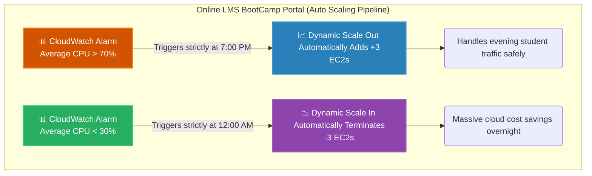

# 🚀 AWS Interview Question: Understanding Auto Scaling

**Question 27:** *What is Amazon EC2 Auto Scaling, and what types of scaling exist?*

> [!NOTE]
> This is a high-impact architectural question. It tests whether you fundamentally understand how the cloud differs from traditional on-premise hardware. The entire premise of the cloud is **elasticity**, and Auto Scaling is the engine that drives it. 

---

## ⏱️ The Short Answer
Amazon EC2 Auto Scaling is a managed service that dynamically adjusts the number of computational resources up or down based absolutely on real-time demand. It accomplishes three critical business goals simultaneously: **High Availability** (replacing crashed instances), **Fault Tolerance** (spanning across multiple Availability Zones), and extreme **Cost Optimization** (destroying servers when traffic legitimately drops). There are three primary scaling strategies: **Dynamic Scaling** (reacting to real-time CPU/Memory metrics), **Scheduled Scaling** (reacting to explicit times/dates), and **Predictive Scaling** (utilizing AWS Machine Learning to automatically predict impending traffic).

---

## 📊 Visual Architecture Flow: Auto Scaling Behavior

---

## 🔍 Detailed Breakdown of Scaling Types

### 1. 📈 Dynamic Scaling 
The most common and heavily utilized scaling method in the cloud.
- **How it works:** It continuously evaluates live CloudWatch metrics (e.g., Target Tracking). If you tell the ASG to "maintain exactly 50% CPU", AWS automatically calculates exactly how many EC2 instances physically need to be spun up or terminated to mathematically satisfy that strict requirement.
- **Best Use Case:** Applications with highly unpredictable traffic spikes, like sudden viral social media posts.

### 2. 📅 Scheduled Scaling
A deterministic scaling policy that relies exclusively on a known calendar.
- **How it works:** You write a cron expression telling the ASG to double capacity at 8:00 AM every Monday.
- **Best Use Case:** Predictable business cycles, such as a localized corporate HR portal where 99% of employees specifically log on strictly between 9 AM and 5 PM on local weekdays, and traffic completely zeroes out on weekends. 

### 3. 🔮 Predictive Scaling
An advanced enterprise scaling policy leveraging AWS Machine Learning.
- **How it works:** AWS permanently analyzes weeks of your historical traffic patterns. Instead of waiting for the CPU to organically hit 70% (which takes 5 minutes to spin up new servers), the ML model predicts the spike is coming and automatically physically spins the servers up completely *before* the traffic even arrives.
- **Best Use Case:** Massive E-Commerce enterprise applications where even a few milliseconds of latency costs thousands of dollars.

---

## 🏢 Real-World Production Scenario

**Scenario: A Massive Student LMS BootCamp Portal**
- **The Execution:** An education company runs an online bootcamp portal. The infrastructure is housed natively behind an Application Load Balancer attached strictly to an Auto Scaling Group (ASG). 
- **The Evening Spike:** During the day, traffic is low. But exactly at 7:00 PM, thousands of students log on simultaneously from their jobs. The collective CPU metrics hit 75%. The ASG dynamically executes a **Scale-Out Action**, automatically seamlessly launching 3 new backend EC2 instances natively to comfortably handle the severe traffic load without crashing the portal.
- **The Midnight Drop:** At midnight, students log off to sleep. The collective CPU drops to 20%. The ASG seamlessly detects the massive drop in utilization and executes a **Scale-In Action**, systematically terminating exactly 3 instances safely.
- **The Business Reality:** Without an ASG, the Architect operates under two dangerous extremes: They either statically deploy exactly 2 servers (which guarantees the website massively crashes at 7 PM), or they statically permanently deploy exactly 5 servers (meaning the business criminally overpays thousands of dollars all day and all night strictly for unused idling hardware). 

---

## 🎤 Final Interview-Ready Answer
*"Amazon EC2 Auto Scaling is an architectural service that dynamically changes the number of computational instances strictly based on real-time load requirements, enabling heavy cost optimization by inherently ensuring you only uniquely pay for perfectly utilized hardware. Architecturally, we use three distinct scaling strategies: **Dynamic Scaling**, which logically reacts formally to live CloudWatch metrics like CPU thresholds; **Scheduled Scaling**, which actively scales resources strictly based completely on calendar cron schedules; and **Predictive Scaling**, which actively leverages deep AWS machine learning fully to predict intelligently upcoming traffic trends efficiently. By using Auto Scaling, an application flawlessly survives large peak spikes entirely without crashing, while safely systematically securely destroying completely idle servers safely sequentially during off-peak hours perfectly comfortably to heavily optimize active AWS monthly billing inherently and cleanly."*
