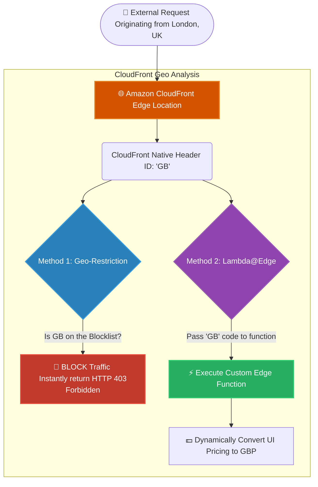

# 🚀 AWS Interview Question: CloudFront Geo-Targeting

**Question 28:** *What is Geo-Targeting in Amazon CloudFront, and how is it used?*

> [!NOTE]
> This is a critical edge-networking question. Interviewers want to verify that you understand how to manipulate web traffic *before* it ever reaches your actual backend servers, significantly saving computational resources and ensuring global compliance.

---

## ⏱️ The Short Answer
Geo-Targeting in CloudFront is the ability to securely restrict, allow, or dynamically alter web content based on the exact geographic location (country) of the end user. It supports two primary methodologies: **Geo-Restriction** (a simple allow/block list directly on the distribution) and **Lambda@Edge** (executing custom serverless code at the physical edge location to flexibly rewrite headers or adjust pricing based on the user's location).

---

## 📊 Visual Architecture Flow: Geo-Targeting

---

## 🔍 Detailed Breakdown of the Methodologies

### 1. 🛡️ Geo-Restriction (The Firewall Approach)
This is a native, out-of-the-box feature directly embedded in CloudFront.
- **How it works:** CloudFront looks at the incoming IP address, determines the country of origin, and compares it against your configured Whitelist or Blacklist.
- **The Core Benefit:** The rejection happens directly at the local geographic edge cache. The illicit traffic never reaches your Application Load Balancer, saving massive computing costs.
- **Limitation:** It is purely a binary feature. You either allow the traffic entirely or block the traffic entirely. 

### 2. ⚡ Lambda@Edge (The Advanced Logic Approach)
This is an advanced architectural capability that allows you to deploy Node.js or Python functions directly to CloudFront edge locations.
- **How it works:** CloudFront logically injects a custom HTTP header (e.g., `CloudFront-Viewer-Country: IN`). The Lambda@Edge function reads that header before generating the final response.
- **The Core Benefit:** Instead of blocking the user, Lambda@Edge redirects the user to a uniquely tailored version of the website specifically designed for their local language and cultural formatting.

---

## 🏢 Real-World Production Scenario

**Scenario: A Global EdTech Course Rollout**
- **The Execution:** You are officially launching an exclusive new tech course solely available for students located within India.
- **Phase 1 (The Block):** The Architect utilizes CloudFront **Geo-Restriction** to build a dynamic block list for IP ranges originating from the USA or the UK. When a London student navigates to the catalog, the edge node instantly drops the connection and returns an HTTP 403 Forbidden page without alerting the underlying server infrastructure.
- **Phase 2 (The Dynamic Localizer):** For legitimate approved visitors located in other international countries, the Architect uses a **Lambda@Edge** function. This function dynamically intercepts the traffic, converting the course interface safely into their localized language and recalculating the UI to prominently display pricing in Euros or USD instead of INR.
- **The Result:** The business successfully achieves geographical regulatory compliance without sacrificing standard user experience.

---

## 🎤 Final Interview-Ready Answer
*"Geo-Targeting allows an architect to manipulate web content based exclusively on the viewer's physical location. You can use standard **Geo-Restriction** to entirely drop traffic originating from unauthorized countries natively at the edge, protecting backend servers. Alternatively, you can leverage advanced **Lambda@Edge** functions to execute custom code, such as reading the viewer's location headers to dynamically alter the rendered webpage, ensuring a localized, compliant, and seamless user experience."*
