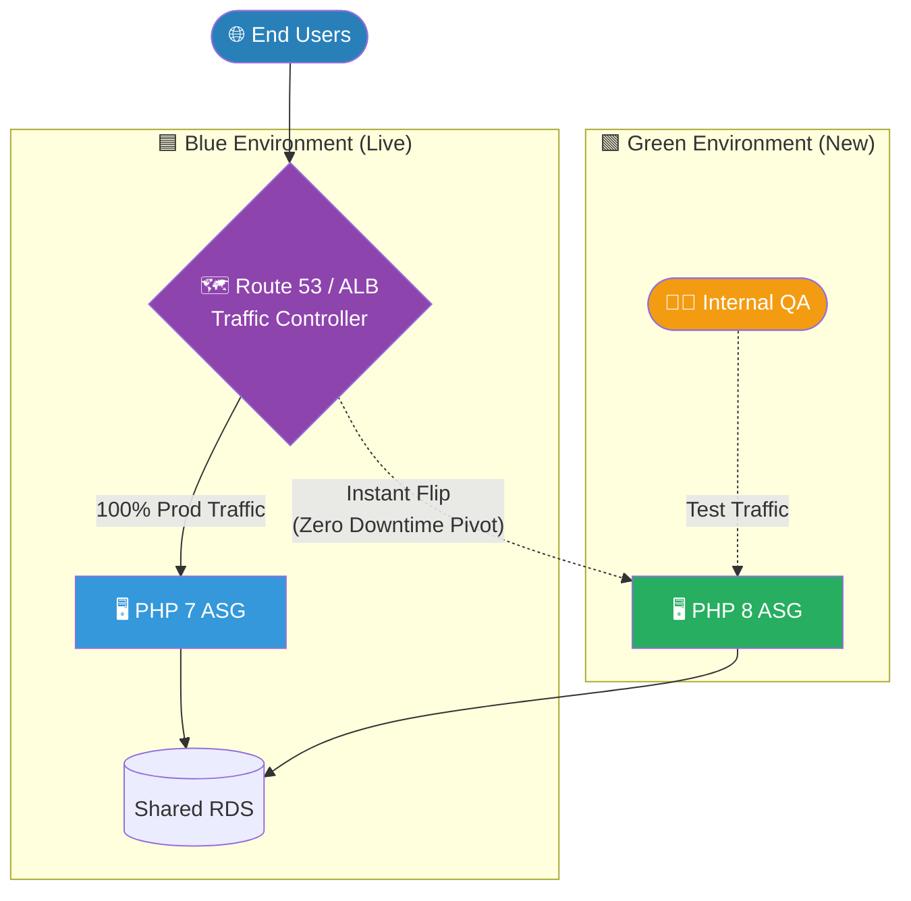

# 🚀 AWS Interview Question: Near-Zero Downtime Deployments

**Question 29:** *How do you upgrade or downgrade a system with near-zero downtime?*

> [!NOTE]
> This is a Senior DevOps question. Interviewers look for specific implementation patterns like "Blue/Green" and "Rolling" deployments rather than manual server updates.

---

## ⏱️ The Short Answer
To achieve near-zero downtime during a deployment, you must utilize architectural routing strategies. The most common methods are **Blue/Green Deployments** (instantly swapping a Load Balancer between two duplicate environments) and **Rolling Deployments** (replacing instances batch-by-batch behind an Auto Scaling Group). For databases, zero-downtime is achieved using **Amazon RDS Multi-AZ** failovers or promoting **Read Replicas**.

---

## 📊 Visual Architecture Flow: Blue/Green Deployment

---

## 🔍 Detailed Deployment Strategies

### 1. 🟦🟩 Blue-Green Deployment
- **How it works:** You maintain two identical environments. The live environment is "Blue" (V1). The newly provisioned environment is "Green" (V2).
- **The Process:** You deploy the new code to Green. QA tests it safely. Once verified, you update the Load Balancer to instantly swap 100% of traffic over to Green. 
- **The Benefit:** Downtime is mathematically zero. Rollbacks take 5 seconds.

### 2. 🔄 Rolling Deployment
- **How it works:** The Load Balancer incrementally destroys one old server and launches one new server simultaneously.
- **The Benefit:** It is cheaper than Blue/Green because you do not need 2X the infrastructure running concurrently.

### 3. 💾 Database Strategies
- You cannot "Blue/Green" a database easily without losing data state. Utilize **Multi-AZ** upgrades, where AWS upgrades the Standby Database first and cleanly fails primary connections over to it.

---

## 🏢 Real-World Production Scenario

**Scenario: A Massive LMS Upgrade from PHP 7 to PHP 8**
- **Phase 1:** The Architect creates a brand-new "Green" environment featuring exclusively PHP 8 infrastructure.
- **Phase 2:** The database schema is maintained compatibly. QA tests the Green environment safely using an internal DNS endpoint without live traffic. 
- **Phase 3:** Once approved, the Architect instantly pivots the production Load Balancer to route all live web traffic exclusively to the new Green target group. 
- **Result:** Millions of students experience zero downtime.

---

## 🎤 Final Interview-Ready Answer
*"To achieve near-zero downtime during an upgrade, I utilize immutable deployment strategies like Blue/Green or Rolling Deployments. For instance, if upgrading an application from PHP 7 to PHP 8, I would spin up an entirely duplicate 'Green' environment running the new code. After QA verifies the Green environment using a test URL, I simply update the Application Load Balancer to instantly shift production traffic from the old Blue environment to the new Green environment. The users experience zero downtime, and if an unexpected error occurs, the rollback is instantaneous."*
