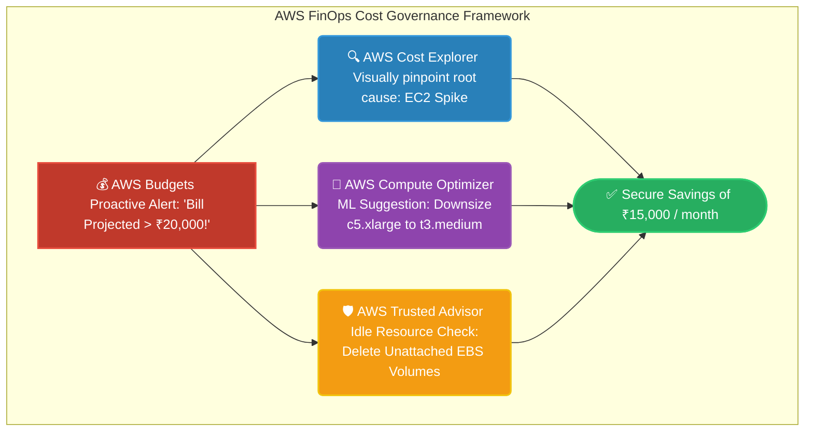

# 🚀 AWS Interview Question: FinOps & Cost Optimization

**Question 30:** *What tools and strategies would you use to identify and resolve overpaying in AWS?*

> [!NOTE]
> This is a FinOps (Cloud Financial Operations) question. A Senior Architect does not just build infrastructure; they actively maximize business ROI. Interviewers want to hear exact AWS billing tool names and how they logically tie together to hunt down idle resources.

---

## ⏱️ The Short Answer
To definitively stop cloud waste, an AWS Architect leverages a layered FinOps approach. You start with **AWS Budgets** to proactively alert you of spikes. You then use **AWS Cost Explorer** for visual deep-dives into which specific service is driving the cost. Finally, you execute actionable recommendations using **AWS Compute Optimizer** (which uses Machine Learning to securely suggest downsizing over-provisioned EC2 instances) and **AWS Trusted Advisor** (which instantly flags inherently idle infrastructure like unattached EBS volumes or orphaned Elastic IPs).

---

## 📊 Visual Architecture Flow: The AWS Cost Optimization Pipeline

---

## 🔍 Detailed Breakdown of AWS FinOps Tools

### 1. 💰 AWS Budgets & Cost Explorer (The Watchdogs)
These core tools answer the question: *How much are we spending, and where?*
- **AWS Budgets:** Set custom tracking alerts (e.g., email me immediately if next month's forecasted bill exceeds ₹20,000).
- **AWS Cost Explorer:** A visual graphing tool. If Budgets yells at you, you open Cost Explorer to group by "Service" to explicitly discover that EC2 is suddenly costing 300% more than last week.

### 2. 🛡️ AWS Trusted Advisor (The Low-Hanging Fruit)
An automated core best-practice engine covering Security, Fault Tolerance, and Cost Optimization.
- **The Engine:** It actively scans your entire account for objectively wasted resources.
- **The Fix:** It explicitly lists out unused Elastic Load Balancers, totally unattached EBS volume drives, and idle RDS database instances so you can instantly delete them to save money.

### 3. 🤖 AWS Compute Optimizer (The ML Engine)
A highly advanced right-sizing tool specifically engineered for compute.
- **The Engine:** It analyzes the actual historical CloudWatch CPU/Memory metrics of your EC2 instances. 
- **The Fix:** If you provisioned a massive `c5.2xlarge` server but it only ever hits 5% CPU, Compute Optimizer formally recommends downsizing to an `m5.large`, explicitly showing you exactly how much money the change will save.

### 4. 📉 Savings Plans & Reserved Instances (The Discounts)
Once you have deleted waste, you optimize what is left.
- **The Fix:** By natively committing to AWS for 1 to 3 years of usage upfront via a Savings Plan, AWS grants you up to a 72% discount compared to On-Demand compute pricing.

---

## 🏢 Real-World Production Scenario

**Scenario: Triaging a Massive Cloud Bill Spike**
- **The Challenge:** Your business's standard monthly AWS bill suddenly aggressively jumps from ₹20,000 directly to ₹45,000 without any change in actual customer traffic.
- **Step 1 (The Investigation):** The Architect opens **AWS Cost Explorer** and natively filters by service, immediately discovering that "EC2 - Compute" is responsible for the massive spike, largely driven by several forgotten test servers running 24/7 unused.
- **Step 2 (The Right-Sizing):** The Architect checks **AWS Compute Optimizer** and realizes the primary production application servers are massively overprovisioned. Following the automated ML advice, they successfully downsize the servers during a maintenance window.
- **Step 3 (The Cleanup):** The Architect systematically opens **AWS Trusted Advisor** and identifies 12 completely unattached, orphaned EBS volumes left over from explicitly terminated servers. They immediately delete the useless volumes.
- **The Result:** The Architect securely optimizes the account infrastructure, instantly securing raw savings of ₹15,000 per month for the business effortlessly.

---

## 🎤 Final Interview-Ready Answer
*"When diagnosing cloud overspend, I rely on a structured AWS FinOps toolchain. I always configure **AWS Budgets** to proactively alert the team to unexpected forecasted spikes. When a spike mathematically occurs, I drill down using **AWS Cost Explorer** to isolate exactly which service is burning money. To actively execute cost reduction, I leverage **AWS Compute Optimizer** to physically right-size overprovisioned EC2 instances based on historical ML analysis, and I review **AWS Trusted Advisor** to aggressively hunt down and entirely delete abandoned resources like unattached EBS volumes and idle Load Balancers."*
