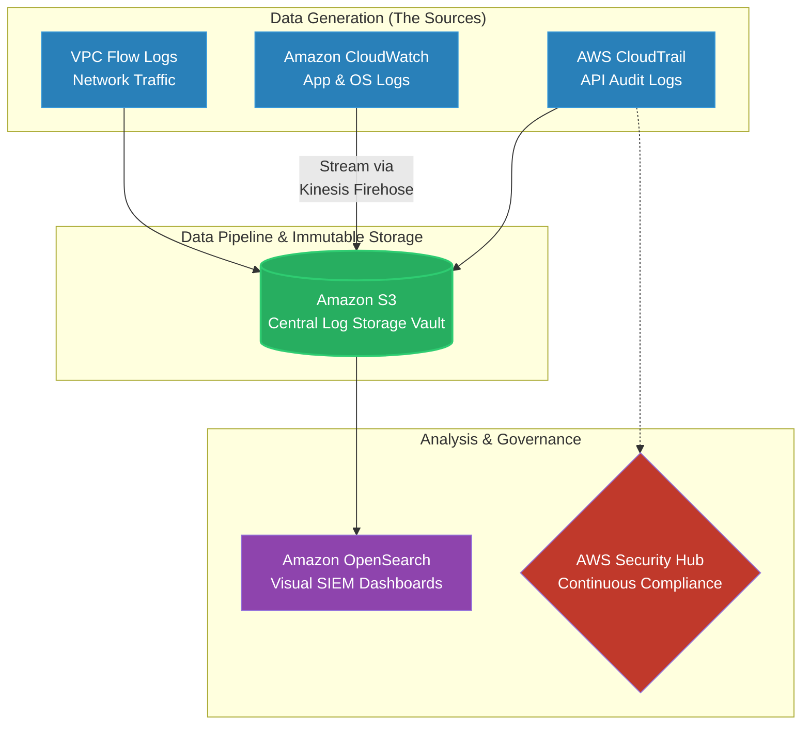

# 🚀 AWS Interview Question: Centralized Logging Architecture

**Question 31:** *What AWS services are required to build a true centralized logging and analysis architecture?*

> [!NOTE]
> This is a Security and Observability question. Interviewers want to prove you don't just "SSH into a server to read a local text file." A Senior Architect routes all log data globally into a central, immutable data lake for real-time dashboards and strict compliance audits.

---

## ⏱️ The Short Answer
To build a robust centralized logging pipeline, an Architect combines multiple managed services. **AWS CloudTrail** captures all account API activity, **CloudWatch Logs** ingests real-time application and system logs, and **VPC Flow Logs** records raw network packet data. For storage and streaming, **Amazon S3** acts as the cheap, infinite, immutable central archive vault, often utilizing **Amazon Kinesis** to stream the telemetry. Finally, **Amazon OpenSearch** (formerly Elasticsearch) provides the graphical analysis dashboards, while **AWS Security Hub** continuously monitors the logs for compliance violations.

---

## 📊 Visual Architecture Flow: Centralized Logging Pipeline

---

## 🔍 Detailed Component Breakdown

### 1. 📡 The Data Generators
You must legally capture everything happening inside your cloud boundary.
- **AWS CloudTrail:** The fundamental governance log. It records exactly who (IAM Identity), did what (e.g., deleted a database), from what IP Address, and exactly when.
- **Amazon CloudWatch:** The operational log. You configure the CloudWatch Agent on your EC2 servers to actively push local Apache/Nginx or raw application crash text files up to the cloud.
- **VPC Flow Logs:** The network log. It records every single allowed and denied IP packet entering or exiting your private subnets.

### 2. 💾 The Central Storage Vault (Amazon S3)
Logging generates terabytes of raw text data. Storing this inside premium databases is financially wasteful.
- **The Solution:** You route everything (CloudTrail, CloudWatch, VPC Flow Logs) directly into an **Amazon S3 Bucket**.
- **Immutable Security:** By enabling S3 Object Lock (WORM: Write Once, Read Many), you guarantee that absolute zero employees or malware can mathematically alter or delete the historical audit logs.

### 3. 🔍 The Analysis Engines
An S3 bucket full of raw JSON files is useless during a frantic midnight outage.
- **Amazon OpenSearch:** You use AWS Kinesis Firehose to automatically stream the raw S3 logs into an OpenSearch cluster. This gives your Security Operations Center (SOC) a brilliant visual Kibana dashboard to query patterns across millions of log lines instantly.

---

## 🏢 Real-World Production Scenario

**Scenario: Passing a Strict Security Audit (SOC 2)**
- **The Challenge:** A company's internal Security Team demands a formalized process where all infrastructure logs are stored securely in one single aggregated location for external auditing and rapid troubleshooting.
- **The Execution:** The Cloud Architect creates a highly secure, locked down `Security-Archive` S3 bucket. They configure CloudTrail to natively write all AWS API actions directly to this bucket. They configure VPC Flow Logs to stream all network metadata natively to this bucket. Finally, they configure CloudWatch to aggregate all individual EC2 application error logs.
- **The Intelligence:** All of this aggregated S3 data is actively piped into **Amazon OpenSearch**.
- **The Result:** The architecture is fully "Audit Ready" for SOC 2 compliance. During an active production incident, engineers no longer manually SSH into servers. They simply log into the centralized OpenSearch dashboard, easily type a specific user's ID, and instantly correlate network drops with specific application crash logs in real-time.

---

## 🎤 Final Interview-Ready Answer
*"To build a true enterprise centralized logging solution, I combine multiple AWS services to separate raw log generation from long-term storage and analytical querying. I utilize AWS CloudTrail to track all API governance actions, Amazon CloudWatch to ingest raw application logic, and VPC Flow Logs to cleanly capture granular network metadata. To heavily optimize operational costs, I route all of these disparate telemetry streams fundamentally into a centralized Amazon S3 bucket, creating a single source of immutable truth. Finally, to make that raw data actionable for our DevOps and Security teams, I pipe the data into Amazon OpenSearch for instant visual dashboarding, ensuring rapid incident troubleshooting and rigorous SOC 2 audit readiness."*
