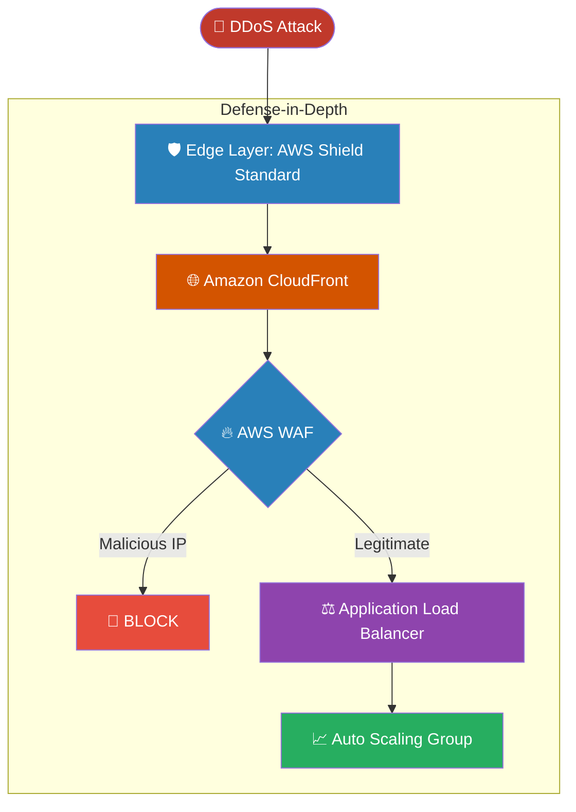

# 🚀 AWS Interview Question: DDoS Mitigation Architectures

**Question 33:** *What is a DDoS attack, and how do you architect an AWS environment to minimize or prevent it?*

> [!NOTE]
> This is a system design question. Outlining the Defense-in-Depth strategy is critical.

---

## ⏱️ The Short Answer
A **DDoS** attack occurs when malicious actors flood a target server with traffic to exhaust its bandwidth. To minimize DDoS impact:
- **CloudFront** caches assets at the global edge to absorb traffic.
- **AWS Shield Standard** automatically mitigates network layer (L3/L4) attacks.
- **AWS WAF** blocks application layer (L7) attacks using custom IP rules.
- **Auto Scaling** dynamically launches more backend EC2 servers to ensure availability.

---

## 📊 Visual Architecture Flow: The DDoS Defense Matrix

---

## 🏢 Real-World Production Scenario

**Scenario: A Targeted App Login Flood**
- **The Attack:** At 9:00 PM, a botnet attempts 1 Million login requests per minute.
- **Defense 1:** **AWS Shield Standard** drops malformed regional network packets. 
- **Defense 2:** **Amazon CloudFront** absorbs the raw bandwidth spike.
- **Defense 3:** **AWS WAF** detects a single IP requesting `/login` 100 times per minute and drops it.
- **Defense 4:** The **Auto Scaling Group** adds three backend EC2 instances to handle the remaining legitimate traffic.
- **The Result:** The application survives with zero downtime.

---

## 🎤 Final Interview-Ready Answer
*"To minimize a DDoS attack, I rely on a Defense-in-Depth strategy. At the edge, I utilize Amazon CloudFront to absorb massive bandwidth spikes, protected inherently by AWS Shield Standard against volumetric network floods. To secure the application layer, I deploy AWS WAF rate-limiting rules to explicitly drop suspicious IPs attempting HTTP floods. Finally, I integrate an Auto Scaling Group in the backend to ensure our compute tier scales elastically if any localized traffic spikes bypass the firewall edge."*
