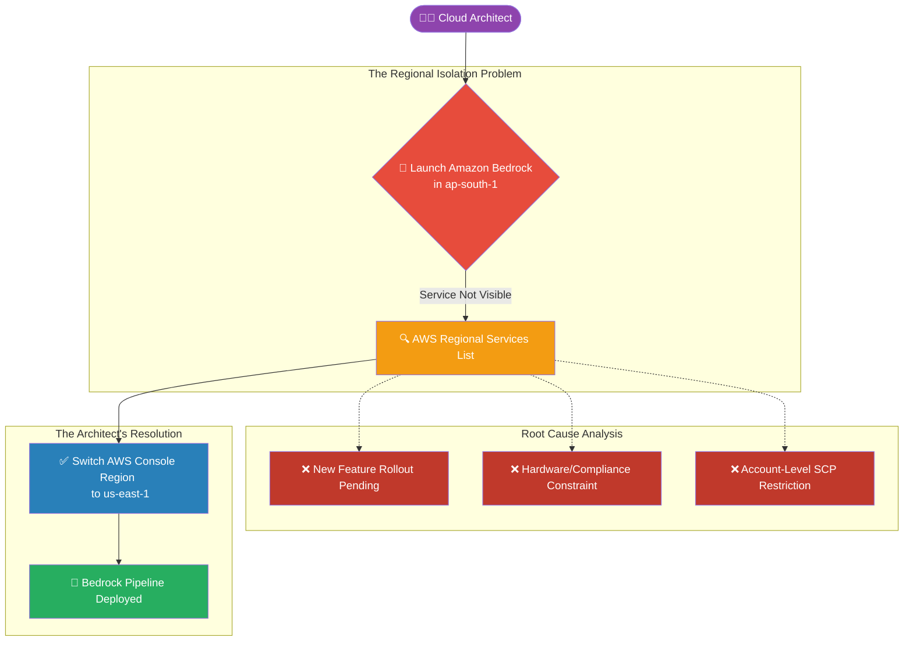

# 🚀 AWS Interview Question: Regional Service Availability

**Question 34:** *What are the possible reasons an AWS service is not visible or available in your selected Region, and how do you fix it?*

> [!NOTE]
> This is a practical administrative question. AWS rolls out new features and advanced AI hardware globally in phases, not universally on day one. Showing you understand "Global vs. Regional" boundaries is key.

---

## ⏱️ The Short Answer
AWS operates on a completely isolated Regional architecture. If a service is missing, it is typically because:
1. **Phased Rollouts:** The service is brand new and currently only deployed in flagship regions (e.g., `us-east-1`).
2. **Hardware Constraints:** The service requires specialized hardware (like ML GPUs for AI) that has not been physically installed in smaller regions yet.
3. **Account Restrictions:** The AWS Administrator has applied an SCP (Service Control Policy) or IAM rule explicitly denying access to that specific region for compliance reasons.

**The Fix:** You must consult the official *AWS Regional Services List*, simply switch your AWS Console to an active supported Region, or architect an alternative native solution using the services that are available locally.

---

## 📊 Visual Architecture Flow: Troubleshooting Missing Services

---

## 🏢 Real-World Production Scenario

**Scenario: Building an AI Generative Pipeline**
- **The Task:** The business wants to integrate a new Generative AI feature into their Indian e-commerce platform using **Amazon Bedrock**.
- **The Problem:** The Cloud Architect logs into the `ap-south-1` (Mumbai) region, searches for "Bedrock" in the console top bar, and nothing appears. 
- **The Investigation:** Because Bedrock requires massive localized GPU clusters, the Architect checks the AWS Regional Services documentation and confirms Bedrock has not launched in Mumbai yet.
- **The Solution:** The Architect simply switches the AWS Console dropdown to `us-east-1` (N. Virginia), successfully provisions the Amazon Bedrock foundational models there, and securely connects the Indian application to the US-based AI API endpoint via the AWS backbone network.

---

## 🎤 Final Interview-Ready Answer
*"If an AWS service is not visible, it fundamentally comes down to how AWS manages its isolated regional infrastructure. Often, new services like Amazon Bedrock or specialized ML instances are rolled out in phases, typically starting in flagship regions like N. Virginia before expanding globally. Alternatively, the issue could be an explicit compliance block via an AWS Organizations Service Control Policy. To resolve this, I instantly cross-reference the official AWS Regional Services list. If the service is genuinely unsupported locally, my standard protocol is to simply switch to a supported region like 'us-east-1' to deploy the resource, or architect an alternative using locally available managed services."*
