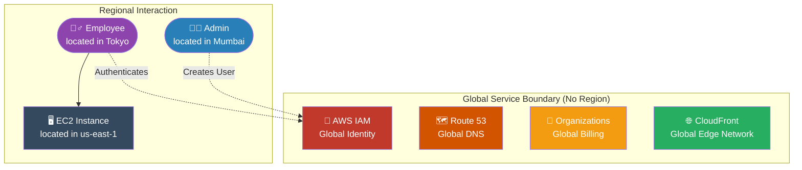

# 🚀 AWS Interview Question: Non-Regional (Global) Services

**Question 35:** *Which AWS services are NOT region-specific, and why do they operate globally?*

> [!NOTE]
> This is a foundational AWS architecture question. Interviewers use it to verify you understand the difference between the "Global Control Plane" (management) and the "Data Plane" (regional resources).

---

## ⏱️ The Short Answer
The vast majority of AWS services (like EC2 and S3) are strictly tied to a single geographic Region. However, certain core management and edge-routing services operate universally across the entire AWS global network. The primary Global Services are:
- **AWS IAM (Identity & Access Management):** Users and roles exist globally.
- **Amazon Route 53:** Global DNS routing.
- **Amazon CloudFront:** Global Content Delivery Network (CDN).
- **AWS Organizations:** Global consolidated billing and account management.
- **AWS Global Accelerator:** Global traffic routing for optimal network performance.
- **AWS WAF (Global):** Global firewall rules (when attached to CloudFront).

---

## 📊 Visual Architecture Flow: The Global Control Plane

---

## 🏢 Real-World Production Scenario

**Scenario: A Global Workforce Authentication**
- **The Setup:** A Cloud Architect sitting in an office in Mumbai logs into the AWS Console.
- **The Action:** They navigate to **AWS IAM** and create a new programmatic user named `tokyo-developer`. 
- **The Result:** The Architect did not have to explicitly create this user inside the `ap-south-1` (Mumbai) region or the `ap-northeast-1` (Tokyo) region. Because IAM is a Global Service, the new credentials instantly replicate dynamically across the entire AWS infrastructure. The developer in Tokyo can immediately use those exact credentials to launch an EC2 instance in `us-east-1` (Virginia). 

---

## 🎤 Final Interview-Ready Answer
*"While the compute layer of AWS is strictly Regional, the foundational management and edge-routing layer is exclusively Global. The core global services I rely on are AWS IAM for universal identity management, Amazon Route 53 for global DNS, AWS Organizations for multi-account governance, and Amazon CloudFront for edge content delivery. For instance, if an administrator physically located in Mumbai creates an IAM User, that user identity isn't bound to the Asia-Pacific region. Because IAM operates on the Global Control Plane, that identity instantly replicates worldwide, allowing that newly created user to seamlessly authenticate and deploy resources in Virginia or London."*
