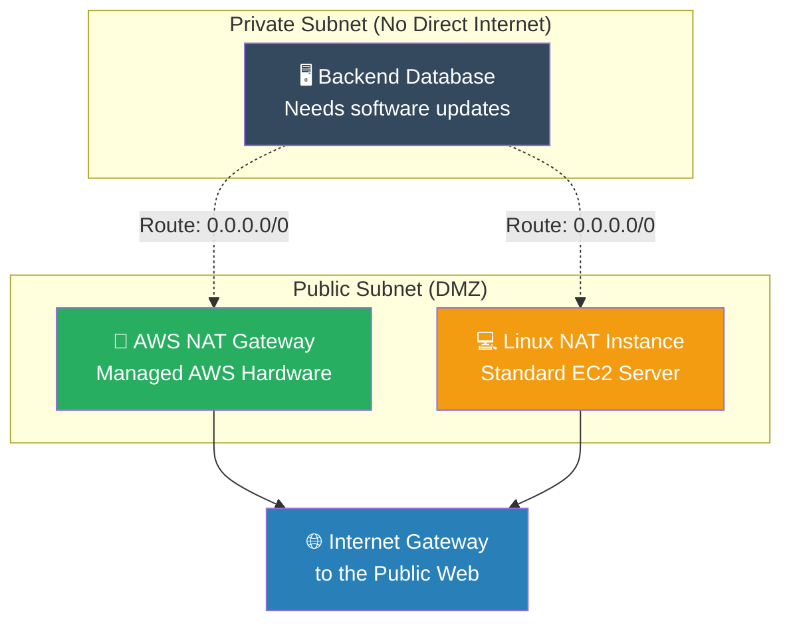

# 🚀 AWS Interview Question: NAT Gateway vs. NAT Instance

**Question 36:** *What is the difference between an AWS NAT Gateway and a NAT Instance, and when would you choose one over the other?*

> [!NOTE]
> This is a classic VPC routing and cost-optimization question. While AWS pushes exclusively for NAT Gateways, explicitly acknowledging the legitimate cost-saving use case for a NAT Instance proves you actually understand startup vs. enterprise budgets.

---

## ⏱️ The Short Answer
Both resources permit servers in a Private Subnet to download critical software updates from the Internet without exposing those servers to inbound attacks.
- A **NAT Gateway** is fully managed by AWS out of the box. It scales its bandwidth automatically up to 100 Gbps, survives underlying hardware failures inherently, and requires absolutely zero patching. It is primarily used for Enterprise stability, but it is expensive (charged by the hour and per GB of data processed).
- A **NAT Instance** is just a standard Amazon Linux EC2 server configured manually with an `iptables` script. You must patch it yourself, manually write scripts to survive instance crashes, and explicitly limit its bandwidth based on the EC2 instance size. However, it is fundamentally used for early-stage Startups because it is drastically cheaper.

---

## 📊 Visual Architecture Flow: Private Subnet Egress

---

## 🔍 Detailed Comparison Table

| Feature | 🌌 AWS NAT Gateway (Enterprise) | 💻 NAT Instance (Startup) |
| :--- | :--- | :--- |
| **Management** | Fully managed by AWS (Serverless). | Self-managed EC2 instance. |
| **Availability** | Highly Available by default within the AZ. | Single point of failure (requires ASG/Scripts). |
| **Bandwidth** | Auto-scales dynamically up to 100 Gbps. | Hard-capped by the chosen EC2 Instance Type. |
| **Maintenance** | Zero maintenance required. | Requires OS patching and software updates. |
| **Cost Profile** | Expensive (Hourly fee + Data Processing fee). | Extremely cheap (Spot Instances + standard free tier). |

---

## 🏢 Real-World Production Scenario

**Scenario: A Bootstrapped Startup vs. A Global Bank**
- **The Startup Phase:** A brand-new startup has exactly three backend servers processing test data. Their monthly budget is only $50. Rather than spending $35/month just on the idle NAT Gateway fee, the Lead Developer launches a tiny `t3.nano` EC2 NAT Instance using an Amazon community AMI. By disabling "Source/Dest Check" in the console, the startup saves hundreds of dollars manually routing traffic cheaply.
- **The Enterprise Phase:** Two years later, the application is acquired by a Global Bank. They are processing 5 terabytes of secure database transaction logs per day. The Architect immediately deletes the fragile `t3.nano` NAT Instance, replacing it strategically with an official **AWS NAT Gateway** in every Availability Zone, mathematically guaranteeing 99.99% uptime during aggressive traffic spikes without requiring a Linux Administrator to constantly manage the box.

---

## 🎤 Final Interview-Ready Answer
*"A NAT Instance is simply a manually configured EC2 server acting as a router, whereas a NAT Gateway is a fully managed, automatically scaling AWS appliance. I determine which to use entirely based on the client's budget and traffic predictability. For a purely bootstrapped startup where cost optimization is the absolute highest priority, I will deploy a small NAT Instance because it is drastically cheaper. However, for a rigid enterprise production environment, we mathematically cannot risk a single EC2 failure taking down all outbound patching traffic. Therefore, I will exclusively deploy the official AWS NAT Gateway, which securely auto-scales up to 100 Gbps of bandwidth inherently and requires absolute zero OS patching."*
