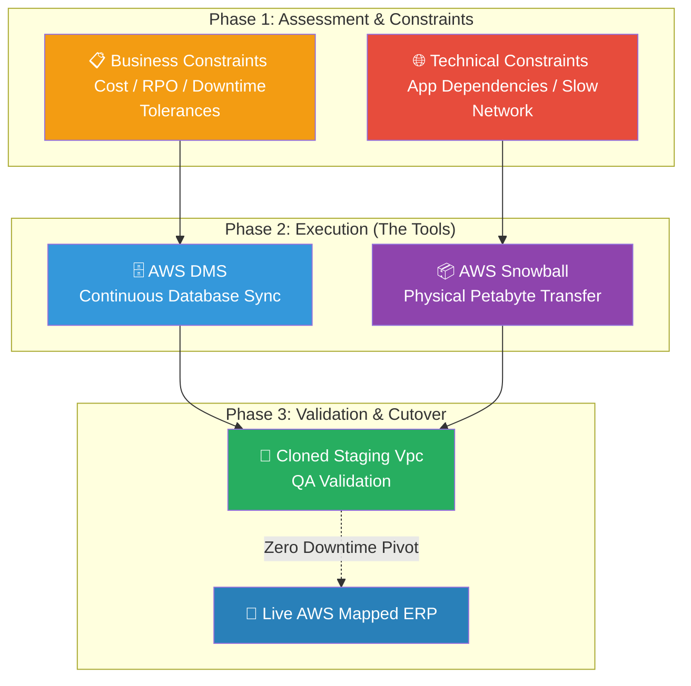

# 🚀 AWS Interview Question: AWS Migration Strategy

**Question 37:** *What are the critical factors an Architect must consider before and during an enterprise migration to AWS?*

> [!NOTE]
> This is an Enterprise Architecture question. An Architect rarely actually performs the physical data copy; instead, they design the blueprint. Mentioning RTO/RPO (Recovery Time/Point Objective) and hardware transfer tools immediately establishes senior-level credibility.

---

## ⏱️ The Short Answer
A successful AWS migration requires assessing both the business and technical constraints before touching any data.
- **Business Factors:** Cost analysis (CapEx vs. OpEx), Compliance requirements (HIPAA, PCI-DSS), and strict Downtime Tolerance (RTO/RPO limits).
- **Technical Factors:** Application dependencies (what breaks if moved first), Security policies, and Network limitations.
- If your on-premise network bandwidth is too slow to transfer massive datasets, you bypass the internet and physically ship an **AWS Snowball** hardware device.
- For living, breathing databases, you utilize **AWS DMS (Database Migration Service)** to replicate changes without downtime.

---

## 📊 Visual Architecture Flow: The Enterprise Migration Plan

---

## 🏢 Real-World Production Scenario

**Scenario: Escaping an On-Premise Data Center (Legacy ERP Migration)**
- **The Challenge:** A massive manufacturing company needs to migrate their core 50-Terabyte ERP monolith to AWS. The CEO dictates a maximum downtime tolerance (RTO) of exactly 4 hours.
- **The Network Problem:** The company's internet pipe is painfully slow. Calculating bandwidth proves that transferring 50-TB over their current VPN will take 8 weeks.
- **The Execution:** The Cloud Architect orders an **AWS Snowball Edge** device directly to the data center, physically loads the 50-TB archive offline, and securely mails it back to AWS, transferring the massive bulk data in 4 days.
- **The Live Data:** Once the archive is uploaded to S3, the Architect configures **AWS DMS** to begin syncing the daily delta changes from the on-premise Oracle database to an Amazon RDS instance seamlessly over the network.
- **The Cutover:** They spin up a Staging environment in AWS, thoroughly test the ERP components, and during a Friday night maintenance window, instantly flip the DNS to point at AWS. Migration complete with zero data loss.

---

## 🎤 Final Interview-Ready Answer
*"When designing an AWS migration strategy, I analyze three core pillars: Business constraints, Security compliance, and Technical capacity. Critically, I establish the exact Downtime Tolerance and RTO/RPO limits with stakeholders. For execution, if I discover severe network bandwidth bottlenecks—which is highly common in legacy data centers—I will completely bypass the internet and provision an AWS Snowball appliance to physically ingest massive terabyte workloads offline. Concurrently, for critical transactional state, I deploy the AWS Database Migration Service (DMS) to continuously replicate live database records to Amazon RDS. I always ensure the entire stack is heavily validated in a mirrored AWS Staging VPC before executing a finalized DNS cutover to production."*
