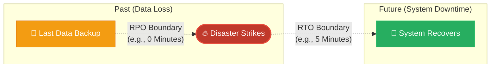

# 🚀 AWS Interview Question: RTO vs RPO

**Question 38:** *Explain the concepts of RTO and RPO in Disaster Recovery, and how they dictate your AWS architecture.*

> [!NOTE]
> This is a mandatory subject for Senior Architects. You must be able to translate business risk metrics (RTO/RPO) into physical AWS services (like Multi-AZ or Cross-Region Replication).

---

## ⏱️ The Short Answer
RTO and RPO are the two fundamental metrics that govern every Disaster Recovery strategy.
- **RTO (Recovery Time Objective):** This dictates *Downtime Tolerance*. It is the maximum acceptable amount of time your application can be entirely offline before it financially damages the business (e.g., "The system must be fully restored in under 5 minutes").
- **RPO (Recovery Point Objective):** This dictates *Data Loss Tolerance*. It is the maximum acceptable amount of data (measured in time) the business is willing to lose permanently from the last backup (e.g., "We can only afford to lose the last 1 hour of data").

---

## 📊 Visual Architecture Flow: The Disaster Timeline

---

## 🔍 Translating RTO/RPO to AWS Services

A low RTO and RPO equals an incredibly expensive AWS architecture. A high RTO and RPO equals a very cheap AWS architecture.

| Business Goal | AWS Architecture Strategy | Relative Cost |
| :--- | :--- | :--- |
| **High RTO (24 Hours)**   **High RPO (24 Hours)** | **Backup & Restore:** Run single-AZ EC2 servers. Run daily EBS snapshots and nightly database dumps to S3 at midnight. | 💵 Very Cheap |
| **Medium RTO (4 Hours)**   **Medium RPO (1 Hour)** | **Pilot Light:** Keep core web servers stopped. Run hourly RDS backups. If a disaster hits, boot up the web servers. | 💵💵 Moderate |
| **Low RTO (15 Mins)**   **Low RPO (5 Mins)** | **Warm Standby:** Keep a scaled-down version of your production environment constantly running in a secondary AWS Region. | 💵💵💵 Expensive |
| **Zero RTO (Seconds)**   **Zero RPO (0 Data Loss)** | **Multi-Site Active/Active:** Full traffic split globally using Route 53 across multiple regions with synchronous DynamoDB Global Tables. | 💵💵💵💵 Massive |

---

## 🏢 Real-World Production Scenario

**Scenario: A Tier-1 Banking Application**
- **The Challenge:** A bank's mobile application processes millions of dollars a minute. The board of directors strictly mandates an **RTO of 5 minutes** and an absolute **RPO of 0 data loss**.
- **The Implementation:** To guarantee an RPO of 0, the Cloud Architect utilizes Amazon RDS Multi-AZ to synchronously replicate every single byte of data to a standby database in real-time. To guarantee an RTO of 5 minutes, they utilize a Warm Standby architecture with Auto Scaling Groups pre-warmed across 3 Availability Zones, allowing AWS to instantly flip traffic via the Load Balancer if a primary zone fails.

---

## 🎤 Final Interview-Ready Answer
*"Every Disaster Recovery strategy starts by explicitly defining RTO and RPO. RTO, or Recovery Time Objective, determines strict downtime constraints, answering how fast the servers must be resurrected. RPO, or Recovery Point Objective, determines strict data loss boundaries, answering how much data we are legally allowed to lose since the last backup. If a banking client demands an RTO of 5 minutes and an RPO of precisely zero, I cannot rely on standard daily S3 backups. I functionally must architect an Active-Active or Warm Standby architecture, utilizing Multi-AZ synchronous replication for the database to mathematically guarantee zero data loss, coupled with globally distributed Load Balancers to guarantee instantaneous recovery."*
