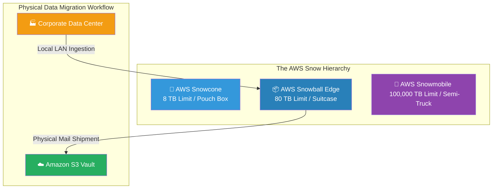

# 🚀 AWS Interview Question: The AWS Snow Family

**Question 39:** *What is the difference between AWS Snowball, Snowball Edge, and Snowmobile, and when would you use them?*

> [!NOTE]
> This is a physical logistics and data migration question. Interviewers use this to verify if you can mathematically calculate when network bandwidth is too slow for a migration, forcing an offline hardware transfer.

---

## ⏱️ The Short Answer
The **AWS Snow Family** consists of physical, securely encrypted hardware devices shipped directly to your corporate data center by AWS to completely bypass slow internet connections during massive data migrations.
- **AWS Snowcone:** The absolute smallest device (8 TB). It is the size of a tissue box, used in harsh environments like drones or hospitals.
- **AWS Snowball Edge:** The standard enterprise device (80 TB). It is the size of a rugged suitcase. It includes built-in EC2 compute power to process data locally before shipping. *(Note: The original standard 'Snowball' has been entirely replaced by the 'Snowball Edge').*
- **AWS Snowmobile:** A massive 45-foot shipping container pulled by a semi-truck (100 PB = 100,000 TB). You literally drive it directly into your massive legacy data center to rip out exabytes of data.

---

## 📊 Visual Architecture Flow: Offline Petabyte Migration

---

## 🏢 Real-World Production Scenario

**Scenario: A Massive Media Company Migration**
- **The Challenge:** A legacy film studio possesses precisely **500 Terabytes** of uncompressed 4K video files stored on local office hard drives. They need to migrate this data into Amazon S3 to utilize AWS Elastic Transcoder.
- **The Network Problem:** The studio's internet connection is extremely slow. Sending 500 TB over their network will mathematically take 1.5 years.
- **The Solution:** The Cloud Architect logs into the AWS console and orders exactly **six (6) AWS Snowball Edge** devices. 
- **The Execution:** AWS mails the six rugged suitcases to the studio via UPS. The studio plugs the devices into the local office switches, copies all 500 TB of video files locally at gigabit LAN speed over a weekend, and hands the suitcases back to the UPS driver. AWS receives the hardware and injects the 500 TB natively into Amazon S3 in just 8 days total.

---

## 🎤 Final Interview-Ready Answer
*"The AWS Snow Family solves the physical mathematical problem of extremely slow network migration speeds. When migrating massive amounts of data—such as 500 Terabytes of media files from an on-premise studio with poor internet—an architect cannot wait months for a network upload. Instead, I bypass the internet completely by ordering multiple AWS Snowball Edge devices. These rugged, 80-Terabyte physical appliances are shipped directly to the data center, where we securely ingest the data locally via high-speed LAN offline. We then ship the hardware back to AWS for direct, secure ingestion into Amazon S3. For vastly larger exabyte-scale migrations, I would coordinate the deployment of an AWS Snowmobile semi-truck directly to the data center."*
