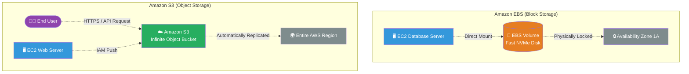

# 🚀 AWS Interview Question: S3 vs. EBS

**Question 40:** *What is the difference between Amazon S3 and Amazon EBS, and what are their primary use cases?*

> [!NOTE]
> This is a foundational storage question. Interviewers want to hear you distinguish between "Object Storage" (web files via HTTP) and "Block Storage" (boot drives mounted directly to an OS). 

---

## ⏱️ The Short Answer
Amazon S3 and Amazon EBS serve entirely completely different architectural purposes.
- **Amazon S3 (Simple Storage Service):** A serverless *Object Storage* service. It is infinitely scalable, accessed globally via HTTP/API, and inherently Highly Available across multiple Availability Zones. It is used for flat files like images, videos, logs, and backups.
- **Amazon EBS (Elastic Block Store):** A high-performance *Block Storage* service. It acts exactly like a physical hard drive (C: Drive / `/dev/sda`) natively mounted to a single EC2 instance. It is strictly locked to one specific Availability Zone and is used for operating systems and raw databases.

---

## 📊 Visual Architecture Flow: Storage Attachment

---

## 🔍 Detailed Comparison Table

| Feature | ☁️ Amazon S3 (Object) | 💽 Amazon EBS (Block) |
| :--- | :--- | :--- |
| **Storage Paradigm** | Object (File + Metadata + Key). | Block (Raw bytes organized by a File System). |
| **Accessibility** | Global/Regional (accessed via HTTPS/API). | Local (physically attached to a single EC2 via network). |
| **Scalability** | Mathematically infinite scalable storage. | Hard limit (must pre-provision gigabytes up to 64 TB). |
| **Availability** | Multi-AZ by default. Automatically survives data center failure. | Single-AZ. Will fail if the specific Availability Zone fails. |
| **Updates** | Slower. If you change 1 byte, you must re-upload the entire file. | Sub-millisecond. You can change raw data blocks directly in real-time. |

---

## 🏢 Real-World Production Scenario

**Scenario: Designing an LMS (Learning Management System)**
- **The Database Layer:** The platform relies heavily on an active PostgreSQL database. Because databases demand sub-millisecond, low-latency micro-edits to individual blocks of data, the Architect fundamentally mounts an **Amazon EBS Volume** directly to the EC2 database server to act as its physical high-IOPS hard drive.
- **The Media Layer:** The platform hosts 10,000 MP4 training videos. The Architect places all 10,000 `.mp4` files directly into an **Amazon S3 Bucket**. This is because S3 provides infinite storage completely decoupled from any single server, and allows students to securely stream the videos natively over HTTP via CloudFront without touching the core database server.

---

## 🎤 Final Interview-Ready Answer
*"Amazon S3 and EBS represent Object Storage versus Block Storage. Amazon EBS is a high-performance block-level hard drive logically attached to a single EC2 instance, locked to a specific Availability Zone. Because of its ultra-low latency, I strictly use EBS for Operating System boot drives and transactional database storage. On the other hand, Amazon S3 is a serverless, infinitely scalable object storage bucket distributed securely across an entire AWS region. I utilize S3 for storing static application assets—such as raw MP4 video tutorials for our LMS platform, user avatar images, and archiving long-term system backup logs."*
