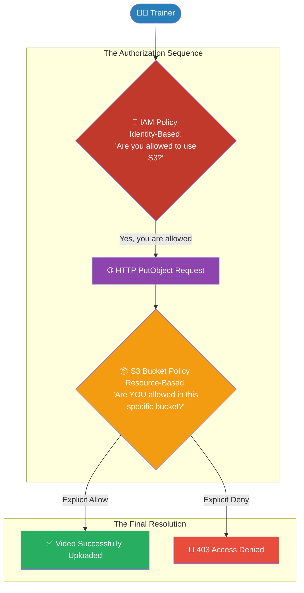

# 🚀 AWS Interview Question: S3 Access Control

**Question 41:** *What are the different ways to allow or restrict user access to an Amazon S3 Bucket?*

> [!NOTE]
> This is a core Security & Governance question. You must clearly differentiate between "Identity-Based Policies" (permissions attached to a person) and "Resource-Based Policies" (permissions attached to the bucket itself). 

---

## ⏱️ The Short Answer
There are four primary ways to control access to an S3 bucket:
1. **IAM Policies (Identity-Based):** You attach a JSON policy directly to an AWS User, Group, or Role (e.g., "John is allowed to put objects into any S3 bucket").
2. **Bucket Policies (Resource-Based):** You attach a JSON policy directly to the S3 Bucket itself (e.g., "This specific bucket only accepts uploads from John's IP address").
3. **IAM Roles (Temporary Access):** Used for server-to-server or cross-account access (e.g., Allowing an EC2 instance to read an S3 bucket dynamically).
4. **Access Control Lists (ACLs):** Legacy object-level permissions. AWS officially recommends disabling ACLs completely unless you have extremely specific legacy cross-account requirements.

---

## 📊 Visual Architecture Flow: IAM vs Bucket Policy Evaluation

---

## 🏢 Real-World Production Scenario

**Scenario: Onboarding a New Course Content Creator**
- **The Challenge:** Your LMS platform hires a new external trainer. They need the ability to upload their new raw `.mp4` video files directly into the platform's cloud storage, but they must be strictly blocked from viewing, modifying, or deleting other trainers' videos.
- **The Solution:** 
  1. The Cloud Architect creates a new **IAM User** specifically for the external trainer.
  2. The Architect crafts a custom **IAM Policy** granting the `s3:PutObject` action (uploading).
  3. Crucially, in the "Resource" section of the JSON policy, the Architect explicitly restricts this permission *only* to `arn:aws:s3:::lms-course-videos/trainer-name/*`.
- **The Result:** The trainer successfully logs in and uploads their videos. If the trainer attempts to click on another folder or delete an asset, the AWS API physically rejects the request with a strict `403 Access Denied` error.

---

## 🎤 Final Interview-Ready Answer
*"To control access to Amazon S3, I utilize a combination of Identity-Based and Resource-Based policies. For standard user access—like allowing an external trainer to upload course videos—I create an IAM User and attach a strict Identity-Based IAM Policy. I utilize the principle of Least Privilege by explicitly defining the 's3:PutObject' action and physically locking the 'Resource' ARN to their specific bucket folder. For overarching security rules, I utilize Resource-Based Bucket Policies. For instance, I can attach a Bucket Policy directly to the S3 bucket that explicitly denies all write traffic unless the request visually originates from our corporate office's IP address, completely overriding any IAM permissions. I actively avoid using legacy S3 ACLs as per AWS foundational security best practices."*
