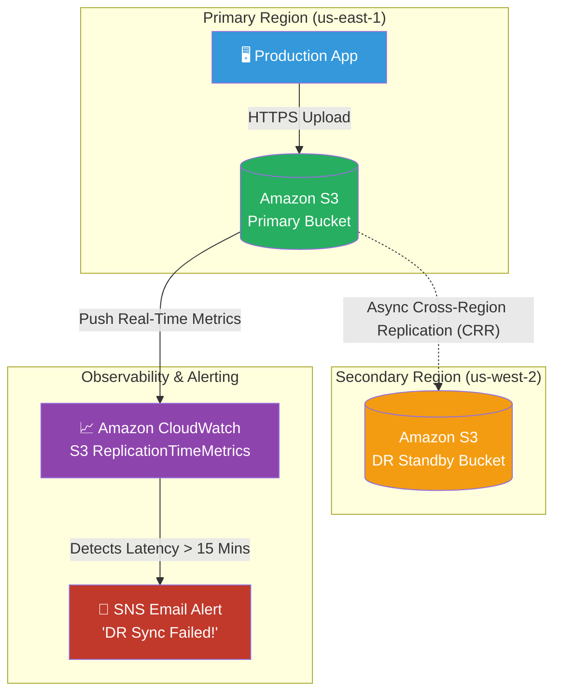

# 🚀 AWS Interview Question: Monitoring S3 Cross-Region Replication

**Question 42:** *How do you monitor S3 Cross-Region Replication (CRR) to formally guarantee your Disaster Recovery bucket is actually synchronized?*

> [!NOTE]
> This is a Senior Observability question. Setting up Cross-Region Replication is simply clicking a button in the console. Proving mathematically that the replication *did not silently fail* using CloudWatch is what separates Junior engineers from Senior Architects.

---

## ⏱️ The Short Answer
To guarantee synchronization, you cannot just manually check the buckets. You must natively enable **S3 Replication Time Control (RTC)** and **S3 Replication Metrics**. 
- Once enabled, S3 automatically publishes continuous metrics directly to **Amazon CloudWatch** (specifically tracking `BytesPendingReplication` and `ReplicationLatency`).
- You configure a CloudWatch Alarm to trigger an **Amazon SNS Email Notification** if the replication latency exceeds a strict business threshold (e.g., 15 minutes), ensuring immediate awareness of any DR synchronization failure.

---

## 📊 Visual Architecture Flow: Observability Pipeline

---

## 🏢 Real-World Production Scenario

**Scenario: Enforcing a Strict 15-Minute RPO**
- **The Challenge:** A financial technology company hosts millions of PDF bank statements in an S3 bucket in N. Virginia. For compliance, they have an absolute Recovery Point Objective (RPO) of 15 minutes, meaning the Disaster Recovery bucket in Oregon must never fall more than 15 minutes behind the primary bucket.
- **The Solution:** The Cloud Architect enables S3 Cross-Region Replication with S3 RTC (Replication Time Control), which contractually guarantees 99.99% of objects replicate within 15 minutes. 
- **The Safety Net:** To prove compliance, the Architect creates an Amazon CloudWatch Alarm targeting the `ReplicationLatency` metric. If an unexpected AWS network drop occurs and the lag hits exactly 15 minutes, CloudWatch instantly fires an Amazon SNS email to the PagerDuty on-call team.
- **The Result:** The business sleeps soundly knowing their DR bucket mathematically matches their primary bucket, and they will be instantly alerted if it breaks.

---

## 🎤 Final Interview-Ready Answer
*"To monitor S3 Cross-Region Replication effectively, I don't rely on manual checks; I rely on native CloudWatch telemetry. I configure S3 Replication Time Control, which inherently publishes robust replication metrics to Amazon CloudWatch, such as 'BytesPendingReplication' and 'ReplicationLatency'. To satisfy our firm's strict Disaster Recovery compliance, I attach an explicit CloudWatch Alarm to those metrics. If, for instance, our 'ReplicationLatency' breaches our strict 15-minute RPO threshold, the alarm dynamically triggers an Amazon SNS topic, instantly sending a high-priority email to our Security Operations Center to investigate the sync failure before an actual disaster occurs."*
