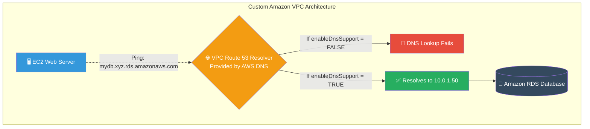

# 🚀 AWS Interview Question: VPC DNS Resolution

**Question 43:** *An EC2 instance inside a custom VPC cannot resolve the hostname of an Amazon RDS database, but it can reach it via IP address. What is the root cause and how do you fix it?*

> [!NOTE]
> This is an incredibly common troubleshooting scenario. Custom VPCs do not have DNS Hostnames enabled by default. Proving you know the exact VPC-level attributes to toggle shows deep, practical Terraform/Infrastructure experience.

---

## ⏱️ The Short Answer
If an AWS resource cannot resolve internal AWS hostnames (like an RDS endpoint or an EFS mount target) inside a custom VPC, the root cause is almost always incredibly simple: **The VPC lacks DNS Support.**
- To fix this immediately, you must navigate to the VPC settings and actively check two specific attributes:
  1. `enableDnsSupport = true` (Allows the VPC to use the native Route 53 Resolver at the `+ 2` IP address).
  2. `enableDnsHostnames = true` (Ensures that EC2 instances receive public DNS hostnames).

---

## 📊 Visual Architecture Flow: VPC DNS Resolution

---

## 🔍 Additional Troubleshooting Steps
If both `enableDnsSupport` and `enableDnsHostnames` are correctly set to `true`, but the connection still fails, check the following:
1. **Security Groups:** Does the EC2 outbound Security Group allow port `53` (UDP/TCP) if you are querying an external custom DNS server? Does the RDS inbound Security Group allow port `3306`/`5432` from the EC2 instance?
2. **Route Tables:** Is there a local route misconfiguration preventing packets from reaching the mapped subsystem?

---

## 🏢 Real-World Production Scenario

**Scenario: A Broken Database Connection String**
- **The Challenge:** A Junior Developer provisions a brand-new custom VPC using Terraform. They launch a PHP EC2 instance and an Amazon RDS PostgreSQL database. The developer copies the RDS endpoint URL (`mydb.cjsd8.us-east-1.rds.amazonaws.com`) into the application configuration, but the PHP application throws a `PDOException: Could not resolve host` error.
- **The Investigation:** The developer struggles to ping the RDS endpoint but notes they *can* successfully ping the exact 10.0.x.x private IP address. They escalate to the Cloud Architect.
- **The Solution:** The Architect immediately recognizes the custom VPC default behavior. They physically edit the VPC configuration in the AWS console, explicitly toggling `DNS resolution` and `DNS hostnames` to `Enabled`.
- **The Result:** The exact same RDS endpoint string in the PHP code instantly resolves correctly, and the application perfectly connects to the backend database.

---

## 🎤 Final Interview-Ready Answer
*"If an EC2 instance can reach a database via an IP address but completely fails to resolve the official AWS hostname endpoint, the root cause is natively tied to the VPC's DNS configuration. Unlike the Default VPC, custom VPCs do not enable internal DNS hostnames out of the box. To fix this, I would immediately navigate to the VPC Settings and explicitly set both 'enableDnsSupport' and 'enableDnsHostnames' to True. This instantly activates the VPC's internal Amazon-provided DNS server, allowing the EC2 instance to perfectly resolve the RDS domain endpoint into its mapped private IP address."*
