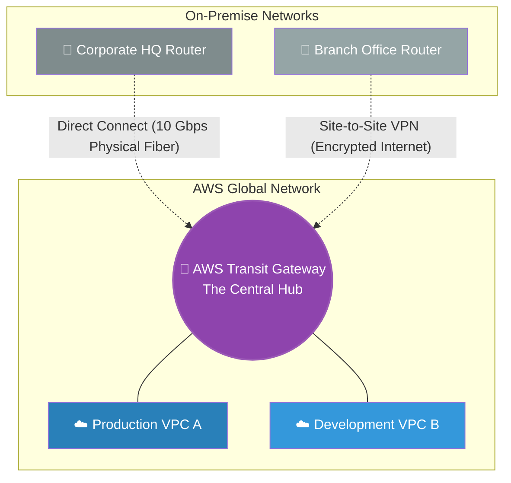

# 🚀 AWS Interview Question: Multi-Site VPC Connectivity

**Question 44:** *How do you architect a secure connection between multiple On-Premise locations (HQ, Branch Offices) and multiple AWS VPCs?*

> [!NOTE]
> This is a Senior Network Architecture question. Explaining the evolution from isolated "Site-to-Site VPNs" to a unified "Amazon Transit Gateway" proves you can build Hub-and-Spoke networks for large enterprises.

---

## ⏱️ The Short Answer
To connect external networks to AWS VPCs, Architects utilize a combination of four distinct networking services based on budget and complexity:
1. **AWS Site-to-Site VPN:** An encrypted IPsec tunnel over the public internet. It is cheap and fast to set up, ideal for branch offices.
2. **AWS Direct Connect (DX):** A physical, dedicated fiber-optic cable from your data center straight into AWS. It completely bypasses the public internet, offering ultra-low latency, but it takes months to physically install.
3. **VPC Peering:** A native connection linking one VPC directly to another VPC. It does not natively support transitive routing (VPC A -> VPC B -> VPC C is not allowed).
4. **AWS Transit Gateway:** The ultimate enterprise "Hub." It acts as a central router. You plug all your VPCs, VPNs, and Direct Connects into the Transit Gateway, entirely simplifying the complex network topology.

---

## 📊 Visual Architecture Flow: The Enterprise Hub-and-Spoke

---

## 🏢 Real-World Production Scenario

**Scenario: Unifying a Global Healthcare Network**
- **The Challenge:** A healthcare company has a massive Corporate HQ Data Center, 15 individual remote hospital branch offices, and 5 separate AWS VPCs hosting different medical applications. Connecting every single hospital to every single VPC using standalone Site-to-Site VPNs creates a nightmare "mesh" of 75 different VPN tunnels to manage.
- **The Core Connection:** The Cloud Architect orders an **AWS Direct Connect** fiber cable to link the Corporate HQ Data Center directly to AWS securely without touching the public internet (satisfying strict HIPAA requirements).
- **The Branch Connections:** For the 15 remote hospitals, the Architect spins up 15 individual encrypted **AWS Site-to-Site VPN** tunnels over the standard internet.
- **The Orchestration:** Instead of connecting these links to individual VPCs, the Architect deploys an **AWS Transit Gateway**. They plug the Direct Connect, all 15 VPN tunnels, and all 5 AWS VPCs directly into this single Hub. 
- **The Result:** The complex mesh topology is instantly simplified. Any hospital can securely route traffic through the Transit Gateway directly to the correct cloud application effortlessly.

---

## 🎤 Final Interview-Ready Answer
*"To securely connect multiple external sites to AWS, I evaluate the strict bandwidth and security requirements. For a massive Corporate HQ requiring guaranteed throughput and zero public internet exposure, I will provision an AWS Direct Connect physical fiber line. For rapid deployment to remote branch offices, I will utilize encrypted AWS Site-to-Site VPN tunnels over the standard internet. Finally, to prevent a complex, unmanageable web of individual VPC Peering connections, I will natively route all of these external connections—along with our internal VPCs—directly into an AWS Transit Gateway. The Transit Gateway acts as a highly scalable central cloud router, dramatically simplifying the enterprise network mathematically into a clean, unified Hub-and-Spoke architecture."*
