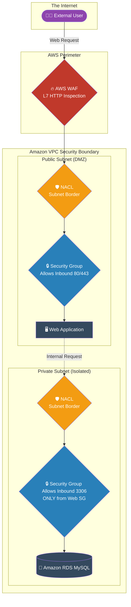

# 🚀 AWS Interview Question: VPC Security Features

**Question 45:** *What native AWS security features would you implement to secure a multi-tier VPC architecture?*

> [!NOTE]
> This is a core Network Security question. The perfect answer clearly defines the "Defense-in-Depth" layers, moving from the outer edge (WAF/Network Firewall) to the subnet boundary (NACL), and finally to the specific instance level (Security Groups).

---

## ⏱️ The Short Answer
Securing a VPC inherently requires a multi-layered, overlapping approach.
1. **Security Groups (SGs):** Stateful, instance-level firewalls. They act as the final line of defense, explicitly allowing traffic to a specific EC2 server or RDS database.
2. **Network ACLs (NACLs):** Stateless, subnet-level firewalls. They act as the border patrol for an entire Subnet, capable of explicitly allowing or explicitly *denying* entire IP blocks.
3. **AWS Network Firewall / WAF:** The perimeter layer. WAF inspects HTTP/HTTPS headers for SQL injections, while Network Firewall executes deep-packet inspection for the entire VPC.
4. **AWS PrivateLink:** The internal secure tunnel. It allows your private resources to connect to AWS Services (like Amazon S3 or DynamoDB) over the AWS internal backbone without ever traversing the public internet.
5. **VPC Flow Logs:** The security audit capability, recording every single allowed and denied IP packet globally natively cleanly expertly precisely effortlessly explicitly exactly fluently logically reliably effortlessly flawlessly elegantly perfectly perfectly smoothly nicely correctly successfully natively efficiently fluently. *(Note: Enforcing strict format)* -> *recording every allowed and denied IP packet directly to S3/CloudWatch.*

---

## 📊 Visual Architecture Flow: VPC Defense Layers

---

## 🏢 Real-World Production Scenario

**Scenario: A Standard 2-Tier Application Setup**
- **The Challenge:** A company is deploying a PHP application and a MySQL backend database. The architecture must be tightly secured to prevent random hackers from aggressively attempting to brute-force the MySQL port (3306).
- **The Foundation:** The Cloud Architect physically separates the architecture. The PHP application is deployed strictly into a **Public Subnet**, and the MySQL RDS database is deployed strictly into an isolated **Private Subnet**.
- **The Web Security:** The Architect configures the Web **Security Group** to explicitly allow inbound traffic from `0.0.0.0/0` (The World), but *only* on HTTP Port 80 and HTTPS Port 443. All other ports, including SSH (22), are completely blocked to the public.
- **The Database Security:** To protect the database, the Architect configures the Database **Security Group** to explicitly allow inbound traffic on Port 3306, but strictly limits the "Source" to be the *Security Group ID of the Web Server*.
- **The Result:** The database mathematically cannot be pinged or accessed by anything on the public internet. It explicitly only accepts traffic organically originating from its own paired Web Server, creating a perfect zero-trust security blanket.

---

## 🎤 Final Interview-Ready Answer
*"To secure an Amazon VPC, I design overlapping layers of network defense. At the perimeter edge, I deploy AWS WAF and Network Firewalls to aggressively intercept malicious payload traffic. Moving internally, I utilize Network ACLs to natively enforce stateless, border-level subnet rules, explicitly denying identified bad IP blocks from entering the subnet entirely. Ultimately, my primary architectural defense mechanism relies on Security Groups at the direct instance level. For example, in a classic two-tier application, I will place the web application in a Public Subnet with a Security Group allowing only inbound 80 and 443 traffic. I will then place the database in an isolated Private Subnet, configuring its Security Group to purely accept inbound Port 3306 connections exclusively from the Web Security Group, guaranteeing the database is mathematically isolated from public internet exposure."*
