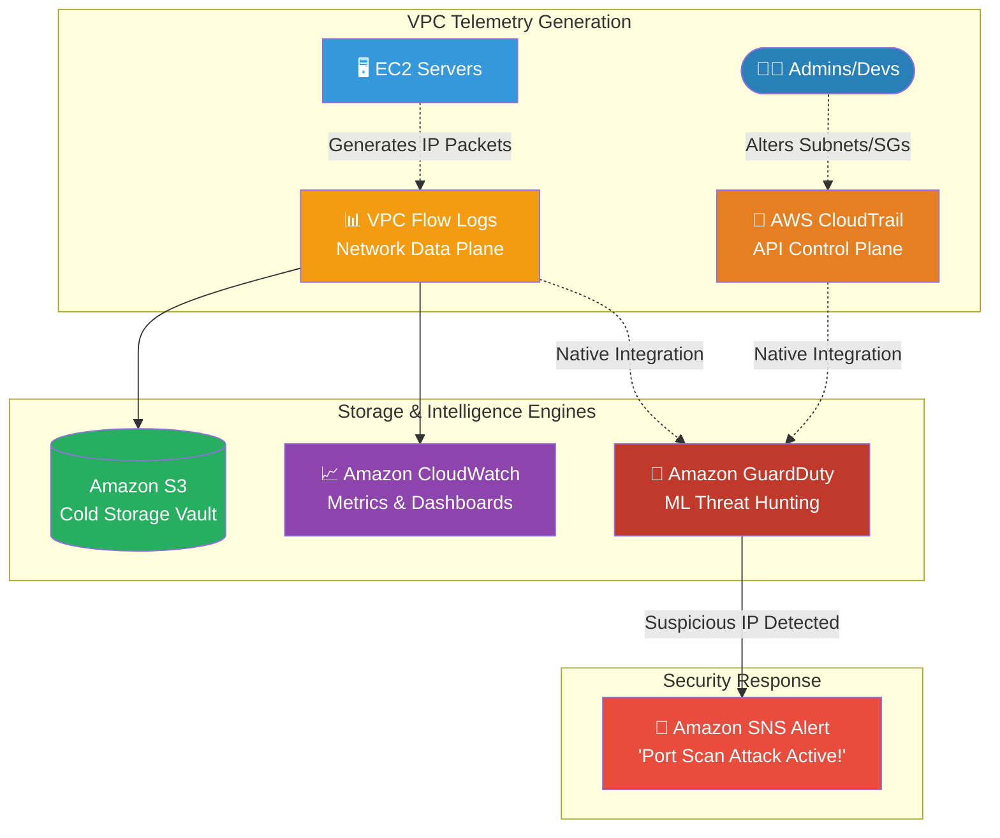

# 🚀 AWS Interview Question: Monitoring the VPC

**Question 46:** *What native AWS services would you implement to monitor the health, traffic, and security of an Amazon VPC?*

> [!NOTE]
> This is a core Network Observability question. Knowing that "VPC Flow Logs" captures the IP traffic while "CloudTrail" captures the API admin changes demonstrates that you understand the fundamental difference between the pure Data Plane and the Control Plane.

---

## ⏱️ The Short Answer
To fully monitor a VPC, you need visibility into both the physical network packets transferring inside and the administrative API calls modifying the infrastructure.
1. **VPC Flow Logs:** Captures information about all IP traffic going to and from network interfaces in your VPC. Determines exactly who is talking to whom.
2. **Amazon CloudWatch:** Stores the VPC Flow Logs, creates visual dashboards, and triggers alarms if unexpected traffic spikes occur.
3. **AWS CloudTrail:** Captures the administrative Control Plane actions. If an engineer accidentally deletes a subnet or opens a Security Group globally, CloudTrail logs exactly who did it.
4. **Amazon GuardDuty:** An intelligent Threat Detection engine. It actively ingests VPC Flow Logs completely behind the scenes, using Machine Learning to instantly identify malicious port scanning or compromised EC2 instances automatically.

---

## 📊 Visual Architecture Flow: The VPC Telemetry Pipeline

---

## 🏢 Real-World Production Scenario

**Scenario: Detecting a Rogue Port Scan**
- **The Challenge:** A company is running an internal CRM application in a Private Subnet. The Security Operations Center (SOC) receives an alert that something inside the network is aggressively attempting to communicate with an external Bitcoin mining server.
- **The Investigation:** Because the Cloud Architect previously enabled **VPC Flow Logs** on all subnets, the network telemetry is continuously pushing directly into **Amazon CloudWatch**.
- **The Solution:** The Architect opens CloudWatch Logs Insights and runs a simple query against the Flow Logs to explicitly filter for `REJECT` traffic traversing port `8333` (the Bitcoin port). 
- **The Intelligence:** Simultaneously, **Amazon GuardDuty** fundamentally ingested those exact same Flow Logs, automatically recognized the known malicious Bitcoin IP address using its threat intelligence databases, and independently fired a critical alert into AWS Security Hub.
- **The Result:** The Architect immediately isolates the compromised EC2 instance by mathematically removing its Security Group, cleanly terminating the intrusion attempt.

---

## 🎤 Final Interview-Ready Answer
*"To comprehensively monitor a VPC, I separate the telemetry into network traffic and API governance. For raw network traffic, I enable VPC Flow Logs on all critical subnets and elastic network interfaces, streaming that exact packet metadata directly into Amazon CloudWatch for dashboard visualization and long-term S3 storage. For API governance, I ensure AWS CloudTrail is strictly logging any modifications to Route Tables or Security Groups. Finally, to make that raw data actionable, I inherently rely on Amazon GuardDuty. GuardDuty seamlessly ingests our VPC Flow Logs behind the scenes, utilizing machine learning threat intelligence to proactively alert our security team the exact moment an EC2 instance attempts a malicious IP port scan or talks to a known compromised botnet."*
