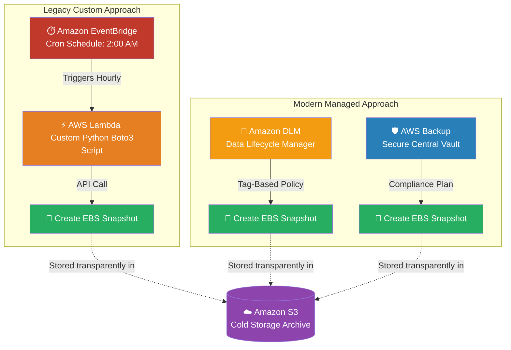

# 🚀 AWS Interview Question: Automating EC2 Backups

**Question 47:** *How do you securely automate the backup process for an EC2 instance's EBS volumes?*

> [!NOTE]
> This is a core infrastructure management question. Explaining the evolution from custom Python scripts (Lambda) to fully managed native services (AWS Backup / DLM) shows you understand how the AWS ecosystem has matured to favor native "Serverless" compliance tools.

---

## ⏱️ The Short Answer
To back up an EC2 instance, you must create a point-in-time Snapshot of its attached EBS Volume, which is natively stored in Amazon S3. There are three primary ways to automate this:
1. **AWS Backup (Modern Enterprise):** A fully managed centralized vault. It allows you to create overarching daily backup plans not just for EC2, but simultaneously for RDS, EFS, and DynamoDB.
2. **Data Lifecycle Manager (DLM):** A native EBS feature. It allows you to define a schedule to automatically take snapshots of any EBS volume bearing a specific tag (e.g., `Backup = Daily`).
3. **Lambda + EventBridge (Legacy Custom):** A classic DevOps approach. You configure an EventBridge cron job to trigger a custom Python Lambda script containing the `boto3` snapshot API command.

---

## 📊 Visual Architecture Flow: The Automation Matrix

---

## 🏢 Real-World Production Scenario

**Scenario: Enforcing a Daily 2:00 AM Production Backup**
- **The Challenge:** A company runs its core revenue-generating application on a tightly coupled EC2 instance. The CTO mandates that the server's hard drive must be backed up exactly at 2:00 AM every single night natively, with snapshots being automatically deleted after 30 days to save storage costs.
- **The Execution:** The Cloud Architect opts for the most modern, maintenance-free approach: **AWS Backup**.
- **The Policy:** The Architect creates a unified "Backup Plan" inside the AWS Backup console, defining a daily 2:00 AM execution window and a strict 30-day lifecycle retention rule. 
- **The Application:** Instead of manually typing in the EC2 Instance ID, the Architect attaches the Backup Plan dynamically to any EC2 instance bearing the precise Resource Tag: `Environment = Production`.
- **The Result:** The system is entirely automated. Any junior developer can launch a new production server tomorrow, and as long as they apply that exact tag, the server is inherently protected by the 2:00 AM daily vault backup without any custom scripting.

---

## 🎤 Final Interview-Ready Answer
*"To automate EC2 EBS backups, we create scheduled Snapshots that are stored transparently in S3. Historically, I would write a custom Python Lambda function triggered by an EventBridge cron schedule to execute the snapshot API call. However, in a modern enterprise architecture, I exclusively utilize fully managed services like Amazon DLM (Data Lifecycle Manager) or AWS Backup. For example, if the business mandates a daily 2:00 AM snapshot for a production server, I will configure an AWS Backup Plan targeting the specific 'Environment=Production' tag natively. This allows centralized compliance, perfectly automating both the creation of the snapshot and its eventual deletion after the retention period natively expires, completely eliminating the need to maintain custom Lambda code."*
