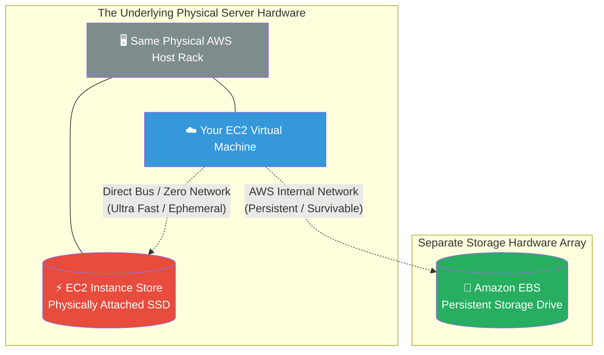

# 🚀 AWS Interview Question: EBS vs. Instance Store

**Question 48:** *What is the difference between an Amazon EBS volume and an EC2 Instance Store, and when do you use each?*

> [!NOTE]
> This is a deep physical infrastructure question. The interviewer is testing if you understand the actual physical arrangement of AWS data centers. "Instance Store" means the hard drive is physically inside the same metal rack as the CPU; "EBS" means the hard drive is connected over a network cable.

---

## ⏱️ The Short Answer
The difference between the two boils down to raw physical data persistence.
- **Amazon EBS (Elastic Block Store):** A highly durable, network-attached storage drive. It persists entirely independently from the EC2 instance. If you stop, shut down, or terminate the EC2 instance, the data stored on the EBS volume fundamentally survives. You can easily take backups (Snapshots) of EBS drives.
- **EC2 Instance Store:** An ephemeral, physical SSD physically mounted inside the exact same host hardware as the EC2 CPU. Because it is physically connected, it provides absolute maximum ultra-low latency IOPS. However, it is fundamentally temporary. If you STOP the EC2 instance, the physical server is reallocated to someone else, and **all data on the Instance Store is permanently, irreversibly deleted**. It cannot be natively snapshotted.

---

## 📊 Visual Architecture Flow: Physical Storage Boundaries

---

## 🔍 Detailed Comparison Table

| Feature | 💽 Amazon EBS | ⚡ EC2 Instance Store |
| :--- | :--- | :--- |
| **Physical Location** | Network-attached (Separate Storage Array). | Physically attached (Inside the same metal server). |
| **Data Persistence** | **Persistent:** Survives instance Stop/Reboots. | **Ephemeral:** Deleted permanently if the instance is Stopped. |
| **Snapshot/Backups** | Native support for S3 snapshots. | No native snapshot support. |
| **Performance (IOPS)** | Fast (Up to 256,000 IOPS on `io2`). | Extremely Fast (Millions of IOPS naturally). |
| **Primary Use Case** | Operating System boot drives, Databases. | Caches, Temporary swap files, load-balanced buffers. |

---

## 🏢 Real-World Production Scenario

**Scenario: A High-Frequency Trading Platform**
- **The Core Database Requirements:** The financial platform utilizes a primary PostgreSQL database to record thousands of encrypted trading transactions. The Cloud Architect specifically mounts a persistent **Amazon EBS Volume** to hold the actual database tables. This mathematically guarantees that if the EC2 instance crashes or reboots, the crucial transaction data survives intact.
- **The Caching Requirements:** The platform also runs a localized Redis cache that calculates ultra-fast, millisecond stock price predictions. Because this cache requires extreme millions-of-IOPS performance, but the data itself is just temporary scratch-pad math, the Architect maps the cache directory exclusively to an **EC2 Instance Store**. If the EC2 server dies, the temporary scratch data vanishes, but the Architect doesn't care because the core database on the EBS volume is completely safe.

---

## 🎤 Final Interview-Ready Answer
*"The fundamental difference between Amazon EBS and EC2 Instance Stores is physical data persistence. An Amazon EBS volume is a persistent, network-attached block drive. It natively survives instance stops and explicitly supports point-in-time snapshots, making it the strict absolute standard for core Operating Systems and relational Databases. Alternatively, an EC2 Instance Store is an ephemeral SSD physically mounted inside the exact same host hardware as the EC2 CPU. This physical proximity provides phenomenal millions-of-IOPS performance, but the data is completely obliterated the moment the instance is stopped or the underlying AWS hardware fails. Therefore, I restrict Instance Stores exclusively to temporary data workloads, such as Redis caches, swap spaces, or heavily dispersed NoSQL database buffers where raw speed overtakes the need for physical disk persistence."*
