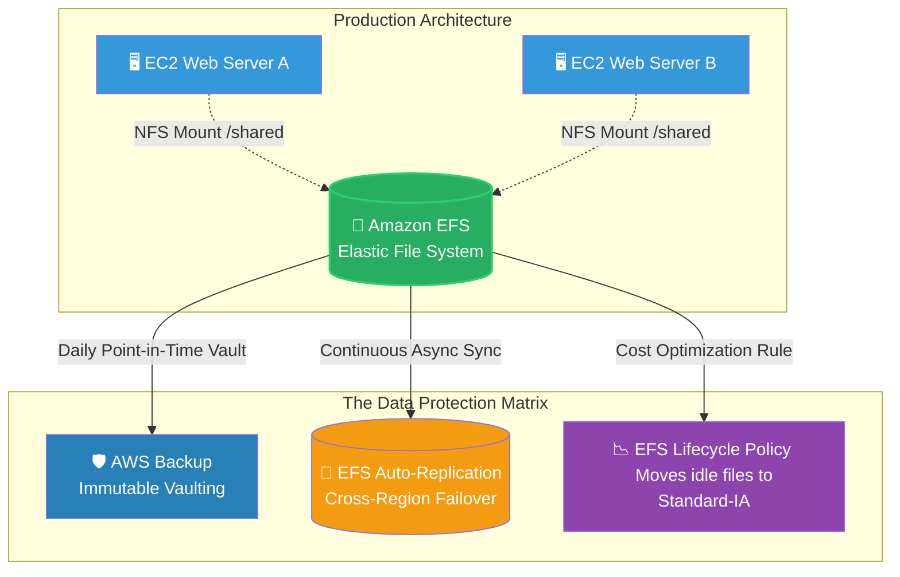

# 🚀 AWS Interview Question: EFS Backup Strategies

**Question 49:** *Can you back up an Amazon EFS (Elastic File System)? If so, what are the primary methods to protect and manage EFS data natively?*

> [!NOTE]
> This is a Storage Operations question. Interviewers look for knowledge beyond just "yes, use AWS Backup." Mentioning EFS Lifecycle Policies shows that you understand how to not just protect the data, but intelligently reduce massive storage costs over time.

---

## ⏱️ The Short Answer
Yes, Amazon EFS fundamentally supports robust, native backup and protection solutions.
- **AWS Backup:** The primary managed tool. It automatically takes daily, immutable snapshots of the entire EFS file system and stores them securely in a centralized recovery vault.
- **EFS Replication (CRR/SRR):** A disaster recovery feature. It continuously, asynchronously replicates all EFS files to a completely separate secondary EFS file system (either in the Same Region or Cross-Region).
- **EFS Lifecycle Policies:** A cost-protection feature. It automatically moves files that haven't been accessed in 30 days from the expensive "Standard" storage class down to the cheaper "Infrequent Access (IA)" storage class automatically.

---

## 📊 Visual Architecture Flow: EFS Data Protection

---

## 🏢 Real-World Production Scenario

**Scenario: Securing Shared Corporate Documents**
- **The Challenge:** A company uses multiple clustered EC2 servers to run its internal intranet portal. Employees constantly upload thousands of PDF documents daily, which are stored collectively on a single shared Amazon EFS file system. A rogue employee accidentally deletes an entire folder of critical payroll PDFs.
- **The Solution:** The Cloud Architect had previously configured an **AWS Backup Plan** targeting the EFS file system. Because AWS Backup takes automated daily snapshots securely into an immutable vault, the Architect simply opens the AWS Backup console, selects yesterday's "Recovery Point," and instantly restores the missing PDF folder perfectly back onto the EFS drive.
- **The Optimization:** Because thousands of these PDFs are never opened again after 90 days, the Architect had also securely configured an **EFS Lifecycle Policy**. This mathematically ensures that any PDF untouched for 90 days drops down to EFS Infrequent Access, saving the company up to 92% on their monthly storage bill without the end-users noticing any changes.

---

## 🎤 Final Interview-Ready Answer
*"Yes, you can natively back up Amazon EFS securely. My primary methodology for point-in-time recovery is AWS Backup, which I use to enforce daily centralized vault backups—an ideal solution for restoring a shared file if an application server accidentally corrupts or deletes it. However, if the business mandates strict Disaster Recovery compliance, I will actively configure native EFS Replication to continuously synchronize the files asynchronously to a secondary region. Additionally, beyond just disaster recovery, I always enforce an EFS Lifecycle Policy to mathematically optimize costs by automatically tiering untouched legacy files down to the cheaper Infrequent Access storage class natively."*
