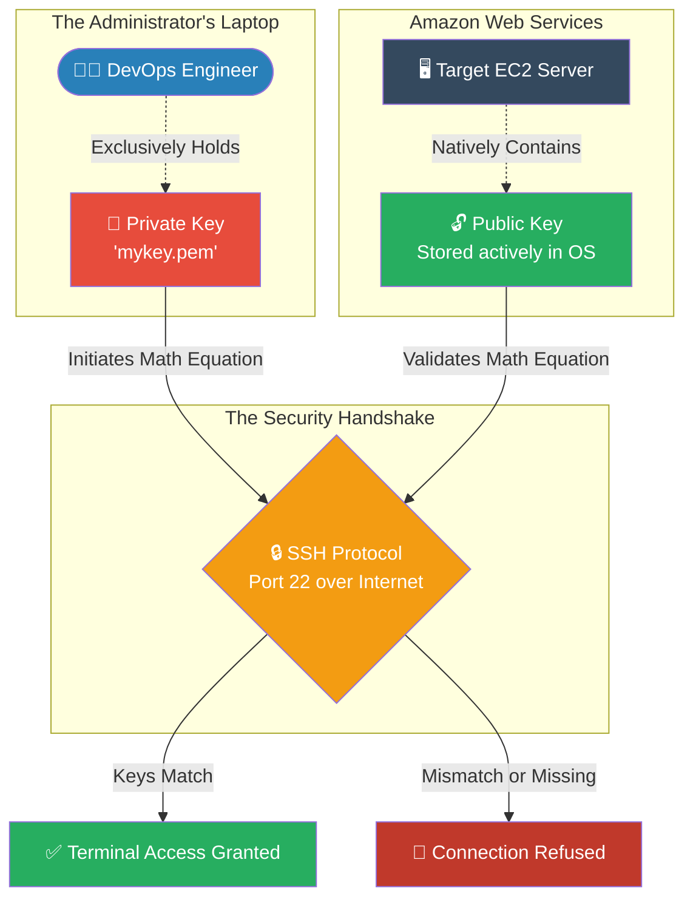

# 🚀 AWS Interview Question: EC2 Key Pairs

**Question 50:** *What are AWS Key Pairs, how do they mathematically work, and why do we use them instead of traditional passwords?*

> [!NOTE]
> This is a foundational Systems Administration question. Answering this by correctly identifying where the specific halves of the key live (Public = AWS, Private = Your Laptop) instantly separates candidates who just click buttons from those who actually understand Linux cryptography.

---

## ⏱️ The Short Answer
Amazon EC2 utilizes asymmetrical public-key cryptography to authenticate secure logins (SSH) instead of relying on easily guessable, weak traditional passwords. 
- A **Key Pair** consists of two mathematically linked files.
- **The Public Key:** This is securely injected and permanently stored *inside* the AWS EC2 instance by Amazon upon launch (specifically in the `~/.ssh/authorized_keys` file).
- **The Private Key (`.pem` file):** This is highly sensitive and downloaded exactly *once* securely to the Administrator's local laptop. AWS does not keep a copy. If it is lost, it cannot be regenerated.

To gain server access, the Administrator provides their Private Key during the SSH attempt. The EC2 server compares it mathematically against its stored Public Key; if they match, access is granted.

---

## 📊 Visual Architecture Flow: The Cryptographic Handshake

---

## 🏢 Real-World Production Scenario

**Scenario: Secure SSH Production Access**
- **The Challenge:** A company is launching a highly sensitive Financial web server in a public subnet. Hackers run automated bots 24/7 attempting to "brute force" guess common passwords (like `admin123`) on port 22.
- **The Solution:** The Cloud Architect completely disables traditional password login on the operating system level. Instead, they strictly require an **AWS Key Pair**. 
- **The Execution:** When a DevOps engineer needs to perform system maintenance on the live production server, they open their local terminal and explicitly declare their secure private key path: 
  `ssh -i my-production-key.pem ec2-user@34.205.112.55`
- **The Result:** The cryptographic handshake occurs instantly. The mathematically random, 2048-bit RSA key is functionally impossible to guess by hacker bots. Even if a bot finds the correct IP address, without the literal `.pem` file physically sitting on the engineer's laptop, they will simply be hit with a `Connection Refused` wall.

---

## 🎤 Final Interview-Ready Answer
*"AWS strictly utilizes asymmetric Key Pairs instead of traditional passwords to explicitly prevent brute-force SSH attacks on EC2 instances. A Key Pair operates via public-key cryptography. When I launch a server, AWS inherently embeds the 'Public Key' into the instance's authorized keys file, while allowing me to securely download the matching sensitive 'Private Key' `.pem` file to my local machine. To gain secure terminal access to a production web server, I execute the SSH command strictly passing in my Private Key identity file (`ssh -i key.pem user@IP`). The server mathematically validates that my private key perfectly matches its embedded public key. Without this physical cryptographic proof, access is completely denied."*
