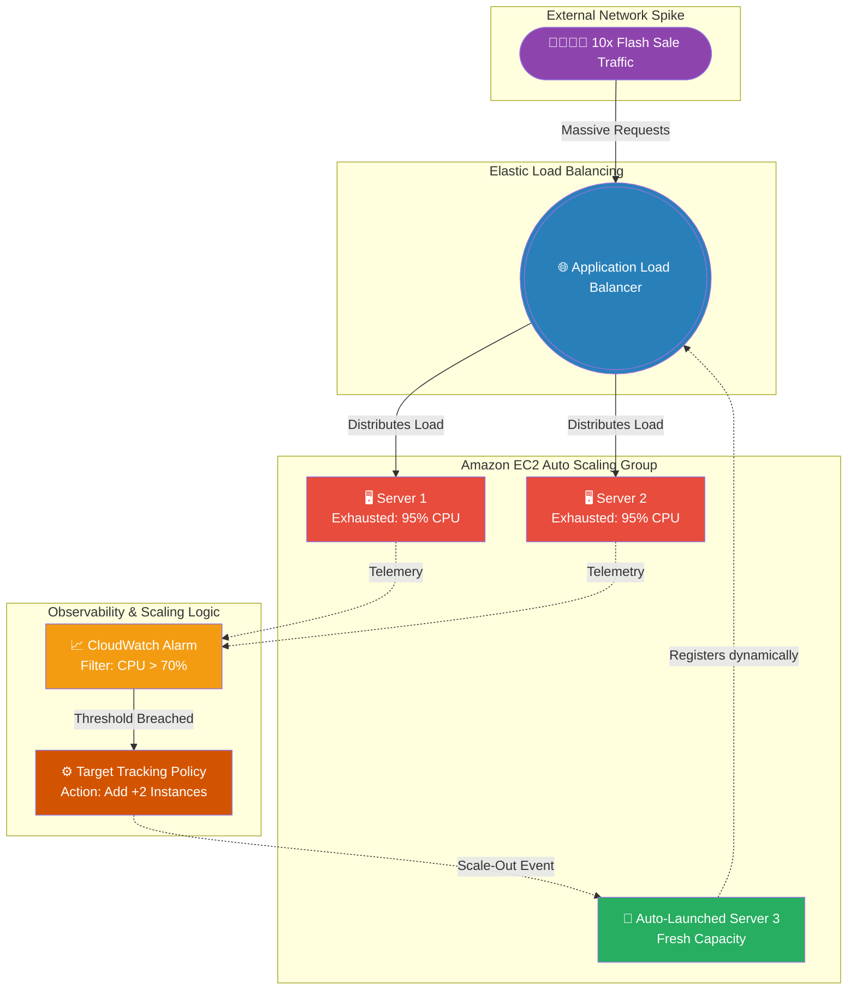

# 🚀 AWS Interview Question: Handling Sudden Traffic Spikes

**Question 51:** *Your application suddenly receives 10x its normal traffic volume. The current EC2 servers are crashing due to CPU exhaustion. How do you architecturally handle this in AWS?*

> [!NOTE]
> This is a classic Architectural System Design question. The interviewer is testing your understanding of "Horizontal Scaling." You must successfully combine three distinct services—ALB, ASG, and CloudWatch—into a single cohesive, self-healing workflow.

---

## ⏱️ The Short Answer
Crashing servers under heavy load is a textbook capacity problem. To solve this, you must fundamentally transition from a static architecture to an **Elastic Architecture**.
1. **The Balancer:** Place all current and future EC2 instances directly behind an **Application Load Balancer (ALB)** to distribute the incoming traffic evenly.
2. **The Automation:** Wrap the EC2 instances inside an **Auto Scaling Group (ASG)**. 
3. **The Trigger:** Configure an Amazon **CloudWatch Alarm** to constantly monitor the aggregate CPU utilization (e.g., if Average CPU > 70%).
4. **The Policy:** Attach a Target Tracking Scaling Policy to the ASG. When CloudWatch fires the alarm, the policy dynamically provisions brand-new EC2 instances and natively registers them with the Load Balancer to absorb the load.

---

## 📊 Visual Architecture Flow: Automated Horizontal Scaling

---

## 🏢 Real-World Production Scenario

**Scenario: The 3:00 AM Black Friday Flash Sale**
- **The Setup:** An e-commerce platform is launching a massive Black Friday flash sale globally at 3:00 AM. 
- **The Problem:** The Operations team is asleep. Suddenly, user traffic artificially spikes 10x. The two primary EC2 backend servers hit 100% CPU lockup and begin dropping HTTP requests, causing the website to crash for paying customers.
- **The Architecture:** The Cloud Architect anticipated this. They had already provisioned an **Auto Scaling Group** with a maximum capacity of 20 servers. 
- **The Execution:** Within 60 seconds of the CPU spike, **CloudWatch** detects the anomaly. It triggers the **Target Tracking Scaling Policy**. The ASG instantly boots up 5 additional EC2 servers automatically while the operations team is still asleep. 
- **The Normalization:** The servers pass their ALB health checks, and the 10x traffic is perfectly distributed across 7 total servers, dropping the average CPU back down to a healthy 45%. When the flash sale ends at 8:00 AM, the ASG automatically terminates the 5 extra servers to save costs.

---

## 🎤 Final Interview-Ready Answer
*"If an application crashes due to a 10x traffic spike, the system fundamentally lacks horizontal elasticity. To permanently resolve this, I would deploy an Application Load Balancer strictly paired with an EC2 Auto Scaling Group. By natively integrating Amazon CloudWatch, I would configure a Target Tracking Scaling Policy anchored to a specific metric—such as Average CPU Utilization exceeding 70% or ALB Request Count Per Target. During a massive marketing campaign or flash sale, CloudWatch will actively detect the infrastructure exhaustion and signal the ASG to dynamically boot up and register new EC2 instances with the Load Balancer. This guarantees absolute zero manual intervention during critical outages, ensuring the application self-heals under load and automatically scales back down when traffic subsides to aggressively optimize costs."*
