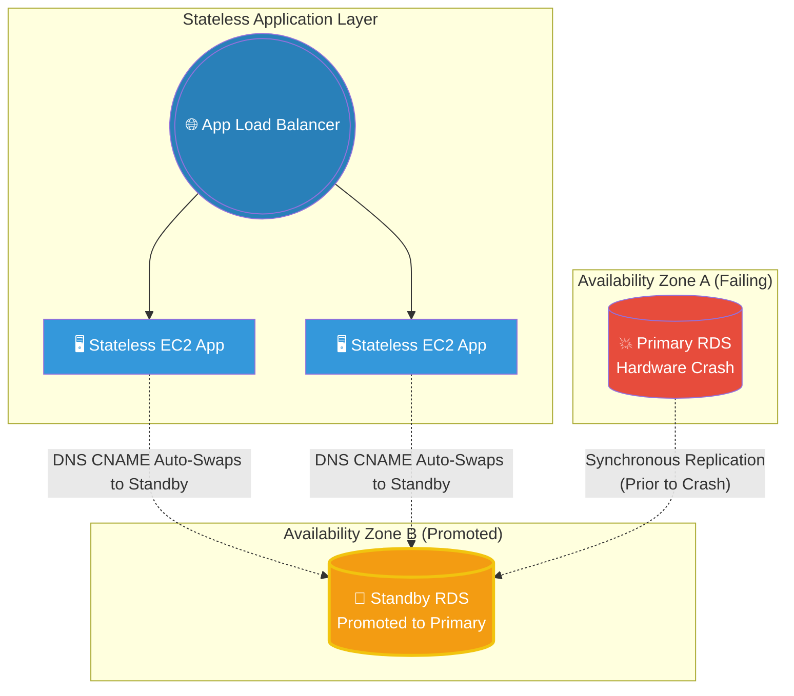

# 🚀 AWS Interview Question: Designing Database High Availability

**Question 52:** *A strict business requirement states that a primary database failure must not impact the end user's application experience. How do you architecturally design this in AWS?*

> [!NOTE]
> This is a classic High Availability (HA) scenario. The trick here is understanding that RDS Multi-AZ isn't just a backup—it is a live, synchronous replication mechanism that automatically flips the DNS endpoint without you lifting a finger.

---

## ⏱️ The Short Answer
To ensure a database crash does not take down the entire application, you must eliminate the Single Point of Failure (SPOF) at the data layer by utilizing **Amazon RDS Multi-AZ**.
1. **The Architecture:** RDS provisions a primary database in Availability Zone A, and totally hides a secondary "Standby" database in Availability Zone B.
2. **The Sync:** Every single transaction written to the primary is synchronously (real-time) replicated byte-for-byte to the standby instance.
3. **The Failover:** If the primary database hardware crashes or loses network connectivity, AWS automatically flips the internal CNAME record of the database endpoint to point directly to the standby database.
4. **The App Layer:** Because the application EC2 instances are entirely **Stateless** and just point to a generic DNS string (rather than a hardcoded IP address), they silently re-establish the connection to the new standby database within 60-120 seconds.

---

## 📊 Visual Architecture Flow: Automated RDS Multi-AZ Failover

---

## 🏢 Real-World Production Scenario

**Scenario: Surviving an AWS Data Center Outage**
- **The Challenge:** A healthcare portal requires 99.99% database uptime. At 4:00 PM, a massive power failure strikes the AWS `us-east-1a` data center, taking the primary PostgreSQL RDS instance completely offline.
- **The Automatic Failover:** Because the Cloud Architect selected the "Multi-AZ" checkbox during database creation, RDS detects the primary instance is unreachable within 15 seconds. RDS automatically promotes the hidden Standby instance sitting in `us-east-1b` to become the new Primary.
- **The DNS Swap:** RDS dynamically updates the AWS-managed DNS endpoint string (e.g., `mydb.us-east-1.rds.amazonaws.com`) to instantly map to the IP address of the new Primary in `1b`. 
- **The Result:** The stateless EC2 application servers temporarily drop their connection, run their standard retry-logic loop for about 60 seconds, and immediately re-connect successfully. End users experience a brief 1-minute loading spinner instead of a fatal 404 application crash.

---

## 🎤 Final Interview-Ready Answer
*"To ensure absolute high availability against database failures, I strictly design the data layer using Amazon RDS Multi-AZ distributions. In this architecture, AWS natively provisions a primary instance and synchronously replicates all data to a hidden standby instance in a completely separate Availability Zone. Crucially, I ensure the application layer is strictly stateless, utilizing generic AWS DNS endpoints in their configuration strings rather than hard-coded IPs. If a catastrophic hardware or AZ failure occurs, RDS actively detects the crash, automatically promotes the standby instance to primary, and seamlessly repoints the DNS CNAME record. This completely automates the failover process, allowing the stateless application to silently reconnect within 60 seconds, maintaining a seamless experience for the end user."*
