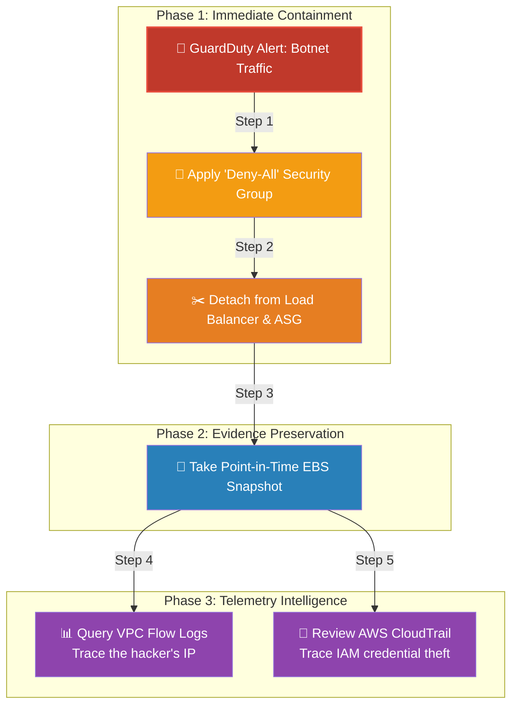

# 🚀 AWS Interview Question: Compromised EC2 Forensics

**Question 53:** *Amazon GuardDuty alerts you that an EC2 instance has been compromised and is communicating with a known botnet. What is your exact step-by-step incident response process?*

> [!NOTE]
> This is an advanced SecOps (Security Operations) question. The fundamental trap here is terminating the instance. A Senior Architect knows that if you terminate the compromised server, you permanently destroy all forensic evidence of *how* the hacker broke in. 

---

## ⏱️ The Short Answer
The Golden Rule of AWS Incident Response is: **Never delete or reboot first; always Contain and Preserve evidence.**
1. **Containment:** Immediately logically isolate the EC2 instance. DO NOT terminate it. Detach it from the Application Load Balancer and apply a strict explicit "Deny-All" Security Group to instantly sever the hacker's active network connection.
2. **Preservation:** Take an immediate Amazon EBS Snapshot of the compromised root volume to capture the exact disk state and malware artifacts.
3. **Forensics (Network):** Analyze Amazon VPC Flow Logs using CloudWatch Insights to explicitly identify which IP address the hacker originated from.
4. **Forensics (API):** Review AWS CloudTrail to explicitly verify if the hacker managed to extract temporary IAM credentials and execute API calls against other AWS services (like S3).

---

## 📊 Visual Architecture Flow: The Golden Incident Protocol

---

## 🏢 Real-World Production Scenario

**Scenario: The Cryptominer Infection**
- **The Event:** At 11:00 PM, a Junior DevOps Engineer receives a PagerDuty alert. A production web server's CPU has unexpectedly spiked to 100%. GuardDuty confirms the server is actively communicating with a known cryptocurrency mining pool.
- **The Mistake:** The Junior Engineer panics and aggressively clicks `Terminate Instance` in the AWS Console. 
- **The Aftermath:** The ASG perfectly boots up a replacement server, and the CPU normalizes. However, the next day, the architectural team is completely blind. Because the hardware was wiped, they cannot pull the Apache access logs, they cannot identify the CVE vulnerability the hacker exploited, and they don't know if the hacker stole the EC2 instance's IAM Role credentials. Three days later, the replacement server gets infected via the exact same unknown vulnerability.
- **The Architect's Pivot:** The Cloud Architect rewrites the Incident Response runbook: The Junior Engineer is now instructed to isolate the `Network Interface (ENI)` by overriding the Security Group with a blank one. They immediately take an `EBS Snapshot`, and mount that frozen snapshot exclusively to an isolated Forensic EC2 Instance to safely extract the Apache logs and identify the exact unpatched PHP vulnerability.

---

## 🎤 Final Interview-Ready Answer
*"If an EC2 instance is compromised, my absolute first rule is to never reboot or terminate the instance, as that permanently destroys volatile memory and disk evidence. My protocol is purely Contain, Preserve, and Investigate. Step one is logical containment: I instantly detach the instance from the Load Balancer and override its attached Security Group with a strict 'Deny-All Inbound/Outbound' rule to physically sever the attacker's connection. Step two is preservation: I explicitly trigger an Amazon EBS Snapshot of the server's attached volumes to physically freeze the disk state for malware analysis. Step three is telemetry intelligence: I dive into Amazon VPC Flow Logs to trace the exact external IP address the attacker compromised us from, and heavily audit AWS CloudTrail to verify if the attacker managed to abuse the instance's IAM role to harvest data from our other internal AWS services."*
