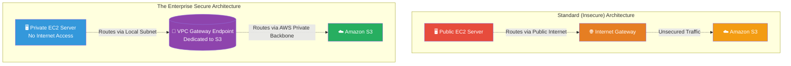

# 🚀 AWS Interview Question: Private S3 Access (VPC Endpoints)

**Question 55:** *A strict security mandate states that your EC2 application must communicate with Amazon S3 without the traffic ever touching the public internet. How do you architect this?*

> [!NOTE]
> This is a mandatory Security/Networking question. Understanding that Amazon S3 sits *outside* of your VPC on the public AWS network, and knowing how to natively bridge that gap securely using VPC Endpoints, is fundamental Architect knowledge.

---

## ⏱️ The Short Answer
By default, EC2 instances must use an Internet Gateway or NAT Gateway to reach Amazon S3 over the public internet. To completely bypass the internet and keep all data fundamentally private, you must provision an **Amazon VPC Gateway Endpoint for S3**.
- **The Routing:** The Gateway Endpoint logically creates a direct, private tunnel from your Subnet's Route Table explicitly to the Amazon S3 service over the pristine AWS internal backbone network.
- **The Security Blanket:** To enforce the policy, you write a strict **S3 Bucket Policy** utilizing the `aws:sourceVpce` condition. This instructs the S3 bucket to maliciously reject any traffic that does not physically originate from that exact VPC Endpoint ID, mathematically rendering the bucket invisible to the public internet.

---

## 📊 Visual Architecture Flow: The VPC Gateway Endpoint

---

## 🏢 Real-World Production Scenario

**Scenario: A Compliant Health Tech Platform**
- **The Challenge:** A healthcare startup is finalizing an ML architecture to analyze encrypted patient X-Ray images stored in an Amazon S3 bucket. To pass their strict HIPAA compliance audit, the external auditor mandates that none of the X-Ray image data traversing between the analyzing EC2 servers and the storage bucket can touch public internet lines, even if heavily encrypted.
- **The Action:** The Cloud Architect provisions a **VPC Gateway Endpoint** specifying the `com.amazonaws.us-east-1.s3` service name. They natively attach this endpoint directly into the exact Route Table of the Private Subnet hosting the ML EC2 servers.
- **The Lockdown:** To legally ensure compliance, the Architect writes a Resource-Based Bucket Policy on the X-Ray S3 bucket containing an explicit "Deny" rule conditionally triggered if `aws:sourceVpce` does not mathematically match their unique Gateway Endpoint ID (e.g., `vpce-1a2b3c4d`).
- **The Result:** The EC2 servers seamlessly read and write the massive X-Ray files securely over the high-speed AWS internal network. The auditor successfully signs off on the HIPAA compliance certification, and the startup saves thousands of dollars monthly by completely dodging expensive NAT Gateway data processing fees.

---

## 🎤 Final Interview-Ready Answer
*"To guarantee that my EC2 instances communicate with Amazon S3 completely privately, without ever touching the public internet, I exclusively design the architecture around a VPC Gateway Endpoint. Ordinarily, reaching the S3 API requires traversing an Internet Gateway or NAT Gateway. By natively injecting an S3 Gateway Endpoint directly into the Private Subnet's Route Table, I architect a direct physical tunnel over the internal AWS backbone. Crucially, to logically enforce this boundary, I immediately attach a strict Resource-Based Bucket Policy to the S3 bucket utilizing the 'aws:sourceVpce' condition. This explicitly drops any web requests that do not organically originate from my specific VPC Endpoint ID, guaranteeing absolute data privacy and effortlessly satisfying strict enterprise compliance standards."*
