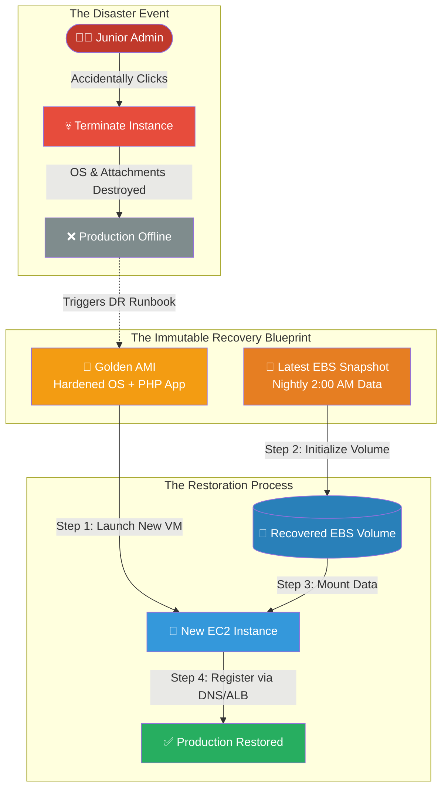

# 🚀 AWS Interview Question: EC2 Accidental Deletion

**Question 56:** *A junior developer accidentally terminates a critical production EC2 instance. How do you recover the server and exactly how do you prevent this downtime in the future?*

> [!NOTE]
> This is a classic "Disaster Recovery & Immutability" question. Knowing the difference between recovering the *Application Code* (via an AMI) versus recovering the *User Data* (via an EBS Snapshot) proves you deeply understand cloud infrastructure.

---

## ⏱️ The Short Answer
When an EC2 instance is completely terminated, it is permanently gone and cannot be "undeleted." You must strictly recreate it from two separate backup sources:
1. **The Operating System (AMI):** You launch a brand-new EC2 instance utilizing your company's latest custom **Golden AMI** (Amazon Machine Image), which inherently contains the pre-configured OS, security patches, and application binaries.
2. **The Dynamic Data (EBS Snapshot):** You locate the most recent daily **Amazon EBS Snapshot** taken before the deletion. You convert that snapshot into a fresh EBS volume and physically mount it to the new EC2 instance to fully restore the missing user file data.

---

## 📊 Visual Architecture Flow: The Instance Restoration Protocol

---

## 🏢 Real-World Production Scenario

**Scenario: Standardizing with Golden AMIs**
- **The Challenge:** Historically, whenever a server crashed or was accidentally deleted, the operations team spent 4 hours manually installing Ubuntu, configuring Apache, downloading PHP, and tweaking the exact internal corporate firewall settings on the fresh server from scratch.
- **The Execution:** The Cloud Architect completely halts this manual process. They create a perfect, fully configured Ubuntu baseline server and explicitly save it as a **Golden AMI**. 
- **The Aftermath:** The next time a junior developer accidentally clicks `Terminate` on a production server at 3:00 PM, the recovery team does zero manual configuration. They simply click `Launch Instance from Golden AMI`, entirely resurrecting the perfectly configured application in exactly 60 seconds. They attach the nightly **EBS Snapshot** to restore the dynamic files, drastically reducing business downtime from 4 hours to roughly 5 minutes.
- **The Prevention:** Moving forward, the Architect formally enables **Termination Protection** on all instances and strictly revokes the `ec2:TerminateInstances` IAM permission from junior roles.

---

## 🎤 Final Interview-Ready Answer
*"If a production EC2 instance is accidentally terminated, it mathematically cannot be undeleted; it must be rebuilt. To rapidly recover the application base, I immediately launch a fresh EC2 instance utilizing our most recent pre-approved 'Golden AMI', which instantly provides the hardened Operating System and pre-compiled software dependencies. To recover the active user states and dynamic files, I seamlessly convert our most recent automated EBS Snapshot into a physical drive and mount it natively to the new instance. Crucially, as an Architect, I proactively prevent this specific human error entirely by enabling EC2 Termination Protection dynamically via Terraform, and enforcing strict Least Privilege IAM policies that physically prevent junior engineers from executing the termination API call entirely."*
