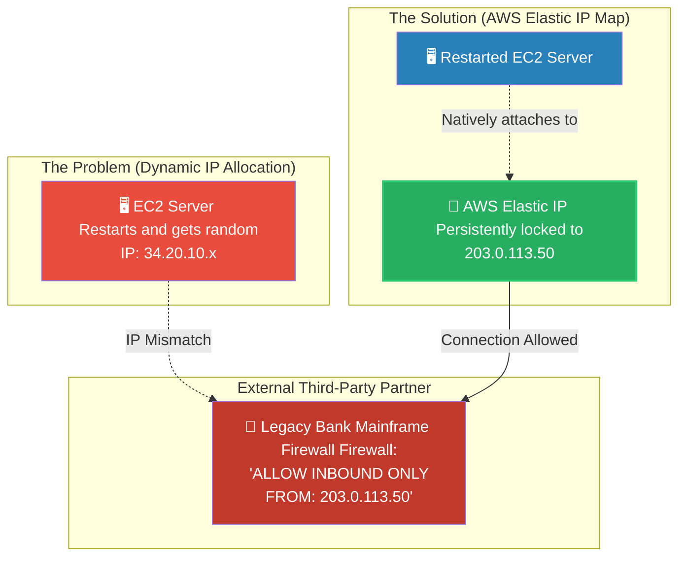

# 🚀 AWS Interview Question: Elastic IPs for Static Access

**Question 57:** *Your core application requires a static IPv4 address that does not mathematically change, even if the EC2 instance crashes or is rebooted. How do you architect this in AWS?*

> [!NOTE]
> This is a foundational Networking and Integrations question. The primary interview trap here is treating an Elastic IP purely as a convenience feature. To sound like an Architect, you must explicitly mention "whitelist firewalls" and "legacy third-party integrations," as modern scalable applications try to avoid static IPs entirely.

---

## ⏱️ The Short Answer
By default, Amazon EC2 instances are assigned standard Public IP addresses from a regional pool. If you stop the instance, AWS physically reclaims that IP, and upon restart, you are assigned a completely random new IP address. 

To permanently lock a static IPv4 address to your AWS environment, you must provision an **Amazon Elastic IP (EIP)**. 
An Elastic IP is mathematically bound to your AWS Account (not the EC2 instance). You manually map the EIP to a specific EC2 instance or Network Interface. If the EC2 server crashes, the EIP remains safely in your account, allowing you to instantly remap that exact same IP address to a brand-new replacement server.

---

## 📊 Visual Architecture Flow: The Static Mismatch

---

## 🏢 Real-World Production Scenario

**Scenario: The FinTech API Integration**
- **The Challenge:** A modern cloud-based startup needs to transmit daily transaction ledgers securely into an ancient 1980s mainframe sitting at a major global bank. Because the bank operates on archaic security protocols, they mathematically refuse to accept generic DNS endpoints or dynamic cloud traffic. The bank's Chief Security Officer explicitly demands: *"Give us exactly one static IP address to whitelist in our hardware firewall, or the integration fails."*
- **The Solution:** The Cloud Architect logs into the VPC console and allocates an **AWS Elastic IP**. AWS assigns them `203.0.113.50`. The Architect emails this exact string to the bank's security team for whitelisting. 
- **The Recovery Constraint:** The Architect natively maps `203.0.113.50` to the startup's primary EC2 transaction server. Six months later, that physical EC2 instance critically crashes due to a RAM failure. Because the `203.0.113.50` Elastic IP is bound securely to the AWS Account (not the broken server hardware), the Architect launches a fresh EC2 replacement server and simply re-attaches the existing Elastic IP to it.
- **The Result:** The bank's massive firewall continues to securely accept the ledger transmissions from the new server seamlessly, entirely unaware that the underlying EC2 hardware had actually died and been replaced. 

---

## 🎤 Final Interview-Ready Answer
*"If an application has a strict reliance on a permanent IPv4 address, I absolutely must provision an Amazon Elastic IP (EIP) rather than relying on the default ephemeral EC2 Public IP address. An Elastic IP is a static IPv4 address persistently allocated to your AWS Account. In modern cloud architecture, we generally avoid static IPs in favor of Auto Scaling and Load Balancer DNS endpoints. However, an Elastic IP is structurally mandatory when integrating with legacy corporate data centers or strict third-party partners whose rigid edge firewalls explicitly require a hardcoded IP address whitelist. If my underlying EC2 server crashes, the Elastic IP intelligently unbinds and remains securely inside my AWS account, allowing me to map that exact same IP to a replacement server instantly, thereby mathematically guaranteeing zero disruptions to the third-party firewall whitelist."*
