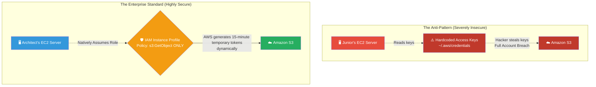

# 🚀 AWS Interview Question: Least Privilege for EC2

**Question 58:** *An EC2 instance needs to read files from an Amazon S3 bucket. How do you securely grant this access using the principle of least privilege?*

> [!NOTE]
> This is a mandatory, pass/fail Security Operations question. If you ever suggest generating AWS Access Keys (`AKIA...`) and saving them on an EC2 server, you will fail the interview instantly. You must exclusively advocate for "IAM Roles" and "Instance Profiles."

---

## ⏱️ The Short Answer
To grant an EC2 instance permissions in AWS, you must **never** generate long-term AWS Access Keys and store them on the server's hard drive. If a hacker breaches the operating system, they will simply copy the keys and gain complete control over your AWS account.

Instead, you must create an **IAM Role**. 
You apply a strict policy to this role (e.g., *only* `s3:GetObject` for a *specific* bucket name) and natively attach the Role to the EC2 instance via an **Instance Profile**. AWS then automatically generates temporary, dynamically rotating security credentials in the background, keeping the EC2 instance securely integrated without any permanent keys floating around the hard drive.

---

## 📊 Visual Architecture Flow: IAM Roles vs Hardcoded Keys

---

## 🏢 Real-World Production Scenario

**Scenario: The Stolen Credentials Attack**
- **The Setup:** A media company has a fleet of EC2 instances rendering video files and uploading them to S3. 
- **The Mistake:** A new developer generates a permanent `AdministratorAccess` Access Key locally in the AWS Console. They log into the production EC2 server and physically paste the `AKIA...` keys into the `.aws/credentials` text file so the application can access S3 natively.
- **The Breach:** Two weeks later, a hacker exploits an unpatched Apache vulnerability, gains SSH shell access to the EC2 server, simply opens the text file, and extracts the keys. The hacker logs in from Russia using those stolen Administrative keys, spins up 5,000 Bitcoin mining servers, and deleting the company's S3 buckets.
- **The Architect's Pivot:** The Cloud Architect completely revokes all generated Access Keys globally. They create a dedicated IAM Role named `VideoRendererRole` explicitly scoped mathematically to only allow the `s3:PutObject` API call for the `media-uploads-bucket` string. They attach this Role to the EC2 instances. If a hacker breaches the server now, there are absolutely no permanent keys to steal, explicitly preventing the hacker from escalating privileges beyond that single EC2 instance.

---

## 🎤 Final Interview-Ready Answer
*"To securely grant an EC2 instance permissions to other AWS services like S3, I strictly adhere to the Principle of Least Privilege by attaching an IAM Role directly to the EC2 instance using an Instance Profile. Under no circumstances should long-term IAM Access Keys ever be generated and stored manually on a server, as that introduces catastrophic credential-theft vulnerabilities if the OS is ever compromised. By assigning an IAM Role, the AWS metadata service seamlessly injects dynamically rotating, temporary security credentials implicitly into the EC2 instance. I uniquely lock down the IAM Policy attached to this role so that the server mathematically only has permission to perform the exact API call it needs—such as 's3:GetObject'—on the exact target ARN, organically preventing any malicious horizontal privilege escalation."*
